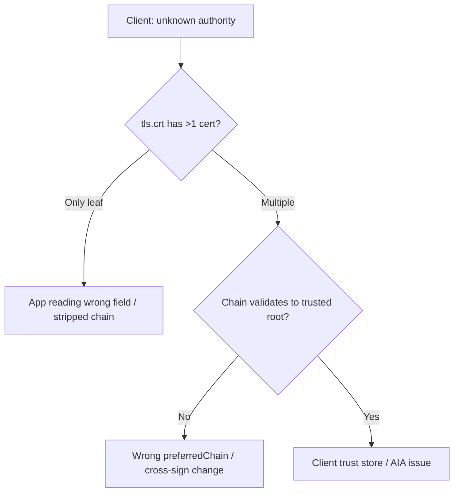

# Incomplete Certificate Chain

> **Severity:** High · **Typical recovery time:** 5–30 min · **Affected versions:** 1.20+

## Error Message

```text
certificate served without intermediate (incomplete chain)
x509: certificate signed by unknown authority
SSL_ERROR_BAD_CERT_DOMAIN / unable to get local issuer certificate
```

## Description

A TLS server must present the leaf certificate **plus all intermediate CA certificates** up to (but not necessarily including) a trusted root. When the `tls.crt` in the `Secret` contains only the leaf — or the wrong intermediate — clients that do not perform AIA chasing (most Go, Java, mobile, and IoT clients) fail with "unknown authority" even though browsers may succeed. With ACME issuers this often appears after a CA cross-sign change (e.g. Let's Encrypt's chain transitions), or when an application reads only `tls.crt` instead of the full bundle, or when `preferredChain` selects a root no longer cross-signed.

## Affected Kubernetes Versions

All Kubernetes 1.20+ with cert-manager v1.x. `additionalOutputFormats` requires cert-manager v1.7+ with the `AdditionalCertificateOutputFormats` feature gate (GA in v1.13+).

## Likely Root Causes

- Application/ingress reads only the leaf and ignores the intermediates cert-manager already bundles in `tls.crt`.
- `preferredChain` pins a root (e.g. `ISRG Root X1` vs `DST Root CA X3`) that is no longer offered, so cert-manager falls back to a chain the client does not trust.
- The consuming controller concatenates `ca.crt` incorrectly or strips intermediates.
- A private/intermediate CA issuer was configured without including its intermediate in the issuing chain.
- Caching/CDN serving an older single-cert bundle.

## Diagnostic Flow



## Verification Steps

1. Inspect the `Secret` and count the certificates in `tls.crt`.
2. Verify the chain order (leaf first, then intermediates) and that it builds to a trusted root.
3. Confirm what the server actually presents on the wire (not just what is in the Secret).
4. Check the `Certificate` spec for `preferredChain` / `additionalOutputFormats`.

## kubectl Commands

```bash
# READ-ONLY ONLY. Allowed: kubectl get/describe certificate,certificaterequest,order,challenge,issuer,clusterissuer ; cmctl status (read-only). NO mutating verbs.
kubectl get certificate my-tls -n app -o yaml
kubectl describe certificate my-tls -n app
kubectl describe issuer letsencrypt-prod -n app
kubectl get certificaterequest -n app
cmctl status certificate my-tls -n app
```

## Expected Output

```text
# cmctl status shows the spec + bundled chain
Spec:
  preferredChain: "ISRG Root X1"
  additionalOutputFormats:
    - type: CombinedPEM
    - type: DER
Status: Ready
# Decoded tls.crt should contain: leaf  ->  R3 (intermediate)  ->  (root optional)
```

## Common Fixes

1. **Serve the full bundle**: point the application/ingress at `tls.crt`, which already contains leaf + intermediates. Do not feed it only the leaf.
2. **Use `additionalOutputFormats`** to emit `CombinedPEM` (`tls-combined.pem` = key + full chain) for apps that need a single concatenated file, or `DER` for binary consumers.
3. **Set or clear `preferredChain`** to select a currently cross-signed root (e.g. `ISRG Root X1`); remove a stale pin left over from `DST Root CA X3`.
4. **For private CA issuers**, ensure the issuing CA `Secret` includes the intermediate so cert-manager bundles it into `ca.crt`/`tls.crt`.
5. Bust any CDN/cache holding the old single-cert bundle.

## Recovery Procedures

1. Read-only confirm the chain content in the Secret.
2. Edit the `Certificate` to add `additionalOutputFormats` or fix `preferredChain`, then **disruptive — `cmctl renew my-tls -n app`** to reissue with the corrected chain. Blast radius: new ACME order; validate on **staging** to avoid prod rate-limit burn during chain experiments.
3. **Disruptive — `kubectl rollout restart`** the consuming workloads/ingress so they reload the updated Secret. Blast radius: brief restarts of affected pods.

## Validation

```bash
kubectl get certificate my-tls -n app   # READY=True
cmctl status certificate my-tls -n app
```

Validate externally that the server presents the full chain (e.g. an SSL checker should report "complete chain"). The decoded `tls.crt` must contain the leaf followed by every intermediate.

## Prevention

- Standardize on `tls.crt` (full chain) for all consumers; reserve `additionalOutputFormats` for apps needing a combined PEM.
- Avoid hard-pinning `preferredChain` unless a specific legacy device requires it; review pins when a CA announces cross-sign changes.
- Add a synthetic monitor that fails on incomplete chains, not just on expiry.
- Test chain changes on ACME staging first.

## Related Errors

- [Certificate Not Ready](./certificate-not-ready.md)
- [Certificate Secret Not Created](./certificate-secret-not-created.md)
- [Issuer Not Ready](./issuer-not-ready.md)

## References

- https://cert-manager.io/docs/configuration/acme/#configuring-the-preferred-certificate-chain
- https://cert-manager.io/docs/usage/certificate/#additional-certificate-output-formats
- https://letsencrypt.org/certificates/
- https://kubernetes.io/docs/concepts/configuration/secret/#tls-secrets

## Further Reading

- https://devopsaitoolkit.com/
