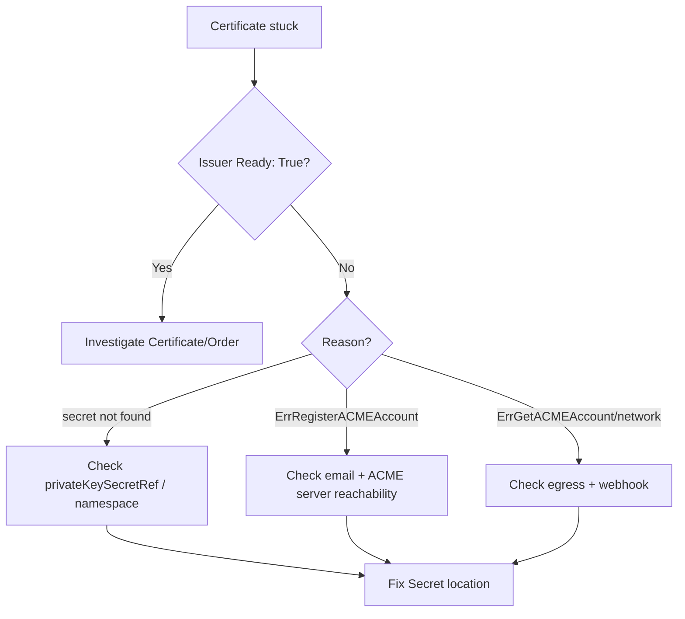

# Issuer Not Ready

> **Severity:** High · **Typical recovery time:** 5–30 min · **Affected versions:** all cert-manager releases on Kubernetes 1.20+

## Error Message
```text
Status:
  Conditions:
    Type:    Ready
    Status:  False
    Reason:  ErrRegisterACMEAccount
    Message: Failed to register ACME account: secret "letsencrypt-prod-key"
             not found
```

## Description
An `Issuer` (namespaced) or `ClusterIssuer` (cluster-wide) is the resource cert-manager uses to decide *how* certificates are signed — ACME, CA, Vault, self-signed, etc. Before it can sign anything, cert-manager validates the issuer's configuration and sets a `Ready` condition. When that condition is `False`, every `Certificate` that references the issuer is stuck: no `CertificateRequest`, no `Order`, no Secret.

From an SRE standpoint, an unready issuer is a single point of failure with broad blast radius. A `ClusterIssuer` that fails to register its ACME account silently blocks issuance and renewal across the whole cluster. Because the failure is at configuration time, the fix is usually about secrets, RBAC, or network reachability rather than the certificates themselves.

## Affected Kubernetes Versions
All cert-manager versions on Kubernetes 1.20+. The condition semantics are stable across releases; only the exact `Reason` strings have evolved.

## Likely Root Causes
- Referenced ACME private key Secret (`privateKeySecretRef`) missing or in the wrong namespace.
- ACME account registration failed — bad email, unreachable ACME server, or EAB misconfiguration.
- DNS-01/HTTP-01 solver references a credentials Secret that does not exist.
- For `ClusterIssuer`, the Secret is not in the cert-manager controller's configured cluster resource namespace (default `cert-manager`).
- cert-manager webhook not reachable, so the issuer spec was admitted but never reconciled correctly.
- Network egress to the ACME directory URL is blocked by a NetworkPolicy or proxy.

## Diagnostic Flow


## Verification Steps
1. Read the issuer's `Ready` condition and `Reason`/`Message`.
2. Confirm the referenced Secret exists in the correct namespace.
3. For `ClusterIssuer`, confirm the Secret lives in the cluster resource namespace.
4. Check controller logs for registration/network errors.

## kubectl Commands
```bash
# READ-ONLY ONLY. No mutating verbs.
kubectl get clusterissuer
kubectl describe clusterissuer letsencrypt-prod
kubectl get issuer -A
kubectl describe issuer my-issuer -n my-ns
kubectl get certificate -n my-ns
kubectl describe certificate my-cert -n my-ns
kubectl get certificaterequest -n my-ns
# Confirm the key/credentials Secret exists where the controller expects it
kubectl get secret -n cert-manager
cmctl status certificate my-cert -n my-ns   # read-only
```

## Expected Output
```text
$ kubectl describe clusterissuer letsencrypt-prod
Status:
  Conditions:
    Type:    Ready
    Status:  False
    Reason:  ErrRegisterACMEAccount
    Message: Failed to register ACME account: secret "letsencrypt-prod-key" not found
Events:
  Warning  ErrRegisterACMEAccount  2m  cert-manager  Failed to verify ACME account
```

## Common Fixes
1. **Missing key Secret:** for an ACME issuer, cert-manager creates the `privateKeySecretRef` Secret automatically on first successful registration. If it is missing and registration fails, fix the underlying cause (email, reachability) and let it recreate.
2. **Wrong namespace:** put solver/credential Secrets in the issuer's namespace for `Issuer`, or in the controller's cluster resource namespace (default `cert-manager`) for `ClusterIssuer`.
3. **Bad email/EAB:** correct the `acme.email` field and any External Account Binding keyID/HMAC.
4. **Network blocked:** allow egress to the ACME directory URL; verify no NetworkPolicy or proxy drops it.

## Recovery Procedures
1. Diagnose the precise `Reason` from the issuer status — do not guess.
2. Place or correct the referenced Secret in the right namespace.
3. **Disruptive — blast radius: all certs using this issuer.** If you must edit the issuer spec, expect cert-manager to re-register the ACME account and re-reconcile dependent certificates.
4. Confirm the webhook is healthy so spec changes are admitted and validated.
5. Wait for cert-manager to flip `Ready: True`, then dependent `CertificateRequest`s proceed automatically.

## Validation
- `kubectl get clusterissuer` shows `READY=True`.
- Dependent `kubectl get certificate -A` resources progress to `READY=True`.
- No `ErrRegisterACMEAccount`/`secret not found` events remain.

## Prevention
- Manage issuers and their Secrets together via GitOps; validate namespace placement in CI.
- Use staging ACME endpoints (`acme-staging-v02.api.letsencrypt.org`) when testing new issuers to avoid burning production rate limits during registration loops.
- Alert on any `Issuer`/`ClusterIssuer` with `Ready != True`.
- Document the cluster resource namespace for `ClusterIssuer` Secrets.

## Related Errors
- [ACME Account Registration Failed](./acme-account-registration-failed.md)
- [Certificate Not Ready](./certificate-not-ready.md)
- [DNS-01 Provider Credentials Error](./dns01-provider-credentials-error.md)
- [cert-manager Webhook Not Reachable](./cert-manager-webhook-not-reachable.md)

## References
- cert-manager Issuer configuration: https://cert-manager.io/docs/configuration/
- cert-manager ACME issuer: https://cert-manager.io/docs/configuration/acme/
- cert-manager troubleshooting: https://cert-manager.io/docs/troubleshooting/
- Kubernetes Secrets: https://kubernetes.io/docs/concepts/configuration/secret/
