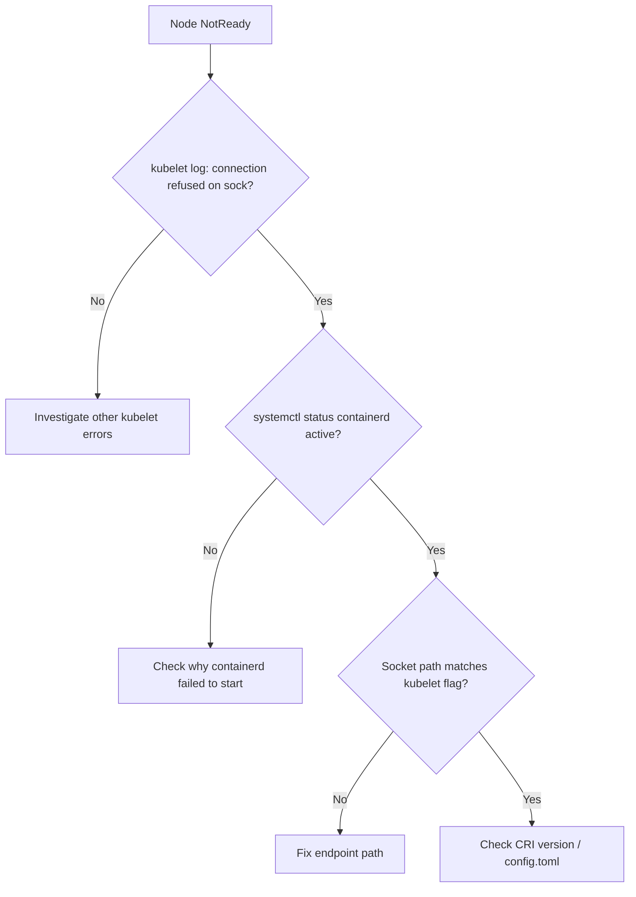

# containerd Connection Refused

> **Severity:** Critical · **Typical recovery time:** 5–30 min · **Affected versions:** 1.20+

## Error Message

```text
"command failed" err="failed to run Kubelet: validate service connection:
CRI v1 runtime API is not implemented for endpoint
\"unix:///run/containerd/containerd.sock\": rpc error: code = Unavailable
desc = connection error: desc = \"transport: Error while dialing dial unix
/run/containerd/containerd.sock: connection refused\""
```

## Description

The kubelet talks to the container runtime over a Unix socket using the CRI
gRPC API. `connection refused` on `/run/containerd/containerd.sock` means the
socket file is missing or nothing is listening — i.e. the containerd daemon is
not running, crashed, or is still starting. Without a runtime the kubelet cannot
create, inspect, or stop any containers, so the node goes `NotReady` and all
pods on it become unmanageable.

This is a node-down-class incident: every workload on the affected node is at
risk. Treat it with the same urgency as kubelet failure.

## Affected Kubernetes Versions

All containerd-backed clusters (default since 1.22). On 1.26+ the kubelet
requires CRI **v1**; an old containerd that only speaks v1alpha2 produces a
similar "not implemented" error even when the socket is up. Default socket path
is `/run/containerd/containerd.sock`.

## Likely Root Causes

- containerd service stopped, crashed, or failed to start (bad config.toml)
- Corrupt/partial `/etc/containerd/config.toml` after an upgrade or edit
- Socket path mismatch between kubelet `--container-runtime-endpoint` and containerd
- Out-of-disk or out-of-memory on the node killing the daemon
- containerd too old to serve CRI v1 (on 1.26+)

## Diagnostic Flow



## Verification Steps

Confirm the kubelet error names the containerd socket and `connection refused`.
Check whether the socket file exists and whether the containerd service is
active on the node.

## kubectl Commands

```bash
kubectl get nodes -o wide
kubectl describe node <node>
kubectl get pods -A -o wide --field-selector spec.nodeName=<node>
# On the affected node (read-only):
systemctl status containerd
journalctl -u containerd --since "30 min ago" --no-pager
crictl --runtime-endpoint unix:///run/containerd/containerd.sock info
```

## Expected Output

```text
NAME        STATUS     ROLES    AGE   VERSION
node-3      NotReady   <none>   210d  v1.29.4

# journalctl -u containerd:
containerd: failed to load TOML: /etc/containerd/config.toml: ... 
systemd: containerd.service: Main process exited, code=exited, status=1/FAILURE
```

## Common Fixes

1. Fix `/etc/containerd/config.toml` (revert the bad edit or regenerate with
   `containerd config default`) so the daemon can start.
2. Align the kubelet runtime endpoint with the actual socket path.
3. Free disk/memory if the daemon was OOM-killed or could not write state.
4. Upgrade containerd to a CRI v1-capable version on 1.26+ clusters.

## Recovery Procedures

1. Start/restart the daemon: **`systemctl restart containerd` recreates all
   containers on the node as the kubelet resyncs; node-wide blast radius** but
   the node is already broken, so this restores service.
2. If config is unrecoverable, regenerate it then restart containerd.
3. If the daemon will not stay up (disk/hardware), cordon and drain —
   **all pods reschedule** — then repair or replace the node.

## Validation

`systemctl status containerd` is `active (running)`; the node returns to
`Ready`; `crictl info` responds; pods on the node report healthy again.

## Prevention

- Validate containerd config (`containerd config default` diff) in CI before
  pushing node changes.
- Alert on `containerd.service` restarts and node `NotReady` transitions.
- Keep disk headroom and image GC tuned so the daemon is never starved.

## Related Errors

- [CRI-O Not Running](crio-not-running.md)
- [Failed To Create Pod Sandbox (Runtime)](failed-to-create-pod-sandbox-runtime.md)
- [NodeNotReady](../nodes/nodenotready.md)
- [kubelet stopped posting status](../nodes/kubelet-stopped-posting-status.md)

## References

- [Kubernetes: Container runtimes](https://kubernetes.io/docs/setup/production-environment/container-runtimes/)
- [containerd getting started](https://github.com/containerd/containerd/blob/main/docs/getting-started.md)

## Further Reading

- [DevOps AI ToolKit — Kubernetes guides](https://devopsaitoolkit.com/blog/)
