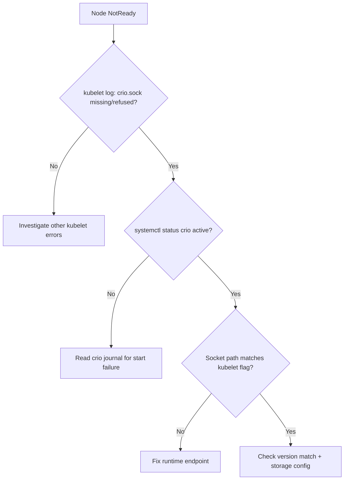

# CRI-O Not Running

> **Severity:** Critical · **Typical recovery time:** 5–30 min · **Affected versions:** 1.20+

## Error Message

```text
"command failed" err="failed to run Kubelet: validate service connection:
CRI v1 runtime API is not implemented for endpoint
\"unix:///var/run/crio/crio.sock\": rpc error: code = Unavailable
desc = connection error: desc = \"transport: Error while dialing dial unix
/var/run/crio/crio.sock: connect: no such file or directory\""
```

```text
systemd[1]: crio.service: Failed with result 'exit-code'.
```

## Description

CRI-O is the lightweight OCI runtime used in OpenShift and many upstream
clusters. The kubelet reaches it over `/var/run/crio/crio.sock`. When
`crio.service` is stopped or crashed, the socket disappears and the kubelet
cannot create or manage containers, so the node goes `NotReady` and every pod on
it is stranded.

This is a node-critical incident equivalent to containerd being down: no new
pods start, existing containers are unmanaged, and probes/health reporting for
the node stop.

## Affected Kubernetes Versions

All CRI-O clusters; CRI-O is versioned to match Kubernetes minor versions
(e.g. CRI-O 1.29 with Kubernetes 1.29). A mismatched CRI-O/Kubernetes pair is a
common cause of startup failure. On 1.26+ the kubelet requires CRI v1, which all
supported CRI-O versions provide.

## Likely Root Causes

- `crio.service` stopped or crashed (bad `/etc/crio/crio.conf` or drop-in)
- CRI-O / Kubernetes minor-version mismatch after an upgrade
- Socket path mismatch with kubelet `--container-runtime-endpoint`
- Missing/invalid registry or storage configuration under `/etc/containers`
- Node out of disk or memory killing the daemon

## Diagnostic Flow



## Verification Steps

Confirm the kubelet error references `crio.sock` and that `crio.service` is not
active. Verify the CRI-O version matches the cluster minor version.

## kubectl Commands

```bash
kubectl get nodes -o wide
kubectl describe node <node>
kubectl get pods -A -o wide --field-selector spec.nodeName=<node>
# On the affected node (read-only):
systemctl status crio
journalctl -u crio --since "30 min ago" --no-pager
crictl --runtime-endpoint unix:///var/run/crio/crio.sock info
crictl ps -a
```

## Expected Output

```text
NAME        STATUS     ROLES    AGE   VERSION
worker-7    NotReady   <none>   95d   v1.29.4

# journalctl -u crio:
crio: validating runtime config: invalid value for ...
systemd: crio.service: Main process exited, code=exited, status=1/FAILURE
systemd: crio.service: Failed with result 'exit-code'.
```

## Common Fixes

1. Fix `/etc/crio/crio.conf` (or the offending drop-in under
   `/etc/crio/crio.conf.d/`) and reload, so the service starts cleanly.
2. Install the CRI-O version that matches the cluster minor version.
3. Align the kubelet runtime endpoint with `/var/run/crio/crio.sock`.
4. Free disk/memory if the daemon was killed by node pressure.

## Recovery Procedures

1. Start/restart the daemon: **`systemctl restart crio` recreates all
   containers on the node during kubelet resync; node-wide blast radius** — but
   the node is already down, so this restores it.
2. If the config is unrecoverable, restore a known-good crio.conf, then restart.
3. If CRI-O will not stay up, cordon and drain — **all pods reschedule** — then
   reinstall the matching version or replace the node.

## Validation

`systemctl status crio` reports `active (running)`; the node returns to `Ready`;
`crictl info` responds and `crictl ps` lists containers again.

## Prevention

- Lock CRI-O and Kubernetes versions together in node bootstrap automation.
- Validate `crio.conf` changes in staging; use drop-ins instead of editing the
  base file.
- Alert on `crio.service` restarts and node `NotReady` events.

## Related Errors

- [containerd Connection Refused](containerd-connection-refused.md)
- [Failed To Create Pod Sandbox (Runtime)](failed-to-create-pod-sandbox-runtime.md)
- [NodeNotReady](../nodes/nodenotready.md)
- [kubelet stopped posting status](../nodes/kubelet-stopped-posting-status.md)

## References

- [Kubernetes: Container runtimes](https://kubernetes.io/docs/setup/production-environment/container-runtimes/)
- [CRI-O documentation](https://github.com/cri-o/cri-o/blob/main/README.md)

## Further Reading

- [DevOps AI ToolKit — Kubernetes guides](https://devopsaitoolkit.com/blog/)
