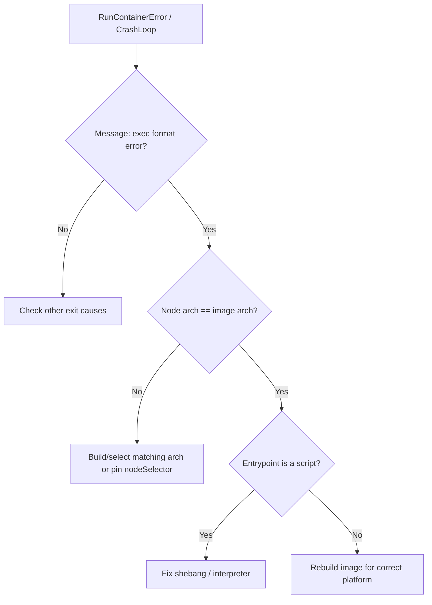

# Exec Format Error (Wrong Arch)

> **Severity:** Medium · **Typical recovery time:** 5–30 min · **Affected versions:** 1.20+

## Error Message

```text
OCI runtime create failed: runc create failed: unable to start container
process: exec: "/app/server": exec format error: unknown
```

```text
standard_init_linux.go: exec user process caused: exec format error
```

## Description

The container started but the kernel refused to execute the entrypoint binary
because its machine code does not match the node's CPU architecture — for
example an `amd64` image scheduled onto an `arm64` node (or vice versa). `runc`
hands the binary to the kernel's exec path, which returns `ENOEXEC`. The pod
typically lands in `RunContainerError` or `CrashLoopBackOff` with exit details
showing the format error.

This shows up constantly on mixed-architecture clusters (Graviton/ARM nodes
beside x86), with single-arch images, or with a missing `binfmt_misc`/QEMU
emulation setup. A related cause is a shell script with a missing or wrong
shebang.

## Affected Kubernetes Versions

All versions; this is a CPU/ABI mismatch, not a Kubernetes feature. It became
far more common as ARM nodes (AWS Graviton, Ampere) entered general clusters
from ~1.24 onward. `nodeSelector`/`affinity` on `kubernetes.io/arch` is the
standard guardrail across versions.

## Likely Root Causes

- Single-arch image (e.g. amd64-only) scheduled onto a different-arch node
- Multi-arch index missing the node's architecture entry
- Cross-built image whose binary targets the wrong platform
- Shell script entrypoint with a bad/absent shebang line
- Emulation (binfmt_misc/QEMU) expected but not installed on the node

## Diagnostic Flow



## Verification Steps

Confirm the literal string `exec format error`. Compare the node's
`kubernetes.io/arch` label with the image's built architecture.

## kubectl Commands

```bash
kubectl describe pod <pod> -n <namespace>
kubectl get events -n <namespace> --sort-by=.lastTimestamp
kubectl get node <node> -o jsonpath='{.metadata.labels.kubernetes\.io/arch}'
kubectl get pod <pod> -n <namespace> -o jsonpath='{.spec.containers[*].image}'
# On the affected node (read-only):
crictl images
crictl inspect <container-id>
journalctl -u containerd --since "10 min ago" --no-pager | grep -i "format error"
```

## Expected Output

```text
  Warning  Failed  4s  kubelet  Error: failed to create containerd task:
  failed to create shim task: OCI runtime create failed: runc create failed:
  unable to start container process: exec: "/app/server":
  exec format error: unknown

# node arch:
arm64
```

## Common Fixes

1. Build and push a multi-arch image (`docker buildx build --platform
   linux/amd64,linux/arm64`) so the right binary is selected per node.
2. Constrain scheduling with a `nodeSelector`/affinity on `kubernetes.io/arch`
   so the workload only lands on supported nodes.
3. Fix script entrypoints: ensure a correct shebang (`#!/bin/sh`) and that the
   interpreter exists in the image.

## Recovery Procedures

1. Push a corrected/multi-arch image and roll the deployment — no node action;
   blast radius is the workload only.
2. If you cannot rebuild immediately, pin the pod to matching-arch nodes via
   `nodeSelector` and reschedule — pods move to compatible nodes only.
3. No runtime restart is needed; this is an image/scheduling fix, not a daemon
   fault.

## Validation

The container starts and stays `Running`; logs show the application booting; no
further `exec format error` events.

## Prevention

- Publish multi-arch manifests for every image used on mixed clusters.
- Add CI checks that build all target architectures.
- Label/segregate node pools by arch and use affinity to prevent mismatches.

## Related Errors

- [Invalid Image Configuration](invalid-image-config.md)
- [Failed To Create containerd Task](failed-to-create-containerd-task.md)
- [RunContainerError](../pods/runcontainererror.md)
- [Exit Code 1](../pods/exit-code-1.md)

## References

- [Kubernetes: Assigning Pods to Nodes](https://kubernetes.io/docs/concepts/scheduling-eviction/assign-pod-node/)
- [containerd CRI configuration](https://github.com/containerd/containerd/blob/main/docs/cri/config.md)

## Further Reading

- [Free Kubernetes config validators](https://devopsaitoolkit.com/validators/)
