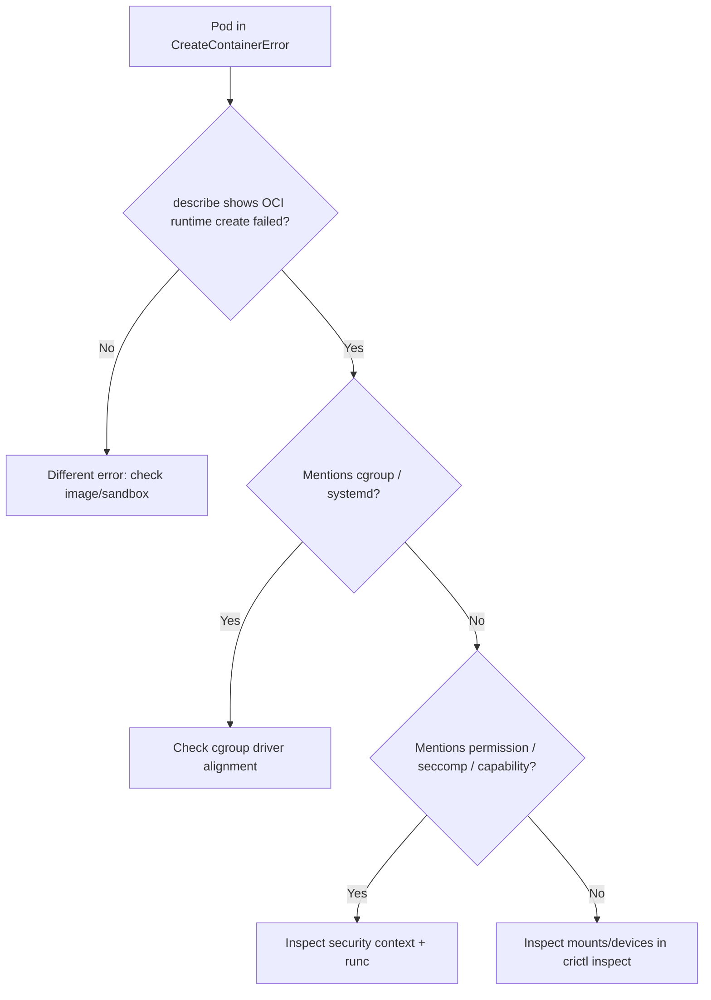

# Failed To Create containerd Task

> **Severity:** High · **Typical recovery time:** 10–45 min · **Affected versions:** 1.20+

## Error Message

```text
Error: failed to create containerd task: failed to create shim task:
OCI runtime create failed: runc create failed: unable to start container
process: error during container init: ... : unknown
```

## Description

containerd has pulled the image and prepared a snapshot, but the final step —
asking the OCI runtime (`runc`) to create and start the container process —
failed. containerd starts a per-container shim (`containerd-shim-runc-v2`),
which invokes `runc create`. When `runc` cannot construct the container's
namespaces, cgroups, mounts, or init process, it returns a non-zero exit and
containerd surfaces it to the kubelet as a `CreateContainerError` /
`RunContainerError` on the pod.

During an incident this almost always means a host-level problem (cgroup
driver, kernel, seccomp, capabilities, bad mount, or a corrupt runc binary)
rather than an application bug, because the workload never actually ran.

## Affected Kubernetes Versions

Applies to all clusters using containerd 1.4+ with the `io.containerd.runc.v2`
runtime (the default since Kubernetes 1.22, when dockershim was removed). The
shim-task wording appears in containerd 1.5+. On cgroup v2 hosts (common on
1.25+ distros) a mismatched `SystemdCgroup` setting is a frequent trigger.

## Likely Root Causes

- cgroup driver mismatch between kubelet and containerd (`systemd` vs `cgroupfs`)
- Missing or unreadable `runc` binary, or incompatible runc/kernel versions
- Restrictive seccomp/AppArmor profile or requested capability the kernel rejects
- Invalid OCI bits in the spec (bad mount path, hook, or device)
- Kernel/cgroup subsystem exhaustion (PID limit, cgroup v2 controllers missing)

## Diagnostic Flow



## Verification Steps

Confirm the failure happens at container *create*, not image pull or sandbox
creation, and that the message contains `OCI runtime create failed`. Reproduce
on the same node to rule out a one-off scheduling artifact.

## kubectl Commands

```bash
kubectl describe pod <pod> -n <namespace>
kubectl get events -n <namespace> --sort-by=.lastTimestamp
kubectl get pod <pod> -n <namespace> -o jsonpath='{.spec.nodeName}'
# On the affected node (read-only runtime diagnostics):
crictl ps -a
crictl inspect <container-id>
journalctl -u containerd --since "15 min ago" --no-pager
systemctl status containerd
```

## Expected Output

```text
  Warning  Failed  21s  kubelet  Error: failed to create containerd task:
  failed to create shim task: OCI runtime create failed: runc create failed:
  unable to start container process: error during container init:
  unable to apply cgroup configuration: ... : unknown
```

## Common Fixes

1. Align cgroup drivers: set `SystemdCgroup = true` under
   `[plugins."io.containerd.grpc.v1.runc".options]` in
   `/etc/containerd/config.toml` and `cgroupDriver: systemd` in the kubelet
   config, then restart both.
2. Repair `runc`: reinstall the runtime package so `/usr/bin/runc` is present,
   executable, and matches the host kernel.
3. Relax an over-tight `securityContext` (seccomp profile, dropped capability,
   read-only paths) that the kernel cannot honour.

## Recovery Procedures

1. Cordon and drain only if you must replace runc: `kubectl cordon <node>` then
   `kubectl drain <node> --ignore-daemonsets` — **blast radius: all pods on the
   node reschedule.**
2. Apply the config fix, then restart containerd —
   **`systemctl restart containerd` kills and recreates every container on that
   node; blast radius is node-wide.** Schedule during a maintenance window or
   after draining.
3. Uncordon: `kubectl uncordon <node>` and let pods reschedule.

## Validation

The pod transitions to `Running`; `crictl ps` lists the container; describe
shows no new `Failed` events. Confirm the container's main process is alive and
probes pass.

## Prevention

- Pin and version-match containerd, runc, and the kubelet cgroup driver in your
  node image / bootstrap automation.
- Validate `securityContext` and seccomp profiles in CI before rollout.
- Monitor `containerd` restarts and shim errors via node logging.

## Related Errors

- [runc Create Permission Denied](runc-create-permission-denied.md)
- [Failed To Create Pod Sandbox (Runtime)](failed-to-create-pod-sandbox-runtime.md)
- [CreateContainerError](../pods/createcontainererror.md)
- [Node cgroup driver mismatch](../nodes/node-cgroup-driver-mismatch.md)

## References

- [Kubernetes: Container runtimes](https://kubernetes.io/docs/setup/production-environment/container-runtimes/)
- [containerd configuration documentation](https://github.com/containerd/containerd/blob/main/docs/cri/config.md)

## Further Reading

- [DevOps AI ToolKit — Kubernetes guides](https://devopsaitoolkit.com/blog/)
