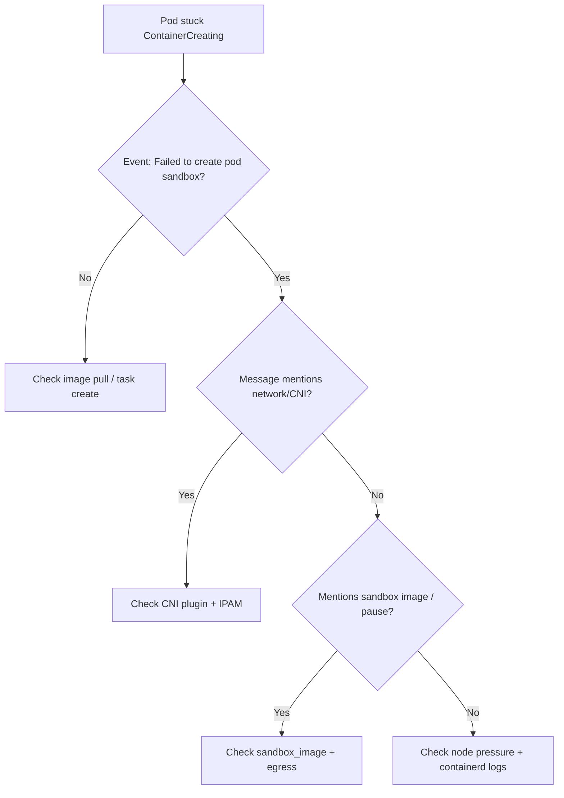

# Failed To Create Pod Sandbox (Runtime)

> **Severity:** High · **Typical recovery time:** 10–45 min · **Affected versions:** 1.20+

## Error Message

```text
Failed to create pod sandbox: rpc error: code = Unknown desc = failed to setup
network for sandbox "<id>": plugin type="..." failed (add): ...
```

```text
Failed to create pod sandbox: rpc error: code = Unknown desc = failed to get
sandbox image "registry.k8s.io/pause:3.9": failed to pull image ...
```

## Description

Before any application container runs, the CRI runtime creates a *pod sandbox*:
it starts the `pause` container (which holds the pod's Linux namespaces) and
invokes the CNI plugin to wire up networking. If either step fails, the kubelet
reports `Failed to create pod sandbox` and the pod stays in
`ContainerCreating`. The generic `code = Unknown` wraps the underlying cause,
which is usually network plugin setup or pulling the `pause` image.

This is a node/infrastructure problem, not an application one — the workload
containers were never created. From an SRE view it overlaps with
`NetworkPluginNotReady` and CNI outages.

## Affected Kubernetes Versions

All containerd/CRI-O clusters. The pause image reference changed to
`registry.k8s.io/pause` (from `k8s.gcr.io/pause`) around 1.25; nodes pinned to
the old registry can fail sandbox creation if egress to the old host is blocked.
The `sandbox_image` is set in `/etc/containerd/config.toml`.

## Likely Root Causes

- CNI plugin not ready, misconfigured, or out of pod IPs (IPAM exhausted)
- `pause` sandbox image cannot be pulled (wrong registry, no egress, auth)
- Missing CNI binaries/config in `/opt/cni/bin` or `/etc/cni/net.d`
- containerd CNI config conflict (multiple/invalid `*.conflist` files)
- Node resource pressure preventing namespace/cgroup setup

## Diagnostic Flow



## Verification Steps

Confirm the event text starts with `Failed to create pod sandbox` and identify
whether the wrapped cause is networking (CNI) or the pause image. Check whether
all new pods on the node are affected (node-wide) or just one.

## kubectl Commands

```bash
kubectl describe pod <pod> -n <namespace>
kubectl get events -n <namespace> --sort-by=.lastTimestamp
kubectl get pods -A -o wide | grep <node>
# On the affected node (read-only):
crictl ps -a
crictl images | grep pause
crictl inspect <sandbox-id>
journalctl -u containerd --since "15 min ago" --no-pager
systemctl status containerd
```

## Expected Output

```text
  Warning  FailedCreatePodSandBox  8s  kubelet  Failed to create pod sandbox:
  rpc error: code = Unknown desc = failed to setup network for sandbox
  "a1b2...": plugin type="calico" failed (add): error getting ClusterInformation:
  connection is unauthorized
```

## Common Fixes

1. Restore the CNI: ensure the CNI DaemonSet is healthy, binaries exist in
   `/opt/cni/bin`, and a valid conflist is in `/etc/cni/net.d`.
2. Fix the sandbox image: set a reachable `sandbox_image` in
   `/etc/containerd/config.toml` and confirm egress/auth to that registry.
3. Resolve IPAM exhaustion by expanding the pod CIDR or reclaiming leaked IPs.

## Recovery Procedures

1. Repair the CNI DaemonSet first (rollout restart of the CNI, not the node) —
   blast radius limited to networking pods.
2. If you edit containerd config, restart containerd —
   **`systemctl restart containerd` recreates all containers on the node;
   node-wide blast radius.** Drain stateful workloads first.
3. As a last resort, cordon/drain and reboot the node —
   **all pods reschedule.**

## Validation

New pods on the node reach `Running` with assigned pod IPs; `crictl ps` shows
the pause sandbox; no further `FailedCreatePodSandBox` events.

## Prevention

- Pin and pre-pull the `pause` image into the node image.
- Monitor CNI DaemonSet health and IPAM free-IP counts.
- Validate CNI config changes in staging before fleet rollout.

## Related Errors

- [Failed To Create containerd Task](failed-to-create-containerd-task.md)
- [Pod Sandbox Changed](pod-sandbox-changed.md)
- [NetworkPluginNotReady](../pods/networkpluginnotready.md)
- [Node container runtime network not ready](../nodes/node-container-runtime-network-not-ready.md)

## References

- [Kubernetes: Network plugins](https://kubernetes.io/docs/concepts/extend-kubernetes/compute-storage-net/network-plugins/)
- [containerd CRI configuration](https://github.com/containerd/containerd/blob/main/docs/cri/config.md)

## Further Reading

- [DevOps AI ToolKit — Kubernetes guides](https://devopsaitoolkit.com/blog/)
