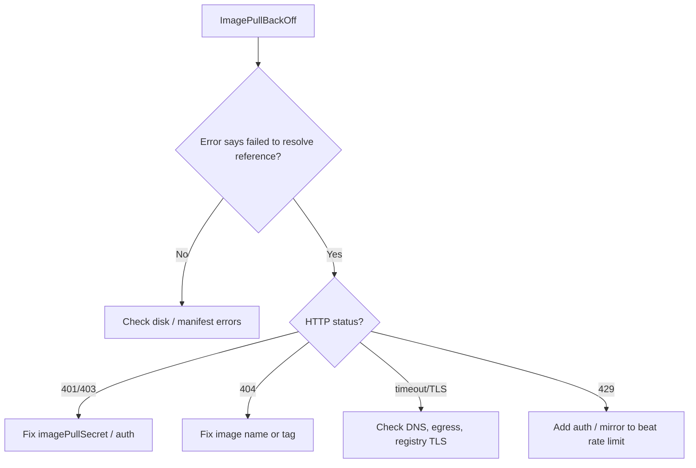

# Failed To Pull And Unpack Image

> **Severity:** High · **Typical recovery time:** 5–30 min · **Affected versions:** 1.20+

## Error Message

```text
failed to pull and unpack image "registry.example.com/team/app:v1.2.3":
failed to resolve reference "registry.example.com/team/app:v1.2.3":
failed to do request: Head "https://registry.example.com/v2/team/app/manifests/v1.2.3":
... / unexpected status: 401 Unauthorized
```

## Description

This is containerd's CRI image service reporting that it could not fetch and
extract an image. "Resolve reference" is the very first step — containerd
contacts the registry to look up the manifest for the tag/digest. A failure
here means the request never got to downloading layers: the registry was
unreachable, the name/tag does not exist, or authentication/authorization was
rejected. The kubelet surfaces this to the pod as `ErrImagePull` →
`ImagePullBackOff`.

In production this is most often a credential, hostname, or tag-typo problem,
or a registry that is down or rate-limiting. It is distinct from "no space left
on device" (disk) and "invalid image configuration" (corrupt/unsupported
manifest).

## Affected Kubernetes Versions

Applies to all containerd-backed clusters (default runtime since 1.22). The
exact "failed to pull and unpack" wording is containerd 1.4+. Registry
mirror/auth config moved to the `config_path` (hosts.toml) model in containerd
1.5+, so older inline `[registry.mirrors]` config may be silently ignored on
newer nodes.

## Likely Root Causes

- Missing or wrong `imagePullSecret`, or expired registry credentials (401/403)
- Image tag/digest does not exist or was deleted (404 / not found)
- Registry DNS/network unreachable, TLS failure, or proxy blocking egress
- Registry rate limiting (429) — common with anonymous Docker Hub pulls
- Private registry not configured in containerd `hosts.toml` mirror config

## Diagnostic Flow



## Verification Steps

Confirm the message contains `failed to resolve reference` and capture the HTTP
status. Verify the exact image reference in the pod spec matches what exists in
the registry.

## kubectl Commands

```bash
kubectl describe pod <pod> -n <namespace>
kubectl get events -n <namespace> --sort-by=.lastTimestamp
kubectl get pod <pod> -n <namespace> -o jsonpath='{.spec.containers[*].image}'
kubectl get pod <pod> -n <namespace> -o jsonpath='{.spec.imagePullSecrets[*].name}'
# On the affected node (read-only):
crictl images
crictl inspect <container-id>
journalctl -u containerd --since "10 min ago" --no-pager | grep -i resolve
```

## Expected Output

```text
  Warning  Failed  12s  kubelet  Failed to pull image
  "registry.example.com/team/app:v1.2.3": rpc error: code = Unknown
  desc = failed to pull and unpack image "...": failed to resolve reference
  "...": unexpected status: 401 Unauthorized
  Warning  Failed  12s  kubelet  Error: ErrImagePull
```

## Common Fixes

1. Create/repair the pull secret and reference it:
   `kubectl create secret docker-registry ...` then add it to the pod's
   `imagePullSecrets` (or the service account).
2. Correct the image name/tag/digest in the manifest to one that exists.
3. For private registries, configure containerd `hosts.toml` under
   `config_path` (e.g. `/etc/containerd/certs.d/<registry>/hosts.toml`) with the
   correct endpoint and CA.

## Recovery Procedures

1. Fix credentials/tag and let the kubelet retry — no node disruption needed;
   backoff clears automatically.
2. If you changed containerd registry config, restart containerd —
   **`systemctl restart containerd` recreates all containers on the node;
   node-wide blast radius.** Drain first for stateful workloads.
3. For rate limiting, add authenticated pulls or a pull-through mirror to remove
   the 429 source.

## Validation

`kubectl get pod` shows the image pulled and the container `Running`;
`crictl images` lists the image; no further `ErrImagePull` events appear.

## Prevention

- Manage pull secrets centrally (per-namespace or attached to service accounts).
- Use immutable digests for critical workloads to avoid tag drift.
- Run a pull-through registry mirror to survive upstream outages and rate limits.

## Related Errors

- [ImagePullBackOff](../pods/imagepullbackoff.md)
- [ErrImagePull](../pods/errimagepull.md)
- [Invalid Image Configuration](invalid-image-config.md)
- [Image Filesystem No Space](image-filesystem-no-space.md)

## References

- [Kubernetes: Pull an image from a private registry](https://kubernetes.io/docs/tasks/configure-pod-container/pull-image-private-registry/)
- [containerd registry configuration (hosts.toml)](https://github.com/containerd/containerd/blob/main/docs/hosts.md)

## Further Reading

- [Free Kubernetes config validators](https://devopsaitoolkit.com/validators/)
