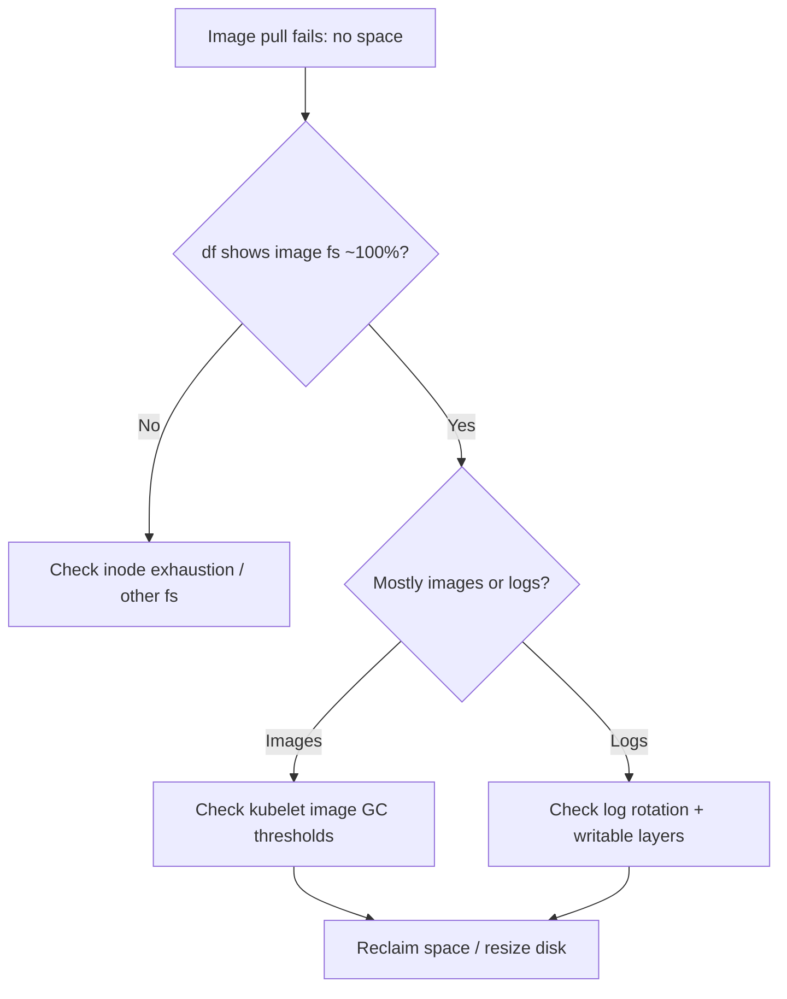

# Image Filesystem No Space

> **Severity:** High · **Typical recovery time:** 10–45 min · **Affected versions:** 1.20+

## Error Message

```text
Failed to pull image "registry.example.com/app:v2": rpc error: code = Unknown
desc = failed to pull and unpack image "...": failed to extract layer
sha256:...: write /var/lib/containerd/.../layer.tar: no space left on device
```

## Description

The runtime's image/snapshot filesystem is full. containerd writes pulled
layers and snapshots under `/var/lib/containerd` (CRI-O under
`/var/lib/containers`), which usually lives on the same volume the kubelet uses.
When that filesystem hits 100%, layer extraction fails with `no space left on
device`, image pulls fail, and new containers cannot be created. The kubelet
also raises `DiskPressure`, taints the node, and may start evicting pods.

This is a capacity incident. Unlike `failed to resolve reference` (auth/network)
this is purely about disk; the registry is reachable but the node cannot store
the image.

## Affected Kubernetes Versions

All versions. Image garbage collection is driven by kubelet
`imageGCHighThresholdPercent` / `imageGCLowThresholdPercent`. In 1.27+ the
single-filesystem detection and `imageMaximumGCAge` (1.30+) change how
aggressively unused images are reclaimed. Split image-filesystem
(separate disk for images) is supported on newer kubelets.

## Likely Root Causes

- Accumulated unused images/layers never garbage-collected (GC disabled or
  thresholds too high)
- Large container logs or ephemeral writable layers filling the volume
- Orphaned snapshots / leaked exec mounts from crashed containers
- Undersized node root/image disk for the workload mix
- Another tenant or hostPath writing to the same filesystem

## Diagnostic Flow



## Verification Steps

Confirm the error is `no space left on device` and that the image filesystem
(not a data PV) is full. Check the node for the `DiskPressure` condition.

## kubectl Commands

```bash
kubectl describe node <node> | grep -A5 Conditions
kubectl describe pod <pod> -n <namespace>
kubectl get events -n <namespace> --sort-by=.lastTimestamp
# On the affected node (read-only):
crictl images
crictl ps -a
journalctl -u containerd --since "15 min ago" --no-pager | grep -i "no space"
systemctl status containerd
```

## Expected Output

```text
Conditions:
  Type             Status    Reason                Message
  DiskPressure     True      KubeletHasDiskPressure  kubelet has disk pressure

  Warning  Failed  5s  kubelet  Failed to pull image "...": ... 
  failed to extract layer ...: write ...: no space left on device
```

## Common Fixes

1. Let kubelet image GC reclaim space: lower `imageGCHighThresholdPercent` /
   `imageGCLowThresholdPercent` so unused images are pruned automatically.
2. Reduce log/ephemeral usage: enforce container log rotation
   (`containerLogMaxSize`/`Files`) and add `ephemeral-storage` limits.
3. Grow the image/root filesystem or move images to a dedicated, larger disk.

## Recovery Procedures

1. Trigger reclamation by adjusting GC thresholds (kubelet reclaims on its next
   cycle) — no restart, low blast radius.
2. If you must prune manually or resize, do it via your node tooling; restarting
   containerd to clear leaked snapshots is **node-wide blast radius** (all
   containers recreated) — drain first.
3. For chronic shortage, cordon/drain and replace with a larger-disk node —
   **all pods reschedule.**

## Validation

`df` shows the image filesystem below the GC high threshold; the
`DiskPressure` condition clears; image pulls succeed and pods reach `Running`.

## Prevention

- Size image/root disks for peak image footprint plus headroom.
- Keep image GC enabled with sensible thresholds; set `imageMaximumGCAge`.
- Set `ephemeral-storage` requests/limits and rotate container logs.
- Alert on image-filesystem utilization, not just root disk.

## Related Errors

- [Node DiskPressure](../nodes/node-diskpressure.md)
- [Failed To Pull And Unpack Image](failed-to-pull-and-unpack-image.md)
- [Snapshotter overlayfs Error](snapshotter-overlayfs-error.md)
- [Node image GC failed](../nodes/node-image-gc-failed.md)

## References

- [Kubernetes: Garbage collection (images)](https://kubernetes.io/docs/concepts/architecture/garbage-collection/)
- [containerd storage configuration](https://github.com/containerd/containerd/blob/main/docs/ops.md)

## Further Reading

- [DevOps AI ToolKit — Kubernetes guides](https://devopsaitoolkit.com/blog/)
