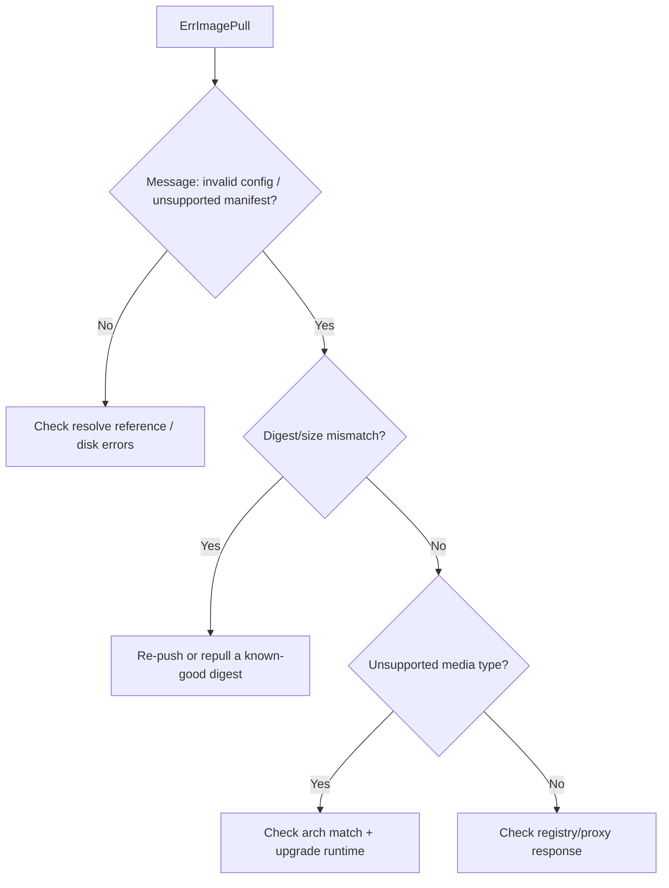

# Invalid Image Configuration

> **Severity:** Medium · **Typical recovery time:** 10–30 min · **Affected versions:** 1.20+

## Error Message

```text
failed to pull and unpack image "registry.example.com/app:bad": invalid image
configuration: ... unexpected media type / unsupported manifest
```

```text
... mismatched image rootfs and manifest layers / config digest mismatch
```

## Description

containerd downloaded the image manifest and config blob but could not validate
or interpret them. This happens when the manifest media type is one containerd
does not support, the config/layer digests do not match (corruption or a broken
push), or the registry returned HTML/JSON that is not a valid image. The kubelet
shows `ErrImagePull` even though the registry responded — the bytes are simply
not a usable image for this runtime.

Operationally this points at the *image itself or the registry*, not at the
node. It is distinct from "no space" (disk) and "failed to resolve reference"
(auth/lookup). A frequent variant is pulling a multi-arch index where no entry
matches the node's platform.

## Affected Kubernetes Versions

All containerd/CRI-O clusters. Older containerd (1.4.x) rejects some newer OCI
1.1 artifact media types (e.g. attestation/SBOM manifests pushed alongside
images); upgrading the runtime resolves those. Behaviour is otherwise
version-independent.

## Likely Root Causes

- Corrupt push or partial layer upload (digest/size mismatch)
- Unsupported or non-image manifest media type (artifact/SBOM/attestation)
- Multi-arch image index with no manifest matching the node platform
- Registry/proxy returning an error page instead of the manifest
- Runtime too old to understand a newer OCI image spec feature

## Diagnostic Flow



## Verification Steps

Confirm the error names `invalid image configuration` or `unsupported manifest`
(not a 401/404 or disk error). Inspect the image reference and intended platform.

## kubectl Commands

```bash
kubectl describe pod <pod> -n <namespace>
kubectl get events -n <namespace> --sort-by=.lastTimestamp
kubectl get pod <pod> -n <namespace> -o jsonpath='{.spec.containers[*].image}'
# On the affected node (read-only):
crictl images
crictl inspect <container-id>
journalctl -u containerd --since "10 min ago" --no-pager | grep -i manifest
```

## Expected Output

```text
  Warning  Failed  9s  kubelet  Failed to pull image
  "registry.example.com/app:bad": rpc error: code = Unknown desc = failed to
  pull and unpack image "...": unsupported media type
  application/vnd.oci.empty.v1+json
  Warning  Failed  9s  kubelet  Error: ErrImagePull
```

## Common Fixes

1. Rebuild and re-push the image cleanly so manifest/config/layer digests are
   consistent; reference the new tag or digest.
2. Ensure the image (or index) includes the node's architecture/OS; build a
   proper multi-arch manifest if nodes are mixed.
3. Upgrade containerd/CRI-O so it understands newer OCI media types, or stop
   pulling non-image artifacts as if they were images.

## Recovery Procedures

1. Fix the image in the registry and let the kubelet retry — no node disruption.
2. If a corrupt layer was cached, restarting containerd clears its content
   store cache so it re-fetches — **node-wide blast radius** (all containers
   recreated); drain first. Usually a re-push avoids this.
3. For a runtime-version gap, upgrade the runtime via node management (rolling).

## Validation

`crictl images` lists the image; the pod pulls and reaches `Running`; no further
`ErrImagePull` / `invalid image configuration` events.

## Prevention

- Verify images in CI (`docker buildx imagetools inspect` / cosign) before
  promotion.
- Use immutable digests for production references.
- Keep runtime versions current to support new OCI media types.

## Related Errors

- [Failed To Pull And Unpack Image](failed-to-pull-and-unpack-image.md)
- [Exec Format Error (Wrong Arch)](exec-format-error.md)
- [ImageInspectError](../pods/imageinspecterror.md)
- [InvalidImageName](../pods/invalidimagename.md)

## References

- [Kubernetes: Images](https://kubernetes.io/docs/concepts/containers/images/)
- [containerd CRI configuration](https://github.com/containerd/containerd/blob/main/docs/cri/config.md)

## Further Reading

- [Free Kubernetes config validators](https://devopsaitoolkit.com/validators/)
