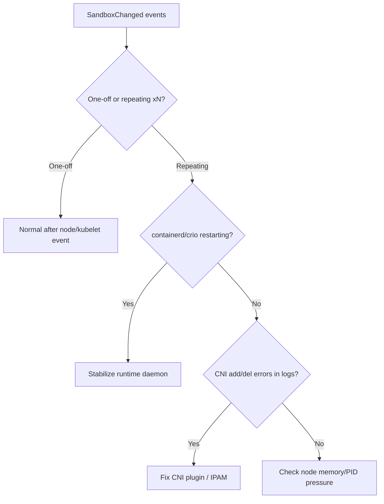

# Pod Sandbox Changed

> **Severity:** Medium · **Typical recovery time:** 5–30 min · **Affected versions:** 1.20+

## Error Message

```text
Pod sandbox changed, it will be killed and re-created.
```

```text
Normal  SandboxChanged  2s (x12 over 4m)  kubelet  Pod sandbox changed,
it will be killed and re-created.
```

## Description

Each pod has a sandbox (the `pause` container holding its namespaces). The
kubelet expects exactly one healthy sandbox per pod; if the sandbox it tracked
is gone or unhealthy, it logs `Pod sandbox changed` and recreates it, then
restarts the pod's containers. A single occurrence after a node event is normal.
**Repeated** `SandboxChanged` events — especially with `(xN over Ndm)` — mean
sandboxes are dying in a loop, which manifests as containers restarting and
intermittent connectivity even though the app itself is fine.

In an incident, a flapping sandbox almost always points at the runtime or CNI:
containerd restarting, the CNI plugin failing teardown/setup, or OOM killing the
pause container. It frequently accompanies `ContainerCreating` churn and brief
network drops.

## Affected Kubernetes Versions

All containerd/CRI-O clusters. Behaviour is stable across versions; the event
reason is `SandboxChanged`. CNI teardown/setup races are the usual repeat-cause
regardless of version.

## Likely Root Causes

- containerd/CRI-O restarting (e.g. config reloads, OOM) invalidating sandboxes
- CNI plugin failing to ADD/DEL the network, causing repeated sandbox recreation
- Node resource pressure (memory/PID) killing the pause container
- `pause` image GC'd or unavailable so the sandbox can't be re-established
- Frequent kubelet restarts re-reconciling pod state

## Diagnostic Flow



## Verification Steps

Check whether the event repeats (the `(xN over Ndm)` counter). Correlate the
timestamps with containerd/CRI-O restarts or CNI errors on the node.

## kubectl Commands

```bash
kubectl describe pod <pod> -n <namespace>
kubectl get events -n <namespace> --sort-by=.lastTimestamp | grep -i SandboxChanged
kubectl describe node <node> | grep -A5 Conditions
# On the affected node (read-only):
crictl ps -a
crictl images | grep pause
journalctl -u containerd --since "30 min ago" --no-pager
systemctl status containerd
```

## Expected Output

```text
  Normal   SandboxChanged   3s (x15 over 6m)  kubelet  Pod sandbox changed,
  it will be killed and re-created.
  Warning  FailedCreatePodSandBox  2s  kubelet  Failed to create pod sandbox:
  rpc error: ... plugin type="cilium" failed (add): ...
```

## Common Fixes

1. Stabilize the runtime: stop containerd/CRI-O from restart-looping (fix
   config.toml / crio.conf, relieve OOM) so sandboxes persist.
2. Repair the CNI: fix the plugin DaemonSet, IPAM exhaustion, or conflist so
   ADD/DEL succeed reliably.
3. Relieve node pressure (memory/PID) and pre-pull/pin the `pause` image so it
   is never GC'd.

## Recovery Procedures

1. Fix the underlying CNI or runtime cause; the sandbox churn stops once
   recreation succeeds — usually no extra action.
2. If the runtime is restart-looping, restarting it cleanly after fixing config
   is **node-wide blast radius** (all containers recreated) — drain first for
   stateful workloads.
3. For persistent CNI faults, roll the CNI DaemonSet (networking pods only) or,
   as a last resort, cordon/drain the node — **all pods reschedule.**

## Validation

`SandboxChanged` events stop incrementing; the pod stays `Running` with a stable
sandbox in `crictl ps`; connectivity is steady.

## Prevention

- Alert on `SandboxChanged` rate and on containerd/CRI-O restart counts.
- Keep CNI healthy with IPAM headroom and validated config rollouts.
- Pin the `pause` image and keep node memory/PID limits from being exceeded.

## Related Errors

- [Failed To Create Pod Sandbox (Runtime)](failed-to-create-pod-sandbox-runtime.md)
- [containerd Connection Refused](containerd-connection-refused.md)
- [NetworkPluginNotReady](../pods/networkpluginnotready.md)
- [ContainerCreating stuck](../pods/containercreating-stuck.md)

## References

- [Kubernetes: Pod lifecycle](https://kubernetes.io/docs/concepts/workloads/pods/pod-lifecycle/)
- [containerd CRI configuration](https://github.com/containerd/containerd/blob/main/docs/cri/config.md)

## Further Reading

- [DevOps AI ToolKit — Kubernetes guides](https://devopsaitoolkit.com/blog/)
