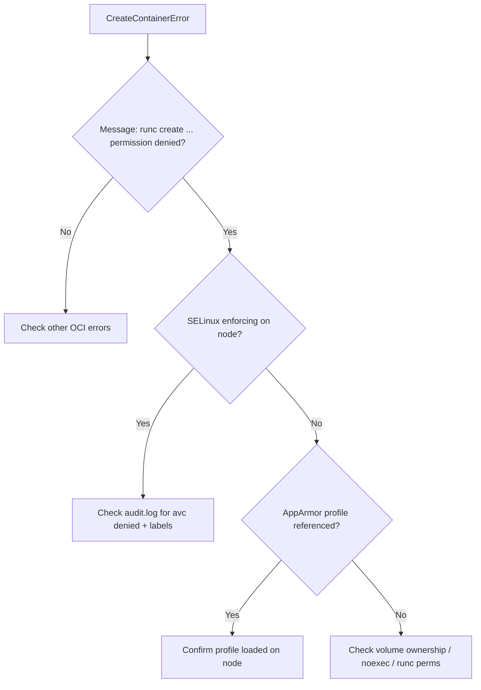

# runc Create Permission Denied

> **Severity:** High · **Typical recovery time:** 10–45 min · **Affected versions:** 1.20+

## Error Message

```text
OCI runtime create failed: runc create failed: unable to start container
process: error during container init: open /proc/self/fd/... : permission denied
```

```text
runc create failed: ... rootfs_linux.go: ... permission denied
```

## Description

`runc` (invoked by the containerd/CRI-O shim) failed during container
*initialization* because the kernel denied an operation: mounting the rootfs,
opening a device, writing a cgroup, or executing the entrypoint. "Permission
denied" almost always points to a mandatory access control layer (SELinux or
AppArmor) or a filesystem permission/ownership problem, not to RBAC. The pod
ends up in `CreateContainerError` / `RunContainerError`.

During an incident this is a host security/posture problem: a node was hardened,
SELinux flipped to enforcing, an AppArmor profile changed, or a mounted volume
has the wrong labels/ownership for the container's user.

## Affected Kubernetes Versions

All clusters using runc via containerd or CRI-O. AppArmor moved from the
`container.apparmor.security.beta.kubernetes.io` annotation to the native
`securityContext.appArmorProfile` field (beta in 1.30); a referenced profile
that is not loaded on the node causes init failures. SELinux relabeling
(`seLinuxOptions`) behaviour applies on RHEL/OpenShift nodes.

## Likely Root Causes

- SELinux enforcing with wrong volume/context labels (`avc: denied` in audit log)
- AppArmor profile referenced by the pod is not loaded on the node
- Mounted hostPath/volume with ownership/permissions the container user can't use
- `runc` binary not executable or noexec mount on the runtime state dir
- Read-only root filesystem combined with a path the init needs to write

## Diagnostic Flow



## Verification Steps

Confirm the failure is at `runc create` init time with `permission denied`.
Check the node's SELinux mode and whether any AppArmor profile named in the pod
spec exists on that node.

## kubectl Commands

```bash
kubectl describe pod <pod> -n <namespace>
kubectl get events -n <namespace> --sort-by=.lastTimestamp
kubectl get pod <pod> -n <namespace> -o jsonpath='{.spec.securityContext}'
kubectl get pod <pod> -n <namespace> -o jsonpath='{.spec.containers[*].securityContext}'
# On the affected node (read-only):
crictl inspect <container-id>
journalctl -u containerd --since "15 min ago" --no-pager
systemctl status containerd
```

## Expected Output

```text
  Warning  Failed  6s  kubelet  Error: failed to create containerd task:
  failed to create shim task: OCI runtime create failed: runc create failed:
  unable to start container process: error during container init:
  rootfs_linux.go:75: mounting "/var/lib/kubelet/pods/.../vol" ...
  caused: ... : permission denied: unknown
```

## Common Fixes

1. Fix SELinux: apply the correct `seLinuxOptions` in the pod or relabel the
   volume so the container context can access it (keep SELinux enforcing).
2. Load the referenced AppArmor profile on every node (via a DaemonSet/Machine
   config) or correct the profile name in the pod spec.
3. Correct volume ownership/permissions (use `fsGroup` / `runAsUser` matching
   the data) and ensure the runtime state dir is not mounted `noexec`.

## Recovery Procedures

1. Adjust the pod `securityContext` / volume settings and redeploy — no node
   restart needed for spec-level fixes.
2. If you must load profiles or change SELinux policy on the node, roll it out
   via your node-management layer; restarting containerd to clear stuck state is
   **node-wide blast radius** (all containers recreated) — drain first.
3. Avoid disabling SELinux/AppArmor cluster-wide as a "fix"; it removes a
   security boundary across every node.

## Validation

The pod reaches `Running`; `crictl ps` shows the container; the node audit log
shows no new `avc: denied` entries for the workload.

## Prevention

- Standardize SELinux contexts and AppArmor profiles in the node image.
- Validate `securityContext` and volume ownership in CI / admission policy.
- Test hardened nodes with representative workloads before fleet rollout.

## Related Errors

- [Failed To Create containerd Task](failed-to-create-containerd-task.md)
- [Volume Mount Permission Denied](../storage/volume-mount-permission-denied.md)
- [CreateContainerError](../pods/createcontainererror.md)
- [RunContainerError](../pods/runcontainererror.md)

## References

- [Kubernetes: Configure a security context for a pod or container](https://kubernetes.io/docs/tasks/configure-pod-container/security-context/)
- [containerd configuration documentation](https://github.com/containerd/containerd/blob/main/docs/cri/config.md)

## Further Reading

- [Free Kubernetes config validators](https://devopsaitoolkit.com/validators/)
