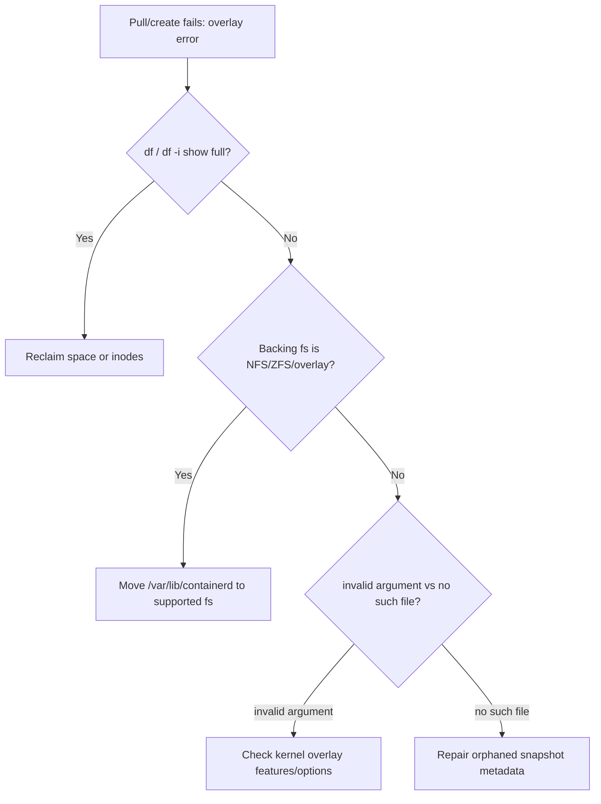

# Snapshotter overlayfs Error

> **Severity:** High · **Typical recovery time:** 15–60 min · **Affected versions:** 1.20+

## Error Message

```text
failed to prepare extraction snapshot "...": failed to mount /var/lib/containerd/
io.containerd.snapshotter.v1.overlayfs/...: failed to mount overlay:
invalid argument
```

```text
snapshotter error: failed to create snapshot: ... no such file or directory
```

## Description

containerd uses a *snapshotter* (overlayfs by default) to assemble each
container's root filesystem by stacking image layers as overlay mounts. When the
overlay mount fails, containerd cannot prepare the rootfs, so image unpacking or
container creation aborts. The kubelet surfaces this as image-pull or
`CreateContainerError`. Common kernel-level failures are `invalid argument`
(unsupported lower/upper combination, or backing filesystem like NFS/ZFS that
overlayfs rejects), `no such file or directory` (orphaned/corrupt snapshot
metadata), or running out of space/inodes.

This is a node storage-stack incident. It is closely related to "no space left
on device" but can also occur with plenty of free space when the underlying
filesystem or snapshot metadata is the problem.

## Affected Kubernetes Versions

All containerd clusters using the `overlayfs` snapshotter (the default). On
kernels without overlay-on-overlay support, nested setups fail. CRI-O's
equivalent is the `overlay` storage driver via containers/storage. The
`metacopy`/`userxattr` overlay options vary by kernel and can trigger
`invalid argument` on cgroup v2 / rootless setups.

## Likely Root Causes

- Backing filesystem incompatible with overlayfs (NFS, ZFS, some encrypted FS)
- Corrupt or orphaned snapshot metadata after an unclean containerd shutdown
- Image/snapshot filesystem out of space or out of inodes
- Kernel lacking required overlay features (`userxattr`, redirect_dir, metacopy)
- `/var/lib/containerd` on a volume mounted with incompatible options

## Diagnostic Flow



## Verification Steps

Confirm the message names `overlay` / `snapshotter`. Check free space *and*
inodes on the image filesystem, and identify the backing filesystem type.

## kubectl Commands

```bash
kubectl describe pod <pod> -n <namespace>
kubectl get events -n <namespace> --sort-by=.lastTimestamp
kubectl describe node <node> | grep -A5 Conditions
# On the affected node (read-only):
crictl images
crictl inspect <container-id>
journalctl -u containerd --since "20 min ago" --no-pager | grep -i overlay
systemctl status containerd
```

## Expected Output

```text
  Warning  Failed  7s  kubelet  Failed to pull image "...": rpc error:
  code = Unknown desc = failed to prepare extraction snapshot "extract-...":
  failed to mount /var/lib/containerd/io.containerd.snapshotter.v1.overlayfs/
  snapshots/42/fs: failed to mount overlay: invalid argument
```

## Common Fixes

1. Free image-filesystem space and inodes (image GC, log rotation) if the volume
   is full.
2. Put `/var/lib/containerd` on a local, overlay-compatible filesystem (ext4 /
   xfs with ftype=1); do not back it with NFS or unsupported ZFS configs.
3. For kernel-feature gaps, update the kernel or set the appropriate snapshotter
   options; consider the `native` snapshotter only as a fallback.

## Recovery Procedures

1. Reclaim space/inodes first — low blast radius, often resolves it immediately.
2. If snapshot metadata is corrupt, the safe repair is to drain the node and
   restart containerd so it rebuilds state —
   **`systemctl restart containerd` recreates every container on the node;
   node-wide blast radius.** Drain first.
3. For filesystem/kernel root causes, cordon, drain, and rebuild the node on a
   supported storage layout — **all pods reschedule.**

## Validation

Image pulls and container creation succeed; `crictl ps` lists containers; no new
overlay/snapshotter errors in the containerd journal.

## Prevention

- Standardize node storage on a supported, local filesystem for `/var/lib/containerd`.
- Keep kernels patched to versions with stable overlayfs support.
- Monitor both free space and free inodes on the image filesystem.

## Related Errors

- [Image Filesystem No Space](image-filesystem-no-space.md)
- [Failed To Create containerd Task](failed-to-create-containerd-task.md)
- [Failed To Pull And Unpack Image](failed-to-pull-and-unpack-image.md)
- [Node DiskPressure](../nodes/node-diskpressure.md)

## References

- [Kubernetes: Container runtimes](https://kubernetes.io/docs/setup/production-environment/container-runtimes/)
- [containerd snapshotters / ops documentation](https://github.com/containerd/containerd/blob/main/docs/ops.md)

## Further Reading

- [DevOps AI ToolKit — Kubernetes guides](https://devopsaitoolkit.com/blog/)
