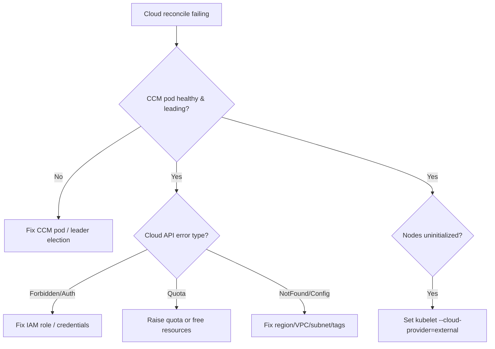

# Cloud Provider Error

> **Severity:** High · **Typical recovery time:** 15–60 min · **Affected versions:** 1.20+

## Error Message

```text
E0629 13:02:55.771  controller.go: failed to ensure load balancer for service
    shop/checkout-lb: googleapi: Error 403: Required 'compute.forwardingRules.create'
    permission ... forbidden
E0629 13:03:10.118  route_controller.go: Could not create route 10.244.3.0/24 for
    node worker-3: error creating route: ... AuthFailure
```

## Description

In modern clusters cloud-specific reconciliation moved out of
kube-controller-manager into the cloud-controller-manager (CCM). The CCM runs the
service controller (provisions external load balancers for `type=LoadBalancer`),
the route controller (programs pod-CIDR routes in the VPC), and the node
controller (labels/initializes nodes and removes deleted instances). A
"cloud provider error" means the CCM called the cloud API and was rejected —
usually IAM/permissions, quota, or a misconfigured provider. The user-visible
symptoms are LoadBalancer Services stuck `<pending>`, cross-node pod traffic
failing where routes are required, or new nodes stuck with the
`node.cloudprovider.kubernetes.io/uninitialized` taint.

## Affected Kubernetes Versions

Applies to 1.20+. In-tree cloud providers were deprecated and removed across
1.26–1.31, so external CCM is now standard. The taint
`node.cloudprovider.kubernetes.io/uninitialized` and the
`--cloud-provider=external` kubelet flag apply to all CCM-based clusters.

## Likely Root Causes

- Missing/expired cloud IAM permissions or credentials on the CCM
- Cloud quota exhausted (no more load balancers, forwarding rules, or routes)
- Misconfigured provider settings (wrong region, VPC, subnet, cluster tags)
- Nodes never initialized — kubelet missing `--cloud-provider=external`
- CCM pod down, crash-looping, or not holding its leader lease

## Diagnostic Flow



## Verification Steps

Identify which CCM sub-controller failed (service, route, or node) and read the
exact cloud API error code.

## kubectl Commands

```bash
kubectl get pods -n kube-system -l k8s-app=cloud-controller-manager -o wide
kubectl logs -n kube-system -l k8s-app=cloud-controller-manager --tail=200
kubectl get svc -A --field-selector spec.type=LoadBalancer
kubectl describe svc checkout-lb -n shop
kubectl get nodes -o wide
kubectl describe node worker-3 | grep -i "taint\|provider"
```

## Expected Output

```text
$ kubectl describe svc checkout-lb -n shop
Events:
  Warning  SyncLoadBalancerFailed  service controller  Error ensuring load
    balancer: googleapi: Error 403: ... compute.forwardingRules.create forbidden

$ kubectl describe node worker-3 | grep -i taint
Taints:  node.cloudprovider.kubernetes.io/uninitialized:NoSchedule
```

## Common Fixes

1. Grant the CCM the missing cloud IAM permissions (LB, route, instance APIs)
   or refresh expired credentials/instance-profile.
2. Increase the exhausted cloud quota or delete unused load balancers/routes.
3. Correct provider config (region, VPC, subnet IDs, required cluster tags).
4. Set `--cloud-provider=external` on kubelets so the node controller can
   initialize and untaint new nodes.

## Recovery Procedures

1. Read CCM logs to classify the failure (auth vs. quota vs. config).
2. Fix the cloud-side issue (IAM/quota/config) — most CCM errors are external.
3. If the CCM manifest/config needs editing, update it and let it restart.
   **Disruptive:** restarting the CCM pauses LB/route/node reconciliation
   cluster-wide for the restart window; existing LBs and routes keep serving, but
   no new ones are programmed until it is back.
4. Re-trigger reconciliation by confirming the CCM re-lists Services and Nodes
   after credentials/quota are fixed (no mutation needed).

## Validation

LoadBalancer Services receive an external IP, new nodes lose the
`uninitialized` taint and schedule pods, and CCM logs show successful
`EnsuredLoadBalancer`/route-created events.

## Prevention

Scope CCM IAM least-privilege but complete, alert on cloud quota usage, pin
provider config in version control, ensure kubelets run with
`--cloud-provider=external`, and run the CCM HA with leader election.

## Related Errors

- [Controller Cannot Sync (Forbidden)](./controller-manager-forbidden.md)
- [Service Type LoadBalancer Pending](../services/service-loadbalancer-pending.md)
- [Node NetworkUnavailable](../nodes/node-networkunavailable.md)

## References

- [Kubernetes: Cloud Controller Manager](https://kubernetes.io/docs/concepts/architecture/cloud-controller/)
- [Kubernetes: Cloud provider integrations](https://kubernetes.io/docs/tasks/administer-cluster/running-cloud-controller/)

## Further Reading

- [DevOps AI ToolKit — Kubernetes guides](https://devopsaitoolkit.com/blog/)
