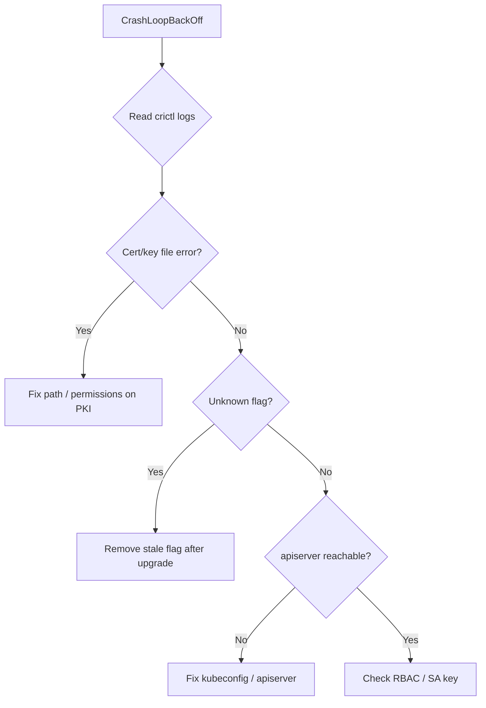

# kube-controller-manager CrashLoopBackOff

> **Severity:** Critical · **Typical recovery time:** 10–40 min · **Affected versions:** 1.20+

## Error Message

```text
$ kubectl get pods -n kube-system
NAME                              READY   STATUS             RESTARTS   AGE
kube-controller-manager-cp01      0/1     CrashLoopBackOff   6          8m

$ crictl logs <id>
F0629 12:14:02.118  controllermanager.go:289] error building controller context:
    failed to start certificate controller: open /etc/kubernetes/pki/ca.key:
    no such file or directory
```

## Description

The kube-controller-manager runs as a static pod managed by the kubelet on each
control-plane node. When it cannot complete startup it exits non-zero, the
kubelet restarts it, and after repeated failures the pod enters
CrashLoopBackOff. While crashing it cannot run the dozens of controllers it
owns (node lifecycle, ServiceAccount tokens, endpoints, replicaset, etc.), so
the cluster slowly stops reconciling desired state even though existing
workloads keep running. In single-master clusters this is a critical
control-plane outage.

## Affected Kubernetes Versions

Applies to all kubeadm/self-managed clusters on 1.20+. Flag names and required
files (signing keys, kubeconfig, service-account key) are stable across these
releases; managed providers hide the static pod, so you diagnose via provider
logs instead.

## Likely Root Causes

- Missing or unreadable cert/key (`ca.key`, `service-account.key`) referenced by flags
- Invalid flag or removed/renamed flag after an upgrade
- Cannot reach the apiserver (`--kubeconfig` wrong, apiserver down)
- RBAC misconfiguration preventing the controller-manager from authenticating
- Corrupted or mis-permissioned manifest / mounted hostPath

## Diagnostic Flow



## Verification Steps

Read the container logs to capture the fatal (`F`) line — that single message
almost always names the exact file, flag, or endpoint at fault.

## kubectl Commands

```bash
kubectl get pods -n kube-system -l component=kube-controller-manager -o wide
kubectl describe pod -n kube-system kube-controller-manager-cp01
crictl ps -a --name kube-controller-manager
crictl logs $(crictl ps -a --name kube-controller-manager -q | head -1)
journalctl -u kubelet --no-pager -n 200
ls -l /etc/kubernetes/pki/ /etc/kubernetes/controller-manager.conf
```

## Expected Output

```text
$ crictl ps -a --name kube-controller-manager
CONTAINER   STATE    NAME                       ATTEMPT
9a1f...     Exited   kube-controller-manager    6

$ crictl logs 9a1f...
F0629 12:14:02 controllermanager.go:289] error building controller context:
    failed to start service-account-token controller:
    error reading key for service account token controller: ... no such file
```

## Common Fixes

1. Restore the missing PKI file or fix its path/permissions to match the flag,
   then let the kubelet restart the pod.
2. Remove a flag that was deprecated/removed in the new minor version.
3. Repair `--kubeconfig` (`/etc/kubernetes/controller-manager.conf`) or restore
   apiserver reachability.
4. Re-issue the service-account signing key if it was lost or rotated.

## Recovery Procedures

1. Capture the fatal log line first; do not restart blindly.
2. Correct the underlying file/flag in
   `/etc/kubernetes/manifests/kube-controller-manager.yaml` or the referenced
   PKI/kubeconfig. **Disruptive:** saving the manifest makes the kubelet
   recreate the static pod; blast radius is that node's controller-manager.
3. In HA clusters, fix one node at a time so a healthy replica keeps the lease.
4. If a manifest was corrupted, regenerate it with
   `kubeadm init phase control-plane controller-manager` on an upgrade-host (run
   only on a node you intend to rebuild).

## Validation

Pod reports `1/1 Running` with stable `RESTARTS`, and
`kubectl get lease kube-controller-manager -n kube-system` shows an advancing
`renewTime` with controllers reconciling again.

## Prevention

Validate manifests in staging before upgrades, keep PKI backed up and
permissions correct, monitor static-pod restart counts, and read the changelog
for removed controller-manager flags before bumping minor versions.

## Related Errors

- [Leader Election Lost](./controller-manager-leaderelection-lost.md)
- [Controller Cannot Sync (Forbidden)](./controller-manager-forbidden.md)
- [API Server Connection Refused](../api-server/api-server-connection-refused.md)

## References

- [Kubernetes: kube-controller-manager reference](https://kubernetes.io/docs/reference/command-line-tools-reference/kube-controller-manager/)
- [Kubernetes: Debug a static pod](https://kubernetes.io/docs/tasks/configure-pod-container/static-pod/)

## Further Reading

- [DevOps AI ToolKit — Kubernetes guides](https://devopsaitoolkit.com/blog/)
