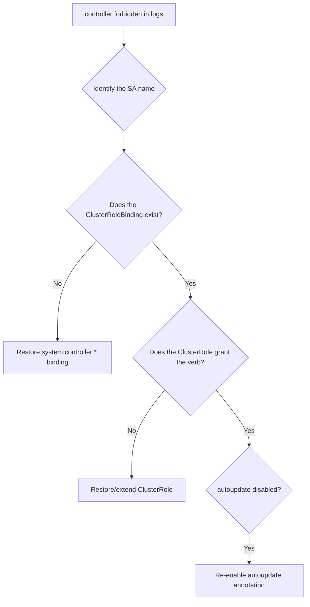

# Controller Cannot Sync (Forbidden)

> **Severity:** High · **Typical recovery time:** 10–30 min · **Affected versions:** 1.20+

## Error Message

```text
E0629 12:22:41.004  reflector.go:147] k8s.io/client-go/informers/factory.go:150:
    Failed to watch *v1.PersistentVolume: failed to list *v1.PersistentVolume:
    persistentvolumes is forbidden: User
    "system:serviceaccount:kube-system:pv-protection-controller" cannot list
    resource "persistentvolumes" in API group "" at the cluster scope
```

## Description

The kube-controller-manager runs each controller loop under a dedicated
ServiceAccount in `kube-system` (for example `endpoint-controller`,
`pv-protection-controller`, `node-controller`). Those SAs are normally granted
permissions by the `system:controller:*` ClusterRoles created at bootstrap. A
"forbidden" error means RBAC for one controller is missing or was overwritten,
so that single loop cannot list/watch the resources it manages. The symptom is
narrow but real: endpoints stop updating, PV protection finalizers stall, or
nodes are not reconciled, while the rest of the cluster looks healthy.

## Affected Kubernetes Versions

Applies to 1.20+ with the default `--use-service-account-credentials=true`,
which runs each controller as its own SA. The bootstrap `system:controller:*`
ClusterRoles and bindings are auto-reconciled by the apiserver unless their
`rbac.authorization.kubernetes.io/autoupdate` annotation was set to `false`.

## Likely Root Causes

- A `system:controller:*` ClusterRole/Binding was deleted or edited
- Autoupdate disabled, so the apiserver no longer restores the default RBAC
- `--use-service-account-credentials=true` but the controller SA is missing
- A custom/aggregated controller lacking the right ClusterRole
- An admission webhook or policy stripping permissions on the SA

## Diagnostic Flow



## Verification Steps

Extract the exact SA and resource from the error, then use `auth can-i` with
`--as` to confirm the permission is genuinely denied.

## kubectl Commands

```bash
kubectl logs -n kube-system kube-controller-manager-cp01 | grep -i forbidden
kubectl auth can-i list persistentvolumes \
  --as=system:serviceaccount:kube-system:pv-protection-controller
kubectl get clusterrole system:controller:pv-protection-controller -o yaml
kubectl get clusterrolebinding system:controller:pv-protection-controller -o yaml
kubectl get sa -n kube-system | grep controller
kubectl get clusterrole -l kubernetes.io/bootstrapping=rbac-defaults
```

## Expected Output

```text
$ kubectl auth can-i list persistentvolumes \
    --as=system:serviceaccount:kube-system:pv-protection-controller
no

$ kubectl get clusterrolebinding system:controller:pv-protection-controller
Error from server (NotFound): clusterrolebindings.rbac.authorization.k8s.io
    "system:controller:pv-protection-controller" not found
```

## Common Fixes

1. Recreate the missing default `system:controller:*` ClusterRole and binding
   (kubeadm/apiserver will reconcile them when autoupdate is on).
2. Restore the `rbac.authorization.kubernetes.io/autoupdate: "true"` annotation
   so the apiserver auto-heals default RBAC on restart.
3. Create the controller's ServiceAccount in `kube-system` if it was deleted.
4. For a custom controller, bind it to a ClusterRole that grants the needed verbs.

## Recovery Procedures

1. Map the SA from the log line to its expected `system:controller:*` role.
2. Restore default RBAC. **Disruptive:** if you restart the apiserver to force
   reconciliation of bootstrap RBAC, blast radius is the control plane on that
   node — prefer simply recreating the objects, which is non-disruptive.
3. For HA, apply RBAC once (cluster-scoped) — no per-node action is needed.
4. After restoring, confirm the controller's informer resyncs (forbidden errors
   stop in the logs).

## Validation

`kubectl auth can-i ... --as=<controller SA>` returns `yes`, the forbidden lines
disappear from the controller-manager log, and the affected objects (endpoints,
PVs, nodes) start reconciling.

## Prevention

Never edit or delete `system:controller:*` roles, keep RBAC autoupdate enabled,
treat default ClusterRoles as managed, and review admission policies so they do
not strip system ServiceAccount permissions.

## Related Errors

- [kube-controller-manager CrashLoopBackOff](./controller-manager-crashloopbackoff.md)
- [ServiceAccount Controller No Tokens](./serviceaccount-controller-no-tokens.md)
- [Forbidden — ServiceAccount Cannot Act](../rbac/forbidden-serviceaccount.md)

## References

- [Kubernetes: Using RBAC Authorization](https://kubernetes.io/docs/reference/access-authn-authz/rbac/)
- [Kubernetes: Controller manager service accounts](https://kubernetes.io/docs/reference/access-authn-authz/service-accounts-admin/)

## Further Reading

- [DevOps AI ToolKit — Kubernetes guides](https://devopsaitoolkit.com/blog/)
