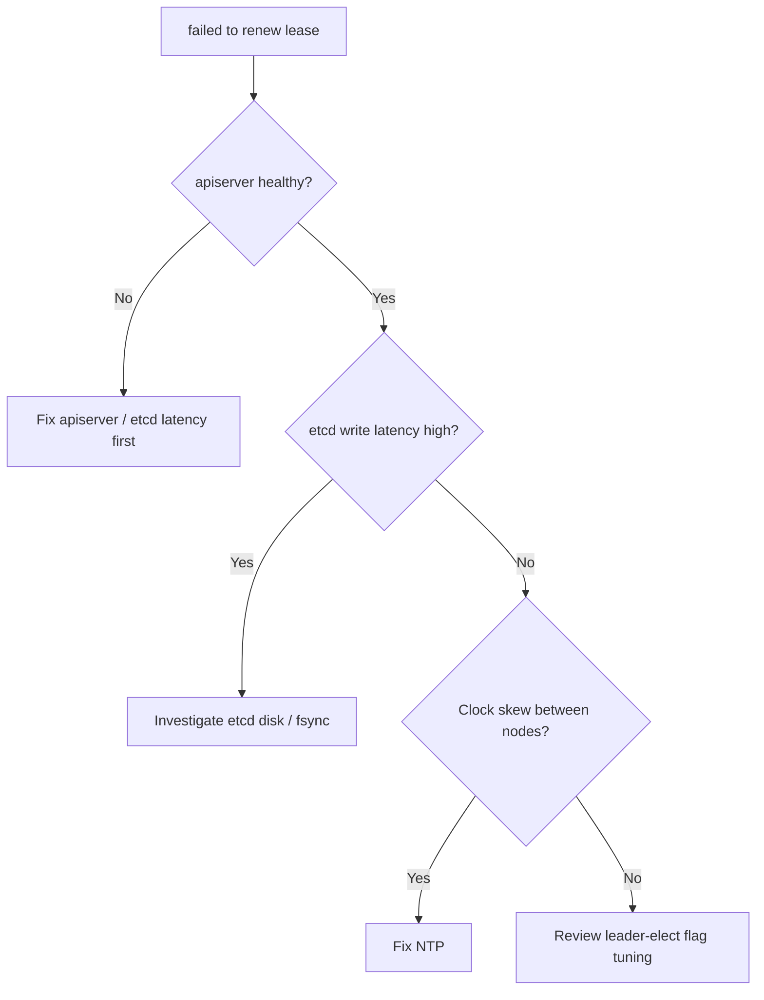

# Leader Election Lost

> **Severity:** High · **Typical recovery time:** 5–20 min · **Affected versions:** 1.20+

## Error Message

```text
E0629 12:01:14.882  leaderelection.go:367] Failed to update lock: Operation cannot be
    fulfilled on leases.coordination.k8s.io "kube-controller-manager": the object has
    been modified; please apply your changes to the latest version and try again
E0629 12:01:14.883  leaderelection.go:308] error retrieving resource lock
    kube-system/kube-controller-manager: ... failed to renew lease
    kube-system/kube-controller-manager: timed out waiting for the condition
I0629 12:01:14.883  leaderelection.go:285] failed to renew lease, stopping leading
```

## Description

The kube-controller-manager runs as an active/standby set across control-plane
nodes and uses a `Lease` object in `kube-system` to elect a single active
instance. The leader must renew that lease before `--leader-elect-lease-duration`
expires. When renewal fails, the leader voluntarily stops controlling and exits,
expecting another replica to take over. If renewal keeps failing cluster-wide,
no controller loops run: nodes are not reconciled, endpoints go stale, and
Deployments stop progressing. During an incident this usually points at the
apiserver or etcd being slow, not at the controller-manager itself.

## Affected Kubernetes Versions

Applies to 1.20+. Since 1.17 the default lock uses the `coordination.k8s.io`
`Lease` API rather than endpoints/configmaps. Defaults are 15s lease duration,
10s renew deadline, 2s retry period; the flags are
`--leader-elect-lease-duration`, `--leader-elect-renew-deadline`,
`--leader-elect-retry-period`.

## Likely Root Causes

- Slow or overloaded apiserver/etcd (lease writes exceed the renew deadline)
- Network latency or packet loss between the control-plane node and apiserver
- Clock skew between control-plane nodes affecting lease timing
- Aggressively tuned (too-short) lease/renew flags
- An apiserver restart or rollout during the renew window

## Diagnostic Flow



## Verification Steps

Confirm the lease is genuinely failing to renew and identify which node held
leadership and whether a standby took over.

## kubectl Commands

```bash
kubectl get lease kube-controller-manager -n kube-system -o yaml
kubectl get events -n kube-system --sort-by=.lastTimestamp | grep -i leader
kubectl get --raw='/healthz/etcd'
kubectl get pods -n kube-system -l component=kube-controller-manager -o wide
crictl logs $(crictl ps -a --name kube-controller-manager -q | head -1)
journalctl -u kubelet --no-pager -n 200
```

## Expected Output

```text
$ kubectl get lease kube-controller-manager -n kube-system -o yaml
spec:
  holderIdentity: cp02_8f3c...
  leaseDurationSeconds: 15
  renewTime: "2026-06-29T12:00:59.882Z"   # stale vs. now → renewal lagging

$ kubectl get events -n kube-system | grep -i leader
LeaderElection  cp01_1a2b stopped leading kube-controller-manager
LeaderElection  cp02_8f3c became leader
```

## Common Fixes

1. Restore apiserver/etcd performance — the lease lives in etcd, so etcd fsync
   latency or an overloaded apiserver is the usual culprit.
2. Fix clock skew by ensuring NTP/chrony is synced on all control-plane nodes.
3. Resolve control-plane network latency or MTU/packet-loss issues.
4. Revert overly aggressive `--leader-elect-*` tuning back to defaults.

## Recovery Procedures

1. Confirm a standby took over (`holderIdentity` changed and events show
   `became leader`); if so, controllers are running again with no action.
2. If no replica holds the lease, address the underlying apiserver/etcd outage —
   the controller-manager cannot lead until writes succeed.
3. If a single node is wedged, let the kubelet restart the static pod after you
   correct the manifest. **Disruptive:** editing
   `/etc/kubernetes/manifests/kube-controller-manager.yaml` recreates the static
   pod; blast radius is that node's controller-manager only, harmless in HA but a
   brief control-loop gap in single-master clusters.

## Validation

`kubectl get lease kube-controller-manager -n kube-system` shows a fresh
`renewTime` advancing every few seconds, and controller loops resume (new pods
schedule, endpoints update).

## Prevention

Run an HA control plane, monitor etcd fsync and apiserver request latency, keep
NTP synchronized, and avoid shortening leader-election timeouts below defaults
unless you have measured headroom.

## Related Errors

- [kube-controller-manager CrashLoopBackOff](./controller-manager-crashloopbackoff.md)
- [API Server etcd Request Timed Out](../api-server/api-server-etcd-request-timed-out.md)
- [API Server Connection Refused](../api-server/api-server-connection-refused.md)

## References

- [Kubernetes: kube-controller-manager reference](https://kubernetes.io/docs/reference/command-line-tools-reference/kube-controller-manager/)
- [Kubernetes: Leases](https://kubernetes.io/docs/concepts/architecture/leases/)

## Further Reading

- [DevOps AI ToolKit — Kubernetes guides](https://devopsaitoolkit.com/blog/)
