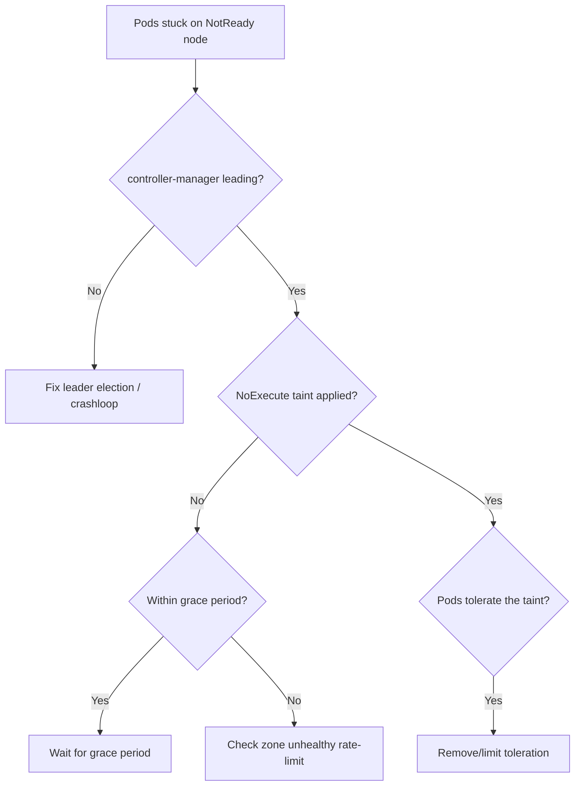

# Node Controller Not Evicting Pods

> **Severity:** High · **Typical recovery time:** 5–30 min · **Affected versions:** 1.20+

## Error Message

```text
$ kubectl get nodes
NAME       STATUS     ROLES    AGE   VERSION
worker-3   NotReady   <none>   40d   v1.29.4

# Node has been NotReady for >10m but its pods still show Running and are not
# rescheduled. No NoExecute taint is being applied by the node controller:
$ kubectl describe node worker-3 | grep -i taint
Taints:   node.kubernetes.io/unreachable:NoSchedule   # NoSchedule only, no NoExecute
```

## Description

The node lifecycle controller inside kube-controller-manager watches node
health. When a node goes `NotReady`/unreachable it applies the
`node.kubernetes.io/unreachable` or `not-ready` taint with `NoExecute`, and the
taint-based eviction logic then deletes pods after their toleration period
(default 300s) so workloads reschedule elsewhere. If eviction never happens,
pods stay bound to a dead node — Services keep routing to unreachable endpoints
and StatefulSet/Deployment replicas are not replaced. This is commonly caused by
the controller-manager not leading, eviction being rate-limited, or pods
tolerating the taint forever.

## Affected Kubernetes Versions

Applies to 1.20+ where `TaintBasedEvictions` is GA and always on. Behaviour is
governed by `--node-monitor-grace-period`, `--node-monitor-period`, and the
large-cluster rate-limit flags (`--node-eviction-rate`,
`--secondary-node-eviction-rate`, `--unhealthy-zone-threshold`,
`--large-cluster-size-threshold`).

## Likely Root Causes

- kube-controller-manager is down / not holding the leader lease
- Pods have `tolerations` for the taint with no or very long `tolerationSeconds`
- Eviction is rate-limited because too large a fraction of a zone is unhealthy
- `--node-monitor-grace-period` not yet elapsed (still within grace window)
- Node controller cannot reach the apiserver to apply the NoExecute taint

## Diagnostic Flow



## Verification Steps

Confirm how long the node has been NotReady, whether the NoExecute taint exists,
and whether the stuck pods tolerate it.

## kubectl Commands

```bash
kubectl get nodes -o wide
kubectl describe node worker-3 | grep -A3 -i taint
kubectl get pods -A --field-selector spec.nodeName=worker-3 -o wide
kubectl get pod <pod> -n <ns> -o jsonpath='{.spec.tolerations}'
kubectl get lease kube-controller-manager -n kube-system
kubectl logs -n kube-system kube-controller-manager-cp01 | grep -i "node\|evict\|taint"
```

## Expected Output

```text
$ kubectl get pod web-0 -n shop -o jsonpath='{.spec.tolerations}'
[{"key":"node.kubernetes.io/unreachable","operator":"Exists",
  "effect":"NoExecute"}]            # no tolerationSeconds → never evicted

$ kubectl logs -n kube-system kube-controller-manager-cp01 | grep -i evict
controller_utils.go: Pods on node worker-3 not evicted: zone unhealthy,
    eviction rate limited (secondary-node-eviction-rate)
```

## Common Fixes

1. Restore the controller-manager / leader election so the node controller runs.
2. Remove or cap the pod's NoExecute toleration with a sane `tolerationSeconds`.
3. Wait out `--node-monitor-grace-period` if the node only just went NotReady.
4. Recover enough nodes in the zone so eviction is no longer rate-limited.

## Recovery Procedures

1. Verify the controller-manager is healthy and leading before anything else.
2. If the node is genuinely dead and you must move workloads now, cordon and
   delete its pods. **Disruptive:** `kubectl delete pod --field-selector
   spec.nodeName=worker-3` forces rescheduling; blast radius is every workload on
   that node and any clients mid-request — do it deliberately, not reflexively.
3. For a flapping zone, fix node networking/kubelet first; mass eviction during a
   zone-wide outage can overload remaining nodes.

## Validation

The NotReady node carries a `NoExecute` taint, its pods are deleted after the
toleration period, and replacements schedule on healthy nodes
(`kubectl get pods -A -o wide`).

## Prevention

Keep an HA control plane, avoid blanket `NoExecute` tolerations without
`tolerationSeconds`, tune monitor/eviction flags for cluster size, and alert on
nodes NotReady longer than the grace period.

## Related Errors

- [Leader Election Lost](./controller-manager-leaderelection-lost.md)
- [Node NotReady](../nodes/nodenotready.md)
- [NoExecute Taint Evicting Pods](../nodes/node-noexecute-taint-evicting.md)

## References

- [Kubernetes: Taint-based evictions](https://kubernetes.io/docs/concepts/scheduling-eviction/taint-and-toleration/#taint-based-evictions)
- [Kubernetes: Node controller](https://kubernetes.io/docs/concepts/architecture/nodes/#node-controller)

## Further Reading

- [DevOps AI ToolKit — Kubernetes guides](https://devopsaitoolkit.com/blog/)
