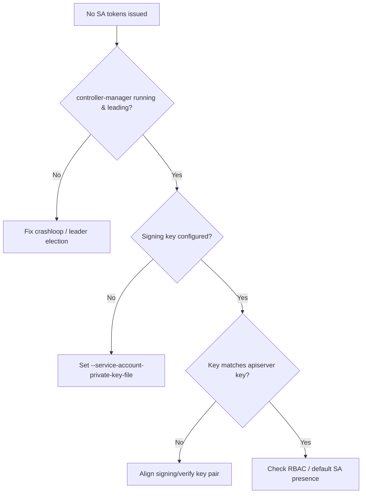

# ServiceAccount Controller No Tokens

> **Severity:** High · **Typical recovery time:** 10–30 min · **Affected versions:** 1.20+

## Error Message

```text
$ kubectl create token default
error: failed to create token: serviceaccounts "default" is forbidden: ... 
# or, on older legacy-token clusters:
Warning  FailedCreate  pod/web  Error creating: pods "web" is forbidden:
    error looking up service account default/default: serviceaccount
    "default" not found / no API token secret generated

# kube-controller-manager log:
E0629 12:40:11.220  serviceaccounts_controller.go: error creating token for
    service account: no signing key configured (service-account-private-key-file)
```

## Description

Two controllers inside kube-controller-manager handle ServiceAccount identity:
the ServiceAccount controller (ensures a `default` SA exists per namespace) and
the token controller (signs JWTs and, on legacy clusters, populates token
Secrets). Both require `--service-account-private-key-file` to be set with a key
that matches the apiserver's `--service-account-key-file`. If the signing key is
missing or mismatched, no usable tokens are issued: pods fail to mount
credentials, the `TokenRequest` API fails, and workloads cannot authenticate to
the apiserver. This blocks new pods that need API access cluster-wide.

## Affected Kubernetes Versions

Applies to 1.20+. Since 1.22 the bound `TokenRequest` API and projected volumes
are the default; auto-generated long-lived token Secrets are deprecated (1.24+
no longer creates them automatically). The signing key flag and key/key-file
pairing requirement are unchanged.

## Likely Root Causes

- `--service-account-private-key-file` missing/unreadable in the manifest
- Signing key does not match the apiserver's verification key
- ServiceAccount controller not running (controller-manager crashloop/no leader)
- Default SA missing in a namespace and not being recreated
- RBAC preventing the controller from creating tokens/secrets

## Diagnostic Flow



## Verification Steps

Confirm the `default` SA exists, that `TokenRequest` works, and that the
controller-manager has a signing key.

## kubectl Commands

```bash
kubectl get sa default -n default
kubectl create token default -n default --dry-run=client
kubectl get pods -n kube-system -l component=kube-controller-manager
kubectl logs -n kube-system kube-controller-manager-cp01 | grep -i "token\|signing\|service account"
crictl logs $(crictl ps -a --name kube-controller-manager -q | head -1) 2>&1 | grep -i sign
grep service-account /etc/kubernetes/manifests/kube-controller-manager.yaml
```

## Expected Output

```text
$ kubectl create token default -n default
error: failed to create token: serviceaccounts "default" not found

$ grep service-account /etc/kubernetes/manifests/kube-controller-manager.yaml
    # (no --service-account-private-key-file line present)

$ kubectl logs -n kube-system kube-controller-manager-cp01 | grep -i sign
serviceaccounts_controller.go: no signing key, token controller disabled
```

## Common Fixes

1. Add `--service-account-private-key-file=/etc/kubernetes/pki/sa.key` to the
   controller-manager manifest so the token controller starts.
2. Ensure the controller-manager key matches the apiserver's
   `--service-account-key-file` (apiserver verifies what the CM signs).
3. Restore controller-manager health if it is crash-looping or has no leader.
4. Recreate a missing `default` ServiceAccount; the controller repopulates it.

## Recovery Procedures

1. Inspect the manifest and PKI to confirm the signing key path and permissions.
2. Edit `/etc/kubernetes/manifests/kube-controller-manager.yaml` to point at the
   correct `sa.key`. **Disruptive:** the kubelet recreates the static pod on
   save; blast radius is that node's controller-manager (brief token-issuance gap
   in single-master clusters).
3. If you rotate the signing key, you must also update the apiserver's
   verification keys and accept that previously issued tokens become invalid —
   plan this as a maintenance action, not an ad-hoc fix.

## Validation

`kubectl create token default` returns a JWT, new pods mount their projected
service-account token, and the controller-manager log shows no signing errors.

## Prevention

Back up the `sa.key`/`sa.pub` pair, keep signing and verification keys in sync
across the control plane, monitor the controller-manager for token errors, and
migrate workloads off legacy long-lived tokens to the bound TokenRequest API.

## Related Errors

- [kube-controller-manager CrashLoopBackOff](./controller-manager-crashloopbackoff.md)
- [Controller Cannot Sync (Forbidden)](./controller-manager-forbidden.md)
- [ServiceAccount Token Not Mounted](../rbac/serviceaccount-token-not-mounted.md)

## References

- [Kubernetes: Managing service accounts](https://kubernetes.io/docs/reference/access-authn-authz/service-accounts-admin/)
- [Kubernetes: Service account tokens](https://kubernetes.io/docs/concepts/security/service-accounts/)

## Further Reading

- [DevOps AI ToolKit — Kubernetes guides](https://devopsaitoolkit.com/blog/)
