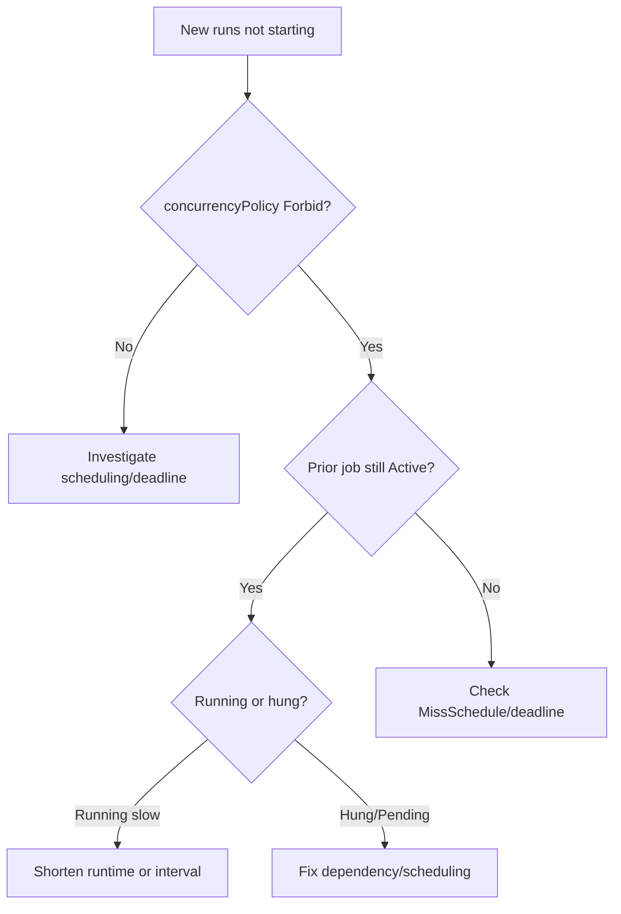

# CronJob ConcurrencyPolicy Forbid

> **Severity:** Medium · **Typical recovery time:** 10–45 min · **Affected versions:** 1.21+

## Error Message

```text
Normal  JobAlreadyActive  cronjob-controller  Not starting job because prior execution is still running and concurrencyPolicy is Forbid
```

## Description

With `spec.concurrencyPolicy: Forbid`, the CronJob controller refuses to start a
new run while the previous child Job is still active. The intent is to prevent
overlapping executions (e.g. a backup that must never run twice at once). When
the prior run consistently overruns the schedule interval, every new tick is
skipped, and the CronJob effectively stops producing fresh runs.

This is correct behaviour, but the symptom — "my hourly job hasn't run in
hours" — looks like an outage. The real problem is almost always a *slow or hung
previous Job* that never finishes, so `Forbid` keeps blocking the next start.

## Affected Kubernetes Versions

batch/v1 CronJobs, v2 controller (1.21+). The three policies are `Allow`
(default), `Forbid`, and `Replace`. `Forbid` blocks; `Replace` cancels the
running Job and starts a new one. Semantics are stable across recent versions.

## Likely Root Causes

- Previous child Job runs longer than the schedule interval
- A hung previous Job (blocked on a lock or unresponsive dependency)
- Previous Job stuck because its Pods are Pending/unschedulable
- Schedule interval too short for the work involved
- A previous Job that never reaches a terminal state (no deadline set)

## Diagnostic Flow



## Verification Steps

Confirm the policy is `Forbid`, find the still-active prior Job, and determine
whether it is genuinely running or hung.

## kubectl Commands

```bash
kubectl get cronjob <cronjob> -n <namespace> -o jsonpath='{.spec.concurrencyPolicy}'
kubectl describe cronjob <cronjob> -n <namespace>
kubectl get jobs -n <namespace> -l cronjob-name=<cronjob> --sort-by=.metadata.creationTimestamp
kubectl get cronjob <cronjob> -n <namespace> -o jsonpath='{.status.active}'
kubectl logs -n <namespace> -l job-name=<active-job> --tail=50
```

## Expected Output

```text
Concurrency Policy:  Forbid
Active Jobs:         backup-28999440   # still running from a prior tick
Events:
  Normal  JobAlreadyActive  Not starting job because prior execution is
          still running and concurrencyPolicy is Forbid
```

## Common Fixes

1. Make the Job finish faster so it completes before the next tick
2. Add `activeDeadlineSeconds` so a hung Job fails instead of blocking forever
3. Lengthen the schedule interval to exceed the worst-case runtime
4. Switch to `concurrencyPolicy: Replace` if cancelling the old run is safe
5. Fix the dependency/scheduling that makes the prior Job hang

## Recovery Procedures

1. Inspect the active Job's logs to see whether it is progressing or stuck.
2. If it is genuinely hung, terminate it so the schedule can resume. **Deleting
   the active Job stops in-flight work** — blast radius is that one run; ensure
   partial work is safe to abandon or is idempotent on retry.
3. Add `activeDeadlineSeconds` to the `jobTemplate` so future hangs self-clear.
4. Confirm the next tick starts a fresh Job once no prior run is active.

## Validation

`status.active` is empty between runs, new child Jobs appear on schedule, and no
further `JobAlreadyActive` events accumulate.

## Prevention

- Always set `activeDeadlineSeconds` on the `jobTemplate` under `Forbid`
- Size the schedule interval above the p99 runtime
- Add internal timeouts so the Job never hangs indefinitely
- Choose `Replace` when the latest run matters more than completing the prior one
- Alert when `status.active` persists across multiple schedule ticks

## Related Errors

- [CronJob Missed Schedule](./cronjob-missed-schedule.md)
- [CronJob Jobs Piling Up](./cronjob-jobs-piling-up.md)
- [Job DeadlineExceeded](../jobs/job-deadlineexceeded.md)

## References

- [Concurrency policy](https://kubernetes.io/docs/concepts/workloads/controllers/cron-jobs/#concurrency-policy)
- [CronJob documentation](https://kubernetes.io/docs/concepts/workloads/controllers/cron-jobs/)

## Further Reading

- [DevOps AI ToolKit — Kubernetes guides](https://devopsaitoolkit.com/blog/)
