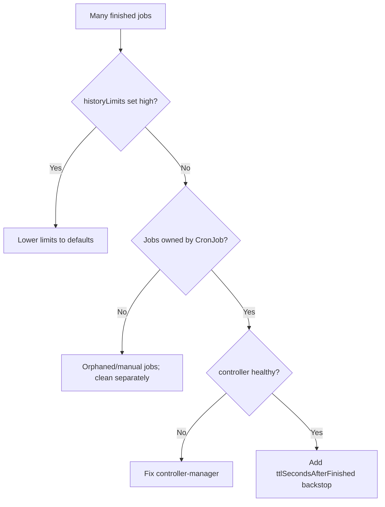

# CronJob Jobs Piling Up

> **Severity:** Low · **Typical recovery time:** 5–30 min · **Affected versions:** 1.21+

## Error Message

```text
completed jobs not pruned (historyLimit)
# Dozens/hundreds of <cronjob>-NNNNN Jobs and their Pods accumulate
```

## Description

A CronJob keeps a bounded history of finished child Jobs via
`successfulJobsHistoryLimit` (default `3`) and `failedJobsHistoryLimit`
(default `1`). The controller deletes older finished Jobs beyond those limits,
cascading to their Pods. When finished Jobs pile up far beyond these numbers,
something is preventing pruning — and the namespace fills with stale Jobs and
Pods, cluttering listings and consuming etcd objects.

This is a slow resource leak rather than an outage. It commonly appears when the
limits are set unusually high, set to a value that disables pruning, or when the
CronJob controller is unhealthy and not reconciling history.

## Affected Kubernetes Versions

batch/v1 CronJobs (1.21+). Defaults are `successfulJobsHistoryLimit: 3` and
`failedJobsHistoryLimit: 1`. Setting either explicitly high keeps more history;
the pruning is performed by the CronJob controller in kube-controller-manager.
`ttlSecondsAfterFinished` on the `jobTemplate` is a complementary cleanup path.

## Likely Root Causes

- `successfulJobsHistoryLimit`/`failedJobsHistoryLimit` set very high
- Manually-created Jobs (not owned by the CronJob) that history limits ignore
- CronJob controller unhealthy and not reconciling
- Orphaned Jobs whose `ownerReferences` to the CronJob were removed
- No `ttlSecondsAfterFinished` as a backstop, relying solely on history limits

## Diagnostic Flow



## Verification Steps

Count finished child Jobs, compare against the configured history limits, and
verify the Jobs are actually owned by the CronJob and the controller is healthy.

## kubectl Commands

```bash
kubectl get cronjob <cronjob> -n <namespace> \
  -o jsonpath='{.spec.successfulJobsHistoryLimit}{"\t"}{.spec.failedJobsHistoryLimit}'
kubectl get jobs -n <namespace> -l cronjob-name=<cronjob> --sort-by=.metadata.creationTimestamp
kubectl get jobs -n <namespace> -o jsonpath='{range .items[*]}{.metadata.name}{"\t"}{.metadata.ownerReferences[0].kind}{"\n"}{end}'
kubectl get pods -n kube-system -l component=kube-controller-manager
kubectl get jobs -n <namespace> | wc -l
```

## Expected Output

```text
3   1
NAME                 COMPLETIONS   AGE
report-28999440      1/1           41d
report-28999500      1/1           40d
# ...dozens more not being pruned -> ownerReferences missing or limits high
```

## Common Fixes

1. Lower `successfulJobsHistoryLimit`/`failedJobsHistoryLimit` to sensible values
2. Add `ttlSecondsAfterFinished` to the `jobTemplate` as a time-based backstop
3. Restore CronJob controller health if it is not reconciling
4. Clean up orphaned/manually-created Jobs separately (limits do not touch them)
5. Avoid setting history limits to extreme values

## Recovery Procedures

1. Confirm whether Jobs are owned by the CronJob and whether limits are high.
2. Lower the history limits on the CronJob spec; the controller then prunes
   excess owned Jobs automatically.
3. For orphaned Jobs the controller will not touch, prune them manually.
   **Deleting Jobs cascade-deletes their Pods and logs** — blast radius is the
   deleted Jobs; ensure logs are archived elsewhere before removing them.
4. Confirm the finished-Job count drops to within the configured limits.

## Validation

`kubectl get jobs -l cronjob-name=<cronjob>` shows no more than the configured
successful/failed history counts, and the total stops growing over time.

## Prevention

- Keep history limits at sane defaults (3 successful / 1 failed) unless needed
- Add `ttlSecondsAfterFinished` to the `jobTemplate` for guaranteed cleanup
- Monitor finished-Job counts per namespace as a leak signal
- Avoid creating ad-hoc Jobs that bypass history pruning
- Keep kube-controller-manager healthy and monitored

## Related Errors

- [Finished Job Not Cleaned](../jobs/job-ttl-not-cleaning.md)
- [CronJob ConcurrencyPolicy Forbid](./cronjob-concurrencypolicy-forbid.md)
- [CronJob Missed Schedule](./cronjob-missed-schedule.md)

## References

- [Jobs history limits](https://kubernetes.io/docs/concepts/workloads/controllers/cron-jobs/#jobs-history-limits)
- [TTL after finished](https://kubernetes.io/docs/concepts/workloads/controllers/ttlafterfinished/)

## Further Reading

- [Free Kubernetes config validators](https://devopsaitoolkit.com/validators/)
