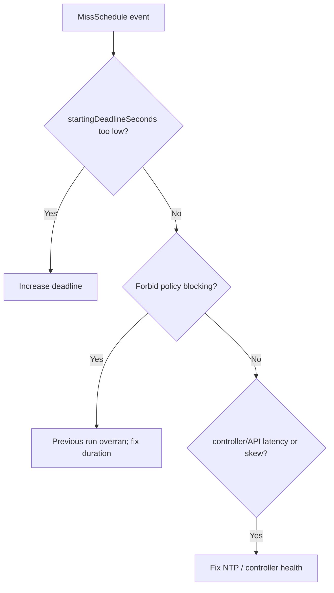

# CronJob Missed Schedule

> **Severity:** Medium · **Typical recovery time:** 10–40 min · **Affected versions:** 1.21+

## Error Message

```text
Warning  MissSchedule  cronjob-controller  Missed scheduled time to start a job: 2026-06-29T02:00:00Z
# Run skipped because it could not start within startingDeadlineSeconds
```

## Description

A CronJob run can be *missed* when the controller cannot create the child Job
within `spec.startingDeadlineSeconds` of its scheduled time. If the deadline is
too tight — or the controller was briefly busy/unavailable at the firing moment —
the run is skipped entirely rather than started late. The schedule then carries
on to the next tick, leaving a gap.

This differs from "too many missed start times": here a *single* (or occasional)
run is dropped because the start window closed. It is a correctness issue for
time-sensitive jobs (backups, billing) where a silently skipped run can go
unnoticed until data is missing.

## Affected Kubernetes Versions

batch/v1 CronJobs, v2 controller (default 1.21+). If `startingDeadlineSeconds`
is unset, the controller does not enforce a start window the same way and is more
forgiving; setting it small makes misses likely. Clock skew amplifies the issue.

## Likely Root Causes

- `startingDeadlineSeconds` set very low (e.g. 10s) relative to controller latency
- Controller momentarily overloaded or restarting at the schedule tick
- Clock skew shifting the perceived scheduled time outside the deadline
- `concurrencyPolicy: Forbid` blocking the start until the deadline elapsed
- Heavy API-server latency delaying Job creation past the window

## Diagnostic Flow



## Verification Steps

Confirm the `MissSchedule` event, check the configured deadline, and correlate
the miss with controller restarts, prior long-running Jobs, or clock skew.

## kubectl Commands

```bash
kubectl describe cronjob <cronjob> -n <namespace>
kubectl get cronjob <cronjob> -n <namespace> -o jsonpath='{.spec.startingDeadlineSeconds}'
kubectl get cronjob <cronjob> -n <namespace> -o jsonpath='{.spec.concurrencyPolicy}'
kubectl get jobs -n <namespace> -l cronjob-name=<cronjob> --sort-by=.metadata.creationTimestamp
kubectl get events -n <namespace> --sort-by=.lastTimestamp | grep -i schedule
```

## Expected Output

```text
Start Deadline Seconds:  10
Concurrency Policy:       Forbid
Events:
  Warning  MissSchedule  Missed scheduled time to start a job: 2026-06-29T02:00:00Z
```

## Common Fixes

1. Increase `startingDeadlineSeconds` to a realistic window (e.g. 60–300s)
2. Ensure the previous run finishes well before the next tick (shorten runtime)
3. Fix control-plane clock skew
4. Reconsider `concurrencyPolicy: Forbid` if overlap is acceptable
5. Reduce schedule frequency if runs cannot reliably start in time

## Recovery Procedures

1. Confirm whether a run was actually skipped and whether downstream data is
   missing — read-only inspection only.
2. Update `startingDeadlineSeconds` to a sane value on the CronJob spec.
3. To backfill the missed run, create a one-off Job from the CronJob's
   `jobTemplate`. **Manually creating a backfill Job runs real work** — blast
   radius is whatever that Job touches (e.g. re-processing data); confirm
   idempotency before doing so.
4. Watch the next scheduled run start within the new deadline.

## Validation

Subsequent scheduled times produce child Jobs with no `MissSchedule` events,
and `lastScheduleTime` advances on every tick.

## Prevention

- Set `startingDeadlineSeconds` generously above controller latency
- Keep job runtime comfortably under the schedule interval
- Maintain healthy NTP and controller-manager availability
- Alert on `MissSchedule` events and on `lastScheduleTime` lag
- For critical jobs, verify success via downstream checks, not just scheduling

## Related Errors

- [CronJob Too Many Missed Start Times](./cronjob-too-many-missed-times.md)
- [CronJob ConcurrencyPolicy Forbid](./cronjob-concurrencypolicy-forbid.md)
- [CronJob Wrong Timezone](./cronjob-wrong-timezone.md)

## References

- [CronJob schedule syntax](https://kubernetes.io/docs/concepts/workloads/controllers/cron-jobs/#schedule-syntax)
- [CronJob documentation](https://kubernetes.io/docs/concepts/workloads/controllers/cron-jobs/)

## Further Reading

- [Free Kubernetes config validators](https://devopsaitoolkit.com/validators/)
