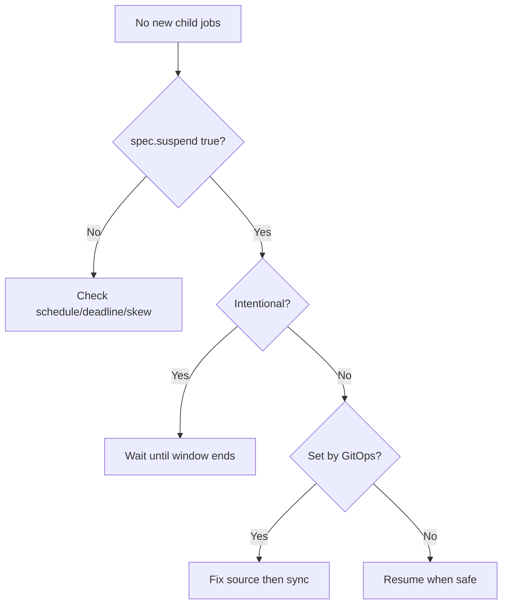

# CronJob Suspended

> **Severity:** Low · **Typical recovery time:** 2–15 min · **Affected versions:** 1.21+

## Error Message

```text
CronJob is suspended
# kubectl get cronjob shows SUSPEND: True ; no new child Jobs are created
```

## Description

A CronJob with `spec.suspend: true` is paused: the controller does not create
any child Jobs at the scheduled times. Already-running Jobs are left alone, but
no new ones start. This is the intended way to temporarily stop a recurring
workload — during a freeze, a migration, or maintenance — without deleting it.

The incident-time confusion is "my scheduled job stopped running." If
`suspend` is `true`, that is expected and not a controller fault. The work is
figuring out who set it (often GitOps, an operator, or a forgotten manual pause)
and whether it is safe to resume.

## Affected Kubernetes Versions

`spec.suspend` exists in batch/v1 CronJobs (GA 1.21). Behaviour is stable:
suspending stops future scheduling only; it does not cancel active child Jobs.
Resuming does not back-fill missed runs.

## Likely Root Causes

- Intentionally suspended for a maintenance window or change freeze
- A manual pause that was never resumed
- GitOps source has `suspend: true` and keeps re-applying it
- An operator/automation suspended it and failed to resume
- Copied from a template that defaulted `suspend` to `true`

## Diagnostic Flow



## Verification Steps

Confirm `spec.suspend` is `true` (not a scheduling/skew problem), then trace who
or what set it.

## kubectl Commands

```bash
kubectl get cronjob <cronjob> -n <namespace>
kubectl get cronjob <cronjob> -n <namespace> -o jsonpath='{.spec.suspend}'
kubectl describe cronjob <cronjob> -n <namespace>
kubectl get cronjob <cronjob> -n <namespace> -o yaml | grep -iE 'suspend|managedFields|ownerReferences' -A2
kubectl get jobs -n <namespace> -l cronjob-name=<cronjob>
```

## Expected Output

```text
NAME     SCHEDULE     SUSPEND   ACTIVE   LAST SCHEDULE   AGE
backup   0 2 * * *    True      0        3d              30d
spec.suspend: true
```

## Common Fixes

1. If the suspension is intentional, take no action until the window ends
2. If unintended, set `spec.suspend: false` to resume scheduling
3. Fix the GitOps source if it keeps re-applying `suspend: true`
4. Remove stale automation that suspended without resuming
5. Correct templates that default `suspend` to `true`

## Recovery Procedures

1. Confirm it is safe to resume (freeze over, dependencies healthy).
2. Resume by setting `spec.suspend` to `false`. **Resuming restarts the schedule
   and will run real work at the next tick** — blast radius is whatever the Job
   does (e.g. a backup overwriting data); verify dependencies first.
3. If GitOps-managed, change the source of truth rather than patching live, to
   avoid drift snapping it back to suspended.
4. Confirm the next scheduled run creates a child Job.

## Validation

`SUSPEND` shows `False`, and a child Job is created at the next schedule point
with `lastScheduleTime` advancing.

## Prevention

- Label/annotate CronJobs that are intentionally suspended, with an owner
- Alert on CronJobs suspended longer than an expected window
- Manage `suspend` only via GitOps in GitOps-controlled clusters
- Restrict who can patch `suspend` via RBAC
- Review templates so `suspend` is not accidentally defaulted true

## Related Errors

- [Job Suspended](../jobs/job-suspended.md)
- [CronJob Missed Schedule](./cronjob-missed-schedule.md)
- [CronJob Too Many Missed Start Times](./cronjob-too-many-missed-times.md)

## References

- [Suspend](https://kubernetes.io/docs/concepts/workloads/controllers/cron-jobs/#suspend)
- [CronJob documentation](https://kubernetes.io/docs/concepts/workloads/controllers/cron-jobs/)

## Further Reading

- [DevOps AI ToolKit — Kubernetes guides](https://devopsaitoolkit.com/blog/)
