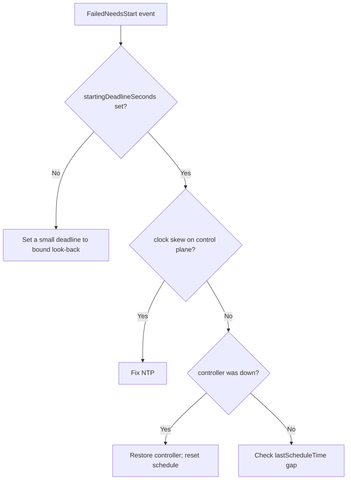

# CronJob Too Many Missed Start Times

> **Severity:** High · **Typical recovery time:** 10–40 min · **Affected versions:** 1.21+

## Error Message

```text
Warning  FailedNeedsStart  cronjob-controller  Cannot determine if job needs to be started: too many missed start times (> 100). Set or decrease .spec.startingDeadlineSeconds or check clock skew
```

## Description

The CronJob controller, when deciding whether to start a run, counts how many
scheduled times were missed since the last successful start. If more than 100
schedule points elapsed without a Job being created, it gives up rather than
firing a flood of back-dated Jobs, and emits this warning. The CronJob then
stops scheduling entirely until the situation is corrected.

This protects the cluster from a thundering herd, but it means your CronJob is
now *dead in the water*. It typically happens after the controller was unable to
run for a long window (controller outage, the CronJob was suspended for ages, or
severe clock skew makes the controller think many runs were missed).

## Affected Kubernetes Versions

Applies to batch/v1 CronJobs. The v2 controller (default since 1.21, GA CronJob
in 1.21) uses the 100-missed-times guard and the explicit warning text. Older
behaviour was similar but with different logging. Clock skew between the API
server and controller is a common trigger across versions.

## Likely Root Causes

- kube-controller-manager was down/unhealthy for a long period
- The CronJob was suspended for far longer than its interval, then resumed
- `startingDeadlineSeconds` unset, so the controller looks back to the last run
- Severe clock skew making the controller believe 100+ runs were missed
- `lastScheduleTime` far in the past with a frequent schedule

## Diagnostic Flow



## Verification Steps

Confirm the warning text, check `startingDeadlineSeconds`, `lastScheduleTime`,
and whether the controller and clocks are healthy.

## kubectl Commands

```bash
kubectl describe cronjob <cronjob> -n <namespace>
kubectl get cronjob <cronjob> -n <namespace> -o jsonpath='{.spec.startingDeadlineSeconds}'
kubectl get cronjob <cronjob> -n <namespace> -o jsonpath='{.status.lastScheduleTime}'
kubectl get events -n <namespace> --sort-by=.lastTimestamp | grep <cronjob>
kubectl logs -n kube-system -l component=kube-controller-manager | grep -i cronjob
```

## Expected Output

```text
Events:
  Warning  FailedNeedsStart  Cannot determine if job needs to be started:
           too many missed start times (> 100). Set or decrease
           .spec.startingDeadlineSeconds or check clock skew
Last Schedule Time:  2026-06-20T00:00:00Z   # days ago for an hourly job
```

## Common Fixes

1. Set `startingDeadlineSeconds` (e.g. 100–200) so the controller only looks
   back a bounded window, not to the last successful run
2. Fix control-plane clock skew (NTP/chrony)
3. Restore kube-controller-manager health if it was down
4. After resuming a long-suspended CronJob, expect to reset the schedule state

## Recovery Procedures

1. Diagnose with the read-only commands; identify whether it is deadline,
   skew, or a controller outage.
2. Set `startingDeadlineSeconds` to a sane bound on the CronJob spec.
3. To clear the stuck state immediately, recreate the CronJob (delete and
   re-apply) so `lastScheduleTime` resets. **Recreating a CronJob is
   disruptive** — in-flight child Jobs may be orphaned/removed depending on
   cascade; blast radius is that CronJob and its current Jobs.
4. Confirm the next scheduled run fires on time.

## Validation

A new child Job is created at the next schedule point, `lastScheduleTime`
updates, and no further `FailedNeedsStart` warnings appear.

## Prevention

- Always set `startingDeadlineSeconds` to bound the controller's look-back
- Keep NTP/chrony healthy across control-plane nodes
- Monitor kube-controller-manager uptime and CronJob `lastScheduleTime` lag
- Avoid leaving CronJobs suspended for many intervals
- Alert when `lastScheduleTime` falls behind the schedule

## Related Errors

- [CronJob Missed Schedule](./cronjob-missed-schedule.md)
- [CronJob Suspended](./cronjob-suspended.md)
- [CronJob ConcurrencyPolicy Forbid](./cronjob-concurrencypolicy-forbid.md)

## References

- [CronJob limitations](https://kubernetes.io/docs/concepts/workloads/controllers/cron-jobs/#cron-job-limitations)
- [CronJob documentation](https://kubernetes.io/docs/concepts/workloads/controllers/cron-jobs/)

## Further Reading

- [DevOps AI ToolKit — Kubernetes guides](https://devopsaitoolkit.com/blog/)
