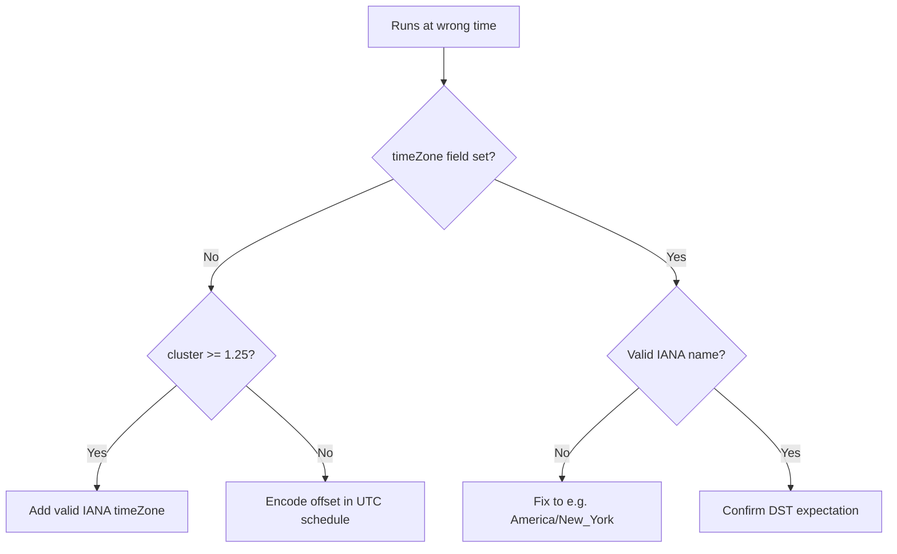

# CronJob Wrong Timezone

> **Severity:** Medium · **Typical recovery time:** 5–30 min · **Affected versions:** 1.25+

## Error Message

```text
CronJob fires at unexpected time (timeZone)
# e.g. a "0 9 * * *" job runs at 09:00 UTC instead of 09:00 local
```

## Description

By default a CronJob's `schedule` is interpreted in **UTC** by the
kube-controller-manager, *not* the cluster nodes' local time or the author's
timezone. A schedule like `0 9 * * *` fires at 09:00 UTC. Teams expecting local
time see runs hours off — a billing job that should run at 9am local kicks off
at, say, 4am local, sometimes on the wrong calendar day.

Since 1.25 the `spec.timeZone` field lets you pin a schedule to an IANA zone
(e.g. `America/New_York`), and the controller handles DST transitions. The error
is almost always a missing or wrong `timeZone`, or an invalid zone name that the
controller rejects.

## Affected Kubernetes Versions

`spec.timeZone` is GA in 1.27 (alpha 1.24, beta 1.25). On clusters older than
1.25 there is **no** `timeZone` field — schedules are UTC-only, and you must
encode the offset into the cron expression. An invalid zone name produces an
`UnknownTimeZone` event and the CronJob will not schedule.

## Likely Root Causes

- `timeZone` not set, so the schedule runs in UTC unexpectedly
- Wrong IANA zone string (typo, or non-IANA like `EST`/`PST`)
- Cluster older than 1.25 where `timeZone` is silently ignored or rejected
- Confusing node-local time with the controller's UTC interpretation
- DST shift changing the local firing time on a UTC-encoded schedule

## Diagnostic Flow



## Verification Steps

Check the `schedule`, the `timeZone` value, the cluster version, and compare
`lastScheduleTime` (always reported in UTC) against the expected local time.

## kubectl Commands

```bash
kubectl get cronjob <cronjob> -n <namespace> -o jsonpath='{.spec.schedule}{"\t"}{.spec.timeZone}'
kubectl describe cronjob <cronjob> -n <namespace>
kubectl get cronjob <cronjob> -n <namespace> -o jsonpath='{.status.lastScheduleTime}'
kubectl version --short
kubectl get events -n <namespace> --sort-by=.lastTimestamp | grep -i timezone
```

## Expected Output

```text
0 9 * * *    <none>
Last Schedule Time:  2026-06-29T09:00:00Z   # 09:00 UTC, not local
# or, with a bad zone:
Warning  UnknownTimeZone  CronJob has invalid timeZone: "EST"
```

## Common Fixes

1. Set `spec.timeZone` to a valid IANA name (e.g. `America/New_York`)
2. Correct an invalid/typo zone string to a real IANA identifier
3. On pre-1.25 clusters, bake the UTC offset into the cron expression
4. Account for DST by using a named zone rather than a fixed offset
5. Verify the controller is reporting times in UTC before assuming a bug

## Recovery Procedures

1. Determine the intended local firing time and the correct IANA zone.
2. Update `spec.timeZone` (or fix the schedule on old clusters). This is a
   low-risk spec change. Note that **changing the schedule may cause an extra or
   skipped run** around the cutover — blast radius is one run of that CronJob;
   ensure the workload is idempotent across the boundary.
3. For pre-1.25 clusters, document that schedules are UTC to avoid future drift.
4. Watch the next run fire at the expected local time.

## Validation

`lastScheduleTime` (UTC) converts to the intended local time, no
`UnknownTimeZone` events appear, and child Jobs are created at the right hour.

## Prevention

- Always set `timeZone` explicitly on time-sensitive CronJobs (1.25+)
- Use full IANA names; never abbreviations like `EST`/`PST`
- Document that bare schedules are UTC for older clusters
- Validate `timeZone` and schedule syntax in CI
- Prefer named zones so DST is handled automatically

## Related Errors

- [CronJob Missed Schedule](./cronjob-missed-schedule.md)
- [CronJob Too Many Missed Start Times](./cronjob-too-many-missed-times.md)
- [CronJob Suspended](./cronjob-suspended.md)

## References

- [Time zones](https://kubernetes.io/docs/concepts/workloads/controllers/cron-jobs/#time-zones)
- [CronJob schedule syntax](https://kubernetes.io/docs/concepts/workloads/controllers/cron-jobs/#schedule-syntax)

## Further Reading

- [Free Kubernetes config validators](https://devopsaitoolkit.com/validators/)
