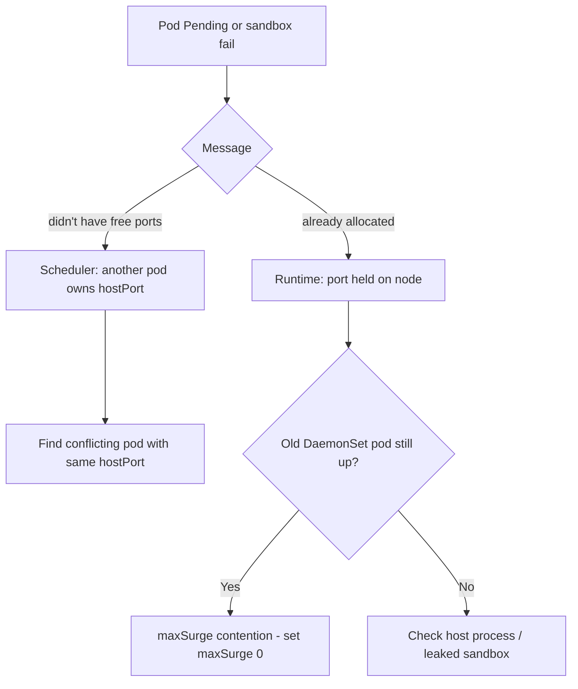

# DaemonSet hostPort Conflict

> **Severity:** High · **Typical recovery time:** 10–30 min · **Affected versions:** 1.20+

## Error Message

```text
Events:
  Type     Reason            Age   From               Message
  ----     ------            ----  ----               -------
  Warning  FailedScheduling  20s   default-scheduler  0/6 nodes are available:
           6 node(s) didn't have free ports for the requested pod ports.

# or, surfaced from the CNI / runtime:
  Warning  FailedCreatePodSandBox  ...  failed to set up sandbox:
           port 9100 already allocated
```

## Description

When a DaemonSet pod declares a `hostPort`, it binds that port on the node's
network namespace. Only one pod per node can own a given host port. DaemonSets and
`hostPort` interact badly during updates and overlaps: if the old pod still holds
the port, the new pod cannot bind it (relevant to surge updates), and if a
non-DaemonSet pod or host process already uses the port, the DaemonSet pod fails to
schedule or fails sandbox setup. The scheduler reports "didn't have free ports";
the runtime reports "already allocated".

## Affected Kubernetes Versions

1.20+. The scheduler accounts for `hostPort` in its `NodePorts` predicate across
all supported versions. The conflict is more likely when using `maxSurge` (1.22+),
because surge intentionally runs the new and old pod simultaneously — both wanting
the same host port — so `maxSurge` with `hostPort` is generally incompatible.

## Likely Root Causes

- Two DaemonSets (or a Deployment) request the same `hostPort` on a node
- A host process or static pod already binds the port
- `maxSurge > 0` causes old and new DaemonSet pods to contend for the port
- Leaked port from a previous pod whose sandbox did not clean up

## Diagnostic Flow



## Verification Steps

Identify which workload claims the port and on which nodes, distinguishing a
scheduler-level conflict (another pod) from a runtime-level leak (host process or
stale sandbox).

## kubectl Commands

```bash
kubectl describe pod <pending-pod> -n monitoring
kubectl get pods --all-namespaces -o json \
  | jq -r '.items[] | select(.spec.containers[].ports[]?.hostPort==9100) | .metadata.name'
kubectl get daemonset <name> -n monitoring -o yaml | grep -A3 hostPort
kubectl get events -n monitoring --sort-by=.lastTimestamp
kubectl get pods -o wide --all-namespaces | grep <node>
```

## Expected Output

```text
$ kubectl get pods -A -o json | jq -r '... hostPort==9100 ...'
node-exporter-abcde
custom-metrics-agent-fghij      # <-- second workload also wants 9100
```

## Common Fixes

1. Change one workload's `hostPort` to a free, non-overlapping port
2. Remove the duplicate DaemonSet if two agents serve the same purpose
3. Set `maxSurge: 0` (use `maxUnavailable`) so updates don't double-bind the port

## Recovery Procedures

1. Determine the conflicting owner of the port.
2. Decide which workload keeps the port; change the other's `hostPort`.
3. Apply the manifest change. **Disruptive:** editing the template triggers a
   rolling update; blast radius is every node running the pod, bounded by
   `maxUnavailable`.
4. If a leaked sandbox holds the port with no live pod, drain/cordon the node and
   let the kubelet recreate the sandbox. **Disruptive:** draining evicts all pods
   on that node — blast radius is the entire node's workloads.

## Validation

The previously failing pods are `Running` on every node, no `FailedScheduling` or
`already allocated` events recur, and the agent answers on its host port
(verify via metrics scrape or the consuming system).

## Prevention

Reserve a documented host-port range for node agents and check new DaemonSets
against it. Avoid `hostPort` entirely where a `hostNetwork` service or a
ClusterIP/headless service suffices. Never combine `maxSurge > 0` with `hostPort`.

## Related Errors

- [DaemonSet Not On All Nodes](daemonset-not-scheduled-all-nodes.md)
- [DaemonSet Rollout Stuck](daemonset-rollout-stuck.md)
- [DaemonSet Update maxUnavailable](daemonset-maxunavailable.md)

## References

- [hostPort in Pod networking](https://kubernetes.io/docs/concepts/services-networking/)
- [Configure Pod ports (hostPort)](https://kubernetes.io/docs/concepts/workloads/pods/)

## Further Reading

- [Free Kubernetes config validators](https://devopsaitoolkit.com/validators/)
