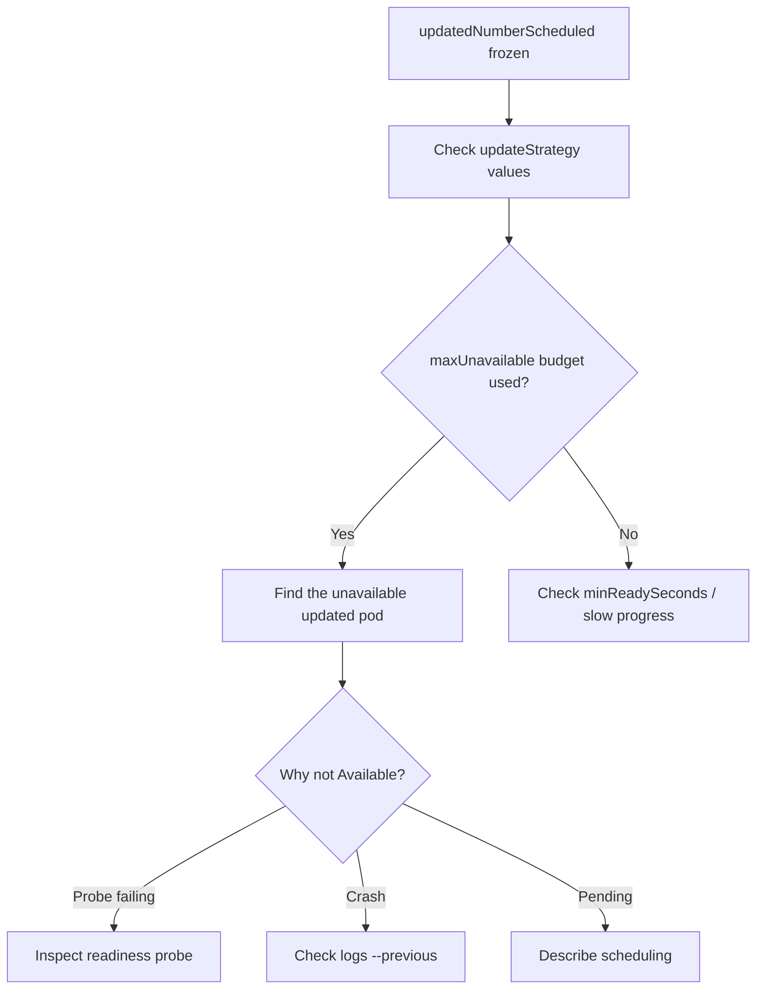

# DaemonSet Update maxUnavailable

> **Severity:** Medium · **Typical recovery time:** 10–30 min · **Affected versions:** 1.22+

## Error Message

```text
$ kubectl get daemonset cilium -n kube-system \
    -o jsonpath='{.status.updatedNumberScheduled}/{.status.desiredNumberScheduled}'
1/6
# updatedNumberScheduled does not advance; rollout pinned by maxUnavailable
```

## Description

During a RollingUpdate the DaemonSet controller will only have `maxUnavailable`
pods unavailable at any moment. It updates a node, waits for the new pod to become
`Available`, then moves on. If a freshly-updated pod never becomes available, the
controller has used up its `maxUnavailable` budget and stops — `updatedNumberScheduled`
freezes. With the default `maxUnavailable: 1`, a single stuck node halts the entire
rollout. This is the mechanism behind most "DaemonSet won't finish updating"
incidents; the value is doing its job protecting availability, but a broken pod
turns that protection into a deadlock.

## Affected Kubernetes Versions

`maxUnavailable` exists across all supported versions. `maxSurge` for DaemonSets is
stable from 1.22 (alpha 1.21); with `maxSurge > 0` the controller creates the new
pod before deleting the old one, avoiding a coverage gap. On clusters older than
1.22, only `maxUnavailable` is available.

## Likely Root Causes

- A node's new pod is not becoming `Available` (probe, crash, resources)
- `maxUnavailable: 1` plus one unhealthy node halts everything
- `minReadySeconds` large enough to look stuck but actually progressing
- `maxSurge` and `maxUnavailable` both 0 (invalid — at least one must be non-zero)
- Old pod not terminating because of a finalizer or stuck preStop hook

## Diagnostic Flow



## Verification Steps

Read the actual `updateStrategy` and the `status` counters, then identify which
single node's pod is consuming the unavailable budget.

## kubectl Commands

```bash
kubectl get daemonset cilium -n kube-system -o yaml | grep -A4 updateStrategy
kubectl get daemonset cilium -n kube-system -o jsonpath='{.status}' | jq
kubectl get pods -n kube-system -l k8s-app=cilium -o wide
kubectl describe pod <not-ready-pod> -n kube-system
kubectl rollout status daemonset/cilium -n kube-system --timeout=20s
```

## Expected Output

```text
updateStrategy:
  rollingUpdate:
    maxSurge: 0
    maxUnavailable: 1
  type: RollingUpdate

status:
  desiredNumberScheduled: 6
  updatedNumberScheduled: 1
  numberUnavailable: 1
```

## Common Fixes

1. Repair the single unavailable pod so the budget frees and the rollout resumes
2. Set `maxSurge: 1` (1.22+) to update without dropping below full coverage
3. Temporarily raise `maxUnavailable` to drain a backlog of slow nodes

## Recovery Procedures

1. Locate the node whose updated pod is unavailable and fix the root cause.
2. If the rollout itself is bad, roll back. **Disruptive:**
   `kubectl rollout undo daemonset/cilium -n kube-system` reverts updated nodes;
   for a CNI DaemonSet this can briefly disrupt pod networking on those nodes.
3. To proceed faster, patch `updateStrategy` (e.g. `maxSurge: 1`). **Disruptive:**
   surge creates an extra pod per node — ensure `hostPort`/resources allow two
   copies transiently.

## Validation

`updatedNumberScheduled == desiredNumberScheduled` and `numberUnavailable: 0`.
`kubectl rollout status` returns success, and every node runs the new revision.

## Prevention

Always set an explicit `updateStrategy`. For agents that must keep full coverage,
prefer `maxSurge: 1` with `maxUnavailable: 0` (requires no `hostPort` collision).
Add reliable readiness probes so the controller's availability accounting is
accurate, and alert on `kube_daemonset_status_number_unavailable` staying non-zero.

## Related Errors

- [DaemonSet Rollout Stuck](daemonset-rollout-stuck.md)
- [DaemonSet Not On All Nodes](daemonset-not-scheduled-all-nodes.md)
- [DaemonSet hostPort Conflict](daemonset-hostport-conflict.md)

## References

- [DaemonSet rolling update](https://kubernetes.io/docs/tasks/manage-daemon/update-daemon-set/#performing-a-rolling-update)
- [DaemonSet maxSurge](https://kubernetes.io/docs/concepts/workloads/controllers/daemonset/#performing-a-rolling-update)

## Further Reading

- [Free Kubernetes config validators](https://devopsaitoolkit.com/validators/)
