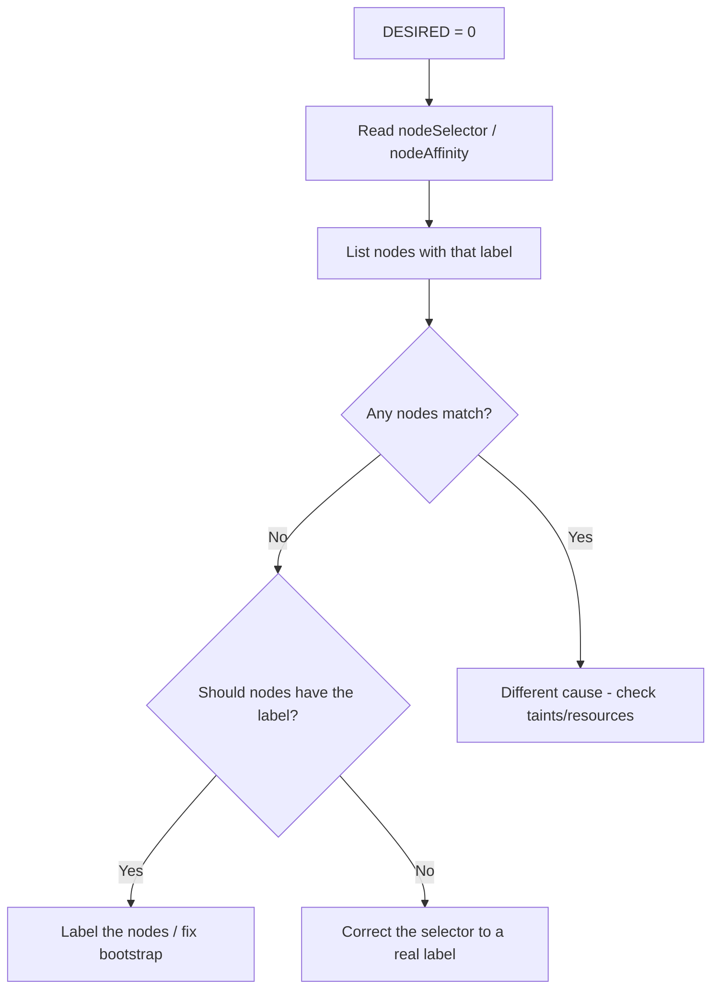

# DaemonSet nodeSelector No Match

> **Severity:** Medium · **Typical recovery time:** 5–15 min · **Affected versions:** 1.20+

## Error Message

```text
$ kubectl get daemonset gpu-driver -n kube-system
NAME         DESIRED   CURRENT   READY   UP-TO-DATE   AVAILABLE   NODE SELECTOR              AGE
gpu-driver   0         0         0       0            0           accelerator=nvidia-tesla   1h

# DESIRED is 0: the nodeSelector matches zero nodes
```

## Description

A DaemonSet's `nodeSelector` (or `nodeAffinity`) defines the set of eligible nodes.
The controller computes `DESIRED` as the count of nodes matching that selector. If
no node carries the required labels, `DESIRED` is `0` — the DaemonSet appears
healthy (no failing pods) but silently runs nowhere. This is an easy state to miss
because nothing is `Pending` or `CrashLooping`; the agent is simply absent. It bites
GPU drivers, zone-specific agents, and selectors that depend on labels a node pool
was supposed to apply but didn't.

## Affected Kubernetes Versions

1.20+. `nodeSelector` semantics are unchanged across versions. Note built-in label
renames: `beta.kubernetes.io/os` and `beta.kubernetes.io/arch` were removed in 1.18
in favour of `kubernetes.io/os` and `kubernetes.io/arch`; selectors still using the
beta keys match nothing on modern clusters.

## Likely Root Causes

- Target nodes are missing the label the selector requires
- Typo or wrong value in the selector key/value
- Use of a deprecated/removed built-in label key
- The labelling step (autoscaler, bootstrap script) never ran on new nodes

## Diagnostic Flow



## Verification Steps

Read the selector from the spec, then query nodes by that exact label to confirm
zero matches before deciding whether to fix the labels or the selector.

## kubectl Commands

```bash
kubectl get daemonset gpu-driver -n kube-system -o jsonpath='{.spec.template.spec.nodeSelector}'
kubectl get nodes -l accelerator=nvidia-tesla
kubectl get nodes --show-labels
kubectl describe daemonset gpu-driver -n kube-system
kubectl get nodes -o json | jq '.items[].metadata.labels'
```

## Expected Output

```text
$ kubectl get daemonset gpu-driver -n kube-system -o jsonpath='{.spec.template.spec.nodeSelector}'
{"accelerator":"nvidia-tesla"}

$ kubectl get nodes -l accelerator=nvidia-tesla
No resources found
```

## Common Fixes

1. Label the intended nodes so they match the selector
2. Correct the selector key/value to match labels nodes actually carry
3. Replace removed beta label keys with their stable equivalents

## Recovery Procedures

1. Confirm whether the missing match is a node-label gap or a selector typo.
2. If nodes should match, apply the label. **Non-disruptive:**
   `kubectl label node <node> accelerator=nvidia-tesla` adds the label and the
   controller schedules a pod onto that node only — no impact to other nodes.
3. If the selector is wrong, patch the DaemonSet template. **Disruptive:** a
   template change rolls the DaemonSet on any nodes already running it.
4. Watch `DESIRED` rise from 0 as nodes start matching.

## Validation

`kubectl get daemonset` shows `DESIRED > 0` and `DESIRED == AVAILABLE`. Pods are
`Running` on each intended node (`kubectl get pods -o wide`), and the agent's
function (e.g. driver installed) is confirmed on those nodes.

## Prevention

Treat node labels as part of node-pool provisioning (managed node-group labels,
autoscaler tags, or a labelling DaemonSet) so new nodes are labelled automatically.
Validate that each DaemonSet's selector matches a non-empty node set in CI, and
alert when a DaemonSet reports `DESIRED == 0` unexpectedly.

## Related Errors

- [DaemonSet Not On All Nodes](daemonset-not-scheduled-all-nodes.md)
- [DaemonSet Pods Pending (taints)](daemonset-pods-pending-taints.md)
- [DaemonSet Skips Control Plane](daemonset-skips-control-plane.md)

## References

- [Assigning Pods to Nodes (nodeSelector)](https://kubernetes.io/docs/concepts/scheduling-eviction/assign-pod-node/)
- [Well-Known Labels, Annotations and Taints](https://kubernetes.io/docs/reference/labels-annotations-taints/)

## Further Reading

- [Free Kubernetes config validators](https://devopsaitoolkit.com/validators/)
