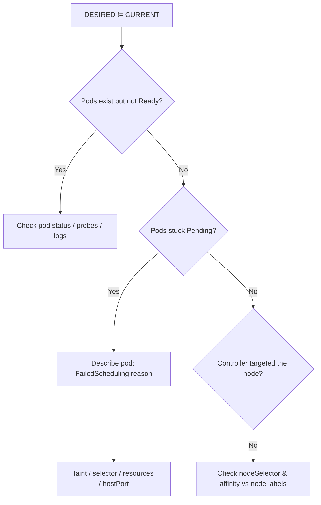

# DaemonSet Not On All Nodes

> **Severity:** High · **Typical recovery time:** 10–30 min · **Affected versions:** 1.20+

## Error Message

```text
$ kubectl get daemonset node-exporter -n monitoring
NAME            DESIRED   CURRENT   READY   UP-TO-DATE   AVAILABLE   NODE SELECTOR   AGE
node-exporter   6         4         4       4            4           <none>          3d
```

## Description

A DaemonSet is meant to run exactly one pod on every eligible node. When `DESIRED`
does not equal `CURRENT` (or `AVAILABLE`), some nodes that should be running the
agent are not. This is common with cluster-critical DaemonSets such as CNI plugins,
log shippers, and metrics exporters, where a coverage gap creates blind spots:
missing logs, missing network plumbing, or unmonitored nodes. The DaemonSet
controller computes `DESIRED` from the set of nodes that match the pod's scheduling
constraints, so a mismatch means either the controller never targeted a node, or it
targeted it but the pod could not be placed.

## Affected Kubernetes Versions

Applies to 1.20 through current releases. Since 1.12 the default scheduler (not the
DaemonSet controller) places DaemonSet pods using `NodeAffinity`, so generic
scheduling pressures (taints, resources, affinity) affect placement the same way
they do for ordinary pods. Behaviour is otherwise stable across versions.

## Likely Root Causes

- Some nodes carry taints the DaemonSet pod does not tolerate
- A `nodeSelector` or `nodeAffinity` excludes the missing nodes
- Insufficient allocatable CPU/memory on the missing nodes
- A `hostPort` already in use, blocking the pod on those nodes
- New nodes joined but the controller has not yet reconciled (transient)

## Diagnostic Flow



## Verification Steps

Confirm the gap is real and identify which nodes are missing the pod rather than
assuming a controller bug. Compare the node list against where pods are running.

## kubectl Commands

```bash
kubectl get daemonset -n monitoring node-exporter -o wide
kubectl get pods -n monitoring -l app=node-exporter -o wide
kubectl get nodes -o wide
kubectl describe daemonset node-exporter -n monitoring
kubectl get events -n monitoring --sort-by=.lastTimestamp
kubectl describe nodes
```

## Expected Output

```text
Number of Nodes Scheduled with Up-to-date Pods: 4
Number of Nodes Scheduled with Available Pods: 4
Number of Nodes Misscheduled: 0
Events:
  Warning  FailedScheduling  pod node-exporter-x had untolerated taint
                             {node-role.kubernetes.io/control-plane: }
```

## Common Fixes

1. Add the missing `tolerations` so pods schedule onto tainted nodes
2. Correct or widen the `nodeSelector`/`nodeAffinity` to match the target nodes
3. Free resources or lower the pod's requests so it fits on the missing nodes

## Recovery Procedures

1. Identify missing nodes: diff `kubectl get nodes` against pod placement.
2. `kubectl describe` a representative missing node for taints and labels.
3. Patch the DaemonSet spec with the required tolerations/selector. **Disruptive:**
   editing the pod template triggers a rolling update of the DaemonSet — blast
   radius is every node already running the pod, one node at a time per
   `maxUnavailable`.
4. Watch the controller reconcile new nodes into `CURRENT`.

## Validation

`kubectl get daemonset` shows `DESIRED == CURRENT == READY == AVAILABLE`, and
`Number of Nodes Misscheduled: 0` in `kubectl describe`. Confirm a pod is present
on each previously missing node with `kubectl get pods -o wide`.

## Prevention

Pin DaemonSet scheduling intentions explicitly: include broad `tolerations`
(`operator: Exists`) for infrastructure agents that must run everywhere, document
required node labels, and add a CI check that the DaemonSet's selector matches
your node pools. Alert on `kube_daemonset_status_number_unavailable > 0`.

## Related Errors

- [DaemonSet Pods Pending (taints)](daemonset-pods-pending-taints.md)
- [DaemonSet nodeSelector No Match](daemonset-nodeselector-no-match.md)
- [DaemonSet Skips Control Plane](daemonset-skips-control-plane.md)
- [DaemonSet hostPort Conflict](daemonset-hostport-conflict.md)

## References

- [DaemonSet concepts](https://kubernetes.io/docs/concepts/workloads/controllers/daemonset/)
- [Taints and Tolerations](https://kubernetes.io/docs/concepts/scheduling-eviction/taint-and-toleration/)

## Further Reading

- [DevOps AI ToolKit — Kubernetes guides](https://devopsaitoolkit.com/blog/)
