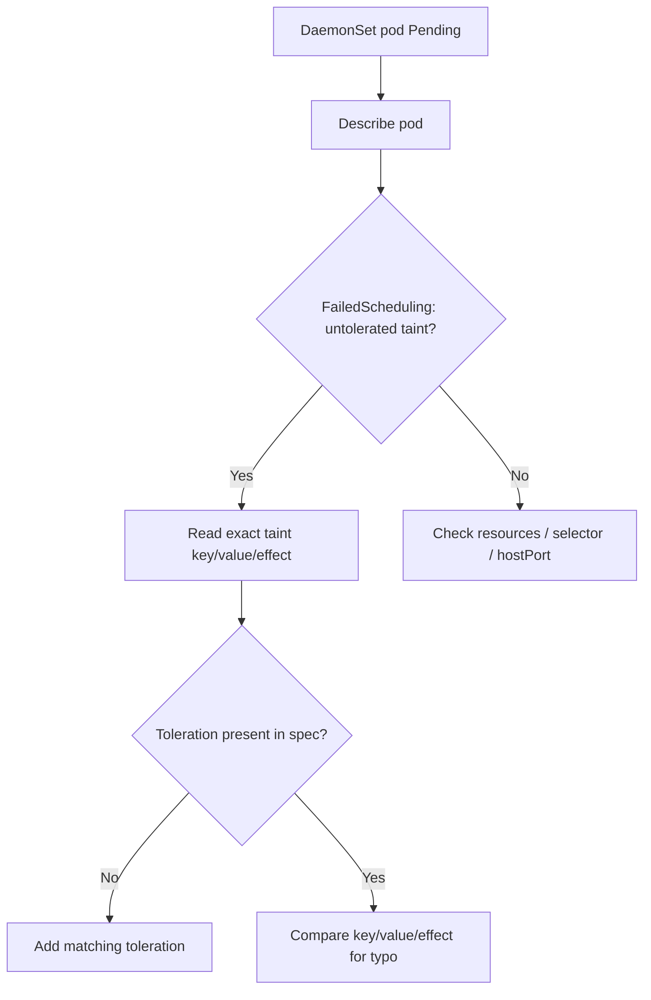

# DaemonSet Pods Pending (taints)

> **Severity:** High · **Typical recovery time:** 5–20 min · **Affected versions:** 1.20+

## Error Message

```text
Events:
  Type     Reason            Age   From               Message
  ----     ------            ----  ----               -------
  Warning  FailedScheduling  30s   default-scheduler  0/6 nodes are available:
           3 node(s) had untolerated taint {dedicated: gpu},
           3 node(s) had untolerated taint {node-role.kubernetes.io/control-plane: }.
```

## Description

DaemonSet pods are placed by the default scheduler using node affinity injected by
the DaemonSet controller. Like any pod, they will not land on a node whose taints
they do not tolerate. When target nodes carry taints — dedicated GPU pools, control
plane taints, or custom isolation taints — the DaemonSet pods sit in `Pending` and
the controller reports those nodes as desired-but-not-running. During an incident
this means an agent (CNI, logging, security sensor) is absent precisely on the
nodes you most want it on.

## Affected Kubernetes Versions

1.20+. The scheduler-based placement model has been the default since 1.12.
Built-in taints like `node.kubernetes.io/not-ready` and `unreachable` are tolerated
automatically for DaemonSet pods (with no `tolerationSeconds`) so agents keep
running during node problems, but user-defined taints are never tolerated unless
you add the toleration.

## Likely Root Causes

- Node has a custom taint (e.g. `dedicated=gpu:NoSchedule`) not tolerated
- Control-plane taint `node-role.kubernetes.io/control-plane:NoSchedule`
- A `NoExecute` taint added after pods were scheduled, evicting them
- Toleration key/value/effect typo so it does not actually match

## Diagnostic Flow



## Verification Steps

Confirm the scheduling failure names a taint, then read the taint off the node
exactly so your toleration matches key, value, and effect character-for-character.

## kubectl Commands

```bash
kubectl get pods -n kube-system -l app=cni -o wide
kubectl describe pod <pending-pod> -n kube-system
kubectl get nodes -o json | jq '.items[].spec.taints'
kubectl describe node <node>
kubectl get daemonset <name> -n kube-system -o yaml
```

## Expected Output

```text
$ kubectl get nodes -o json | jq '.items[0].spec.taints'
[
  {
    "effect": "NoSchedule",
    "key": "dedicated",
    "value": "gpu"
  }
]
```

## Common Fixes

1. Add a `toleration` matching the node taint's key, value, and effect
2. Use `operator: Exists` (no value) to tolerate all taints for a given key
3. For agents required everywhere, tolerate broadly with `operator: Exists` only

## Recovery Procedures

1. Capture the exact taint from the affected nodes.
2. Add the matching toleration to the DaemonSet pod template.
3. Apply the change. **Disruptive:** updating the template starts a rolling update
   across all nodes already running the pod; blast radius is bounded by
   `updateStrategy.rollingUpdate.maxUnavailable`, one batch at a time.
4. The scheduler binds the previously Pending pods onto the tainted nodes.

## Validation

`kubectl get pods -o wide` shows the formerly Pending pods `Running` on the tainted
nodes, and `kubectl get daemonset` shows `DESIRED == AVAILABLE`. No new
`FailedScheduling` events appear.

## Prevention

For infrastructure DaemonSets that must run on every node, include a catch-all
toleration (`operator: Exists`) in the base manifest and keep it in version control.
Document the cluster's taint scheme so platform teams know which DaemonSets need
which tolerations, and validate manifests in CI when new taints are introduced.

## Related Errors

- [DaemonSet Not On All Nodes](daemonset-not-scheduled-all-nodes.md)
- [DaemonSet Skips Control Plane](daemonset-skips-control-plane.md)
- [DaemonSet nodeSelector No Match](daemonset-nodeselector-no-match.md)

## References

- [Taints and Tolerations](https://kubernetes.io/docs/concepts/scheduling-eviction/taint-and-toleration/)
- [DaemonSet — taints and tolerations](https://kubernetes.io/docs/concepts/workloads/controllers/daemonset/#taints-and-tolerations)

## Further Reading

- [Free Kubernetes config validators](https://devopsaitoolkit.com/validators/)
