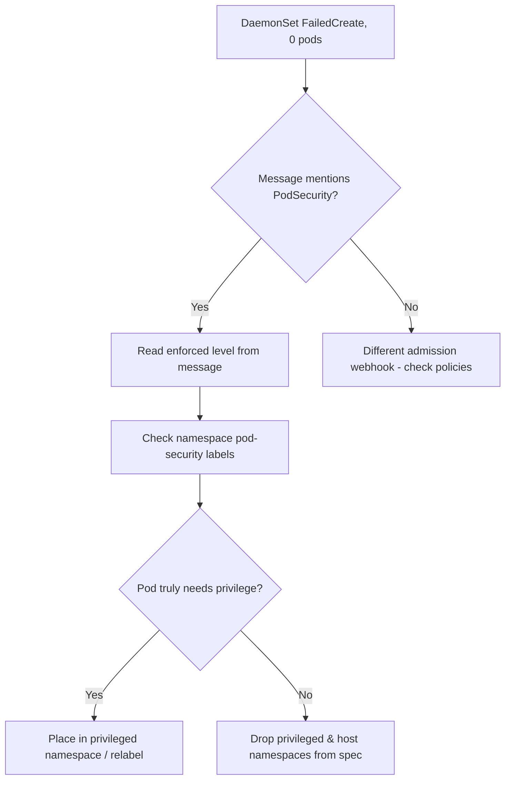

# DaemonSet Privileged Denied

> **Severity:** High · **Typical recovery time:** 10–30 min · **Affected versions:** 1.25+

## Error Message

```text
Events:
  Type     Reason        Age   From                  Message
  ----     ------        ----  ----                  -------
  Warning  FailedCreate  5s    daemonset-controller  Error creating: pods
    "node-agent-" is forbidden: violates PodSecurity "restricted:latest":
    privileged (container "agent" must not set securityContext.privileged=true),
    host namespaces (hostNetwork=true, hostPID=true), hostPath volumes
```

## Description

Node-level DaemonSets frequently need elevated access — `privileged: true`,
`hostNetwork`, `hostPID`, host paths, or specific capabilities — to manage the host.
Pod Security admission (PSA) enforces one of three standards (`privileged`,
`baseline`, `restricted`) per namespace. If the DaemonSet lands in a namespace
labelled `baseline` or `restricted` and `enforce` is on, the API server rejects the
pods. Crucially, the DaemonSet object is created but its pods are not: you see
`FailedCreate` on the DaemonSet, `DESIRED` populated, but zero pods running.

## Affected Kubernetes Versions

Pod Security admission is stable and on by default from 1.25 (it replaced
PodSecurityPolicy, removed in 1.25). On 1.23–1.24 PSA exists as beta. On clusters
still using PSP (pre-1.25) the equivalent denial comes from the PSP admission
controller with a different message.

## Likely Root Causes

- Namespace enforces `baseline`/`restricted` but the pod needs privileged access
- Missing namespace PSA labels, so it inherits a stricter cluster default
- A genuinely over-privileged pod that should be scoped down instead
- PSA `enforce` version pinned to `latest` and a new standard tightened rules

## Diagnostic Flow



## Verification Steps

Confirm the rejection is PSA (not a custom webhook) and read which level is enforced
on the target namespace, then decide whether to relax the namespace or tighten the
pod.

## kubectl Commands

```bash
kubectl describe daemonset node-agent -n security
kubectl get events -n security --sort-by=.lastTimestamp
kubectl get ns security -o jsonpath='{.metadata.labels}'
kubectl get daemonset node-agent -n security -o jsonpath='{.spec.template.spec.containers[*].securityContext}'
kubectl label --dry-run=server --overwrite ns security pod-security.kubernetes.io/enforce=privileged
```

## Expected Output

```text
$ kubectl get ns security -o jsonpath='{.metadata.labels}'
{"kubernetes.io/metadata.name":"security",
 "pod-security.kubernetes.io/enforce":"restricted",
 "pod-security.kubernetes.io/enforce-version":"latest"}
```

## Common Fixes

1. Run the DaemonSet in a namespace labelled `pod-security.kubernetes.io/enforce: privileged`
2. Remove unnecessary `privileged`/host namespaces and use minimal `capabilities`
3. Scope PSA exemptions narrowly (by namespace) rather than disabling enforcement

## Recovery Procedures

1. Read the enforced level and the exact violated fields from the event.
2. If the privilege is required, set the namespace to `privileged`.
   **Disruptive:** relabelling `enforce` on a shared namespace relaxes policy for
   *every* workload in it — blast radius is the whole namespace; prefer a dedicated
   namespace for the agent.
3. If privilege is not required, edit the pod template to drop it. **Disruptive:**
   the template change rolls the DaemonSet across its nodes.
4. The controller retries pod creation automatically once admission passes.

## Validation

`kubectl get pods -n security` shows the agent pods `Running` on every node, the
`FailedCreate` events stop, and `kubectl get daemonset` shows `AVAILABLE == DESIRED`.

## Prevention

Isolate privileged node agents in dedicated namespaces labelled `privileged`, and
keep application namespaces at `restricted`. Pin PSA `enforce-version` to a specific
release so a cluster upgrade does not silently tighten rules. Review securityContext
in CI to grant only the capabilities each agent truly needs.

## Related Errors

- [DaemonSet Not On All Nodes](daemonset-not-scheduled-all-nodes.md)
- [DaemonSet Rollout Stuck](daemonset-rollout-stuck.md)
- [DaemonSet hostPort Conflict](daemonset-hostport-conflict.md)

## References

- [Pod Security Admission](https://kubernetes.io/docs/concepts/security/pod-security-admission/)
- [Pod Security Standards](https://kubernetes.io/docs/concepts/security/pod-security-standards/)

## Further Reading

- [Free Kubernetes config validators](https://devopsaitoolkit.com/validators/)
