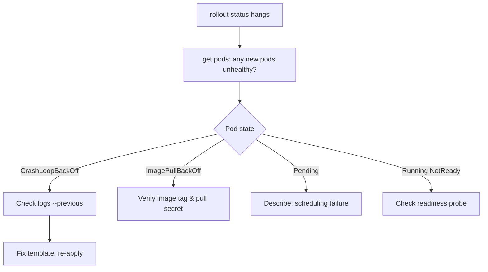

# DaemonSet Rollout Stuck

> **Severity:** High · **Typical recovery time:** 10–40 min · **Affected versions:** 1.20+

## Error Message

```text
$ kubectl rollout status daemonset/fluent-bit -n logging
Waiting for daemon set "fluent-bit" rollout to finish:
  2 out of 6 new pods have been updated...
# (hangs indefinitely, never returns)
```

## Description

`kubectl rollout status` for a DaemonSet blocks until every node runs an up-to-date,
available pod. When it hangs, the RollingUpdate has stalled: the controller updated
a batch of nodes, those new pods are not becoming `Available`, and because
`maxUnavailable` is reached the controller refuses to proceed to the next batch.
The cluster is left in a mixed state — some nodes on the new version, some on the
old — which for a logging or networking agent can mean inconsistent behaviour
across the fleet.

## Affected Kubernetes Versions

1.20+. The default `updateStrategy` is `RollingUpdate` with `maxUnavailable: 1`.
`maxSurge` for DaemonSets graduated to stable in 1.22; on older clusters surge is
unavailable, so a node is always briefly without the pod during update. The
stalling behaviour is identical across versions.

## Likely Root Causes

- New pod version crashes/CrashLoopBackOff, never reaching Ready
- A failing readiness probe keeps new pods `NotReady`
- The new image fails to pull (bad tag, registry auth)
- Updated pod cannot schedule (new resource request, taint, hostPort)
- `minReadySeconds` set high, so progress is genuinely slow not stuck

## Diagnostic Flow



## Verification Steps

Confirm the rollout is truly stuck (not just slow) by checking whether the newest
pods are unhealthy and whether the updated count stops advancing over time.

## kubectl Commands

```bash
kubectl rollout status daemonset/fluent-bit -n logging --timeout=30s
kubectl get daemonset fluent-bit -n logging -o wide
kubectl get pods -n logging -l app=fluent-bit -o wide
kubectl describe daemonset fluent-bit -n logging
kubectl logs <new-pod> -n logging --previous
kubectl rollout history daemonset/fluent-bit -n logging
```

## Expected Output

```text
$ kubectl get daemonset fluent-bit -n logging
NAME         DESIRED   CURRENT   READY   UP-TO-DATE   AVAILABLE   AGE
fluent-bit   6         6         4       2            4           12d

$ kubectl get pods -n logging
fluent-bit-7kq9d   0/1   CrashLoopBackOff   5   4m
```

## Common Fixes

1. Fix the underlying pod failure (bad config, image, probe) and re-apply
2. Correct the image tag or pull secret if `ImagePullBackOff`
3. Roll back to the last known-good revision while you investigate

## Recovery Procedures

1. Inspect the newest pod's logs and events to find the failure cause.
2. If the new version is broken, roll back. **Disruptive:**
   `kubectl rollout undo daemonset/fluent-bit -n logging` re-rolls every updated
   node back to the prior template; blast radius is the already-updated nodes, one
   batch per `maxUnavailable`.
3. If the fix is a config change, patch the template and let the rollout resume.
4. Track progress with `kubectl rollout status`.

## Validation

`kubectl rollout status` returns `successfully rolled out`, and
`UP-TO-DATE == DESIRED == AVAILABLE`. All pods report `Running` and `Ready` on the
new revision (`kubectl rollout history` confirms the active revision).

## Prevention

Test new DaemonSet images in a staging node pool first. Keep `maxUnavailable` low
so a bad rollout halts after one node instead of taking out the fleet. Add accurate
readiness probes so the controller waits for genuine readiness, and use
`kubectl rollout status` gated in CI/CD before declaring a deploy successful.

## Related Errors

- [DaemonSet Update maxUnavailable](daemonset-maxunavailable.md)
- [DaemonSet Not On All Nodes](daemonset-not-scheduled-all-nodes.md)
- [DaemonSet hostPort Conflict](daemonset-hostport-conflict.md)
- [CrashLoopBackOff](../pods/crashloopbackoff.md)

## References

- [Performing a Rolling Update on a DaemonSet](https://kubernetes.io/docs/tasks/manage-daemon/update-daemon-set/)
- [DaemonSet update strategy](https://kubernetes.io/docs/concepts/workloads/controllers/daemonset/#performing-a-rolling-update)

## Further Reading

- [DevOps AI ToolKit — Kubernetes guides](https://devopsaitoolkit.com/blog/)
