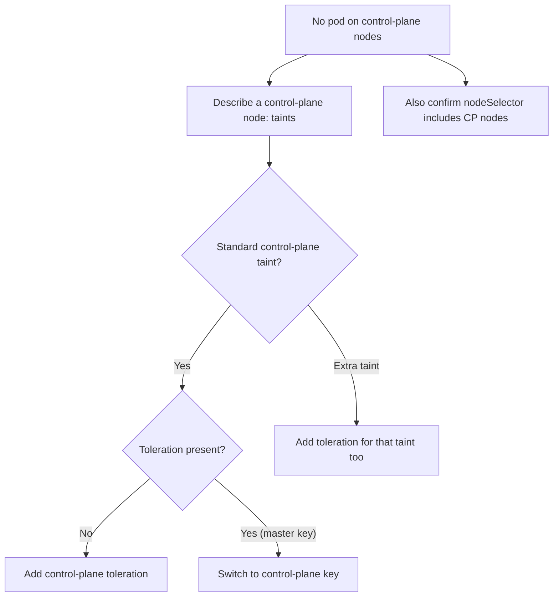

# DaemonSet Skips Control Plane

> **Severity:** Medium · **Typical recovery time:** 5–20 min · **Affected versions:** 1.24+

## Error Message

```text
$ kubectl get pods -n monitoring -l app=node-exporter -o wide
NAME                  READY   STATUS    NODE
node-exporter-7xk2d   1/1     Running   worker-1
node-exporter-9plm4   1/1     Running   worker-2
# no pod on cp-1 / cp-2 / cp-3

Events:
  Warning  FailedScheduling  pod node-exporter had untolerated taint
           {node-role.kubernetes.io/control-plane: }
```

## Description

Control-plane nodes carry the taint `node-role.kubernetes.io/control-plane:NoSchedule`
to keep general workloads off them. A DaemonSet without a matching toleration runs
on workers but skips control-plane nodes — so metrics, logs, or security agents have
no coverage there. Because the control plane is often the most important thing to
observe, this gap is significant even though the DaemonSet looks "mostly healthy".
`DESIRED` will reflect only the tolerated (worker) nodes, masking the omission.

## Affected Kubernetes Versions

The taint key changed: older clusters used `node-role.kubernetes.io/master`; from
1.24 the `control-plane` key is the standard and the legacy `master` taint/label was
removed in 1.25. On a mixed or upgraded cluster a node may briefly carry both, so
tolerate both keys for portability. Behaviour is otherwise consistent 1.24+.

## Likely Root Causes

- DaemonSet lacks a toleration for `node-role.kubernetes.io/control-plane`
- Toleration uses the old `master` key on a 1.25+ cluster (no longer matches)
- A custom additional taint on control-plane nodes beyond the standard one
- A `nodeSelector` that inadvertently excludes control-plane nodes

## Diagnostic Flow



## Verification Steps

Confirm a pod is genuinely absent from control-plane nodes (not just `Pending`), then
read the control-plane taints and compare them against the DaemonSet's tolerations.

## kubectl Commands

```bash
kubectl get nodes -l node-role.kubernetes.io/control-plane
kubectl get pods -n monitoring -l app=node-exporter -o wide
kubectl describe node <control-plane-node> | grep -i taint
kubectl get daemonset node-exporter -n monitoring -o jsonpath='{.spec.template.spec.tolerations}'
kubectl get events -n monitoring --sort-by=.lastTimestamp
```

## Expected Output

```text
$ kubectl describe node cp-1 | grep -i taint
Taints:  node-role.kubernetes.io/control-plane:NoSchedule

$ kubectl get daemonset node-exporter -n monitoring \
    -o jsonpath='{.spec.template.spec.tolerations}'
[{"key":"node-role.kubernetes.io/master","effect":"NoSchedule"}]   # wrong key
```

## Common Fixes

1. Add a toleration for `node-role.kubernetes.io/control-plane` (effect `NoSchedule`)
2. Replace any legacy `master`-key toleration with the `control-plane` key
3. For agents required everywhere, tolerate broadly with `operator: Exists`

## Recovery Procedures

1. Read the exact control-plane taints from the nodes.
2. Add the matching toleration(s) to the DaemonSet pod template (include both
   `master` and `control-plane` keys if the fleet is mid-upgrade).
3. Apply the change. **Disruptive:** the template edit triggers a rolling update on
   nodes already running the pod; blast radius is bounded by `maxUnavailable`, one
   batch at a time. Newly-eligible control-plane nodes simply gain a pod.
4. Confirm the scheduler places pods onto the control-plane nodes.

## Validation

`kubectl get pods -o wide` shows a pod `Running` on every control-plane node, and
`kubectl get daemonset` `DESIRED` now includes those nodes with `AVAILABLE` equal.
The agent's data (metrics/logs) appears for control-plane hosts.

## Prevention

Bake control-plane tolerations into observability and security DaemonSet base
manifests by default. Tolerate both the legacy and current keys until the whole
fleet is on 1.25+. Alert when expected node counts (workers + control plane) do not
match a critical DaemonSet's `DESIRED`.

## Related Errors

- [DaemonSet Pods Pending (taints)](daemonset-pods-pending-taints.md)
- [DaemonSet Not On All Nodes](daemonset-not-scheduled-all-nodes.md)
- [DaemonSet nodeSelector No Match](daemonset-nodeselector-no-match.md)

## References

- [Taints and Tolerations](https://kubernetes.io/docs/concepts/scheduling-eviction/taint-and-toleration/)
- [Well-Known Labels, Annotations and Taints](https://kubernetes.io/docs/reference/labels-annotations-taints/#node-role-kubernetes-io-control-plane-taint)

## Further Reading

- [DevOps AI ToolKit — Kubernetes guides](https://devopsaitoolkit.com/blog/)
