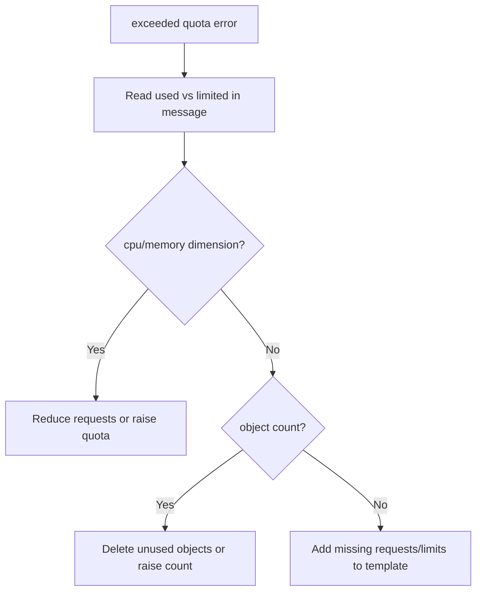

# Exceeded Quota

> **Severity:** High · **Typical recovery time:** 5–30 min · **Affected versions:** 1.20+

## Error Message

```text
Error creating: pods "web-5c9d-" is forbidden: exceeded quota: compute-quota,
requested: requests.cpu=2, used: requests.cpu=9, limited: requests.cpu=10
```

## Description

A namespace `ResourceQuota` caps aggregate resource requests/limits or object
counts. When a Deployment's new pods would push usage past a quota dimension
(here `requests.cpu`), the API server rejects pod creation. The ReplicaSet
controller records the rejection as a `FailedCreate` event and the Deployment
stalls below its desired replica count.

The message is precise: it names the quota, what was requested, what is already
used, and the limit. That arithmetic tells you exactly how much headroom is
missing. This blocks both new rollouts and scale-ups. If a quota also enforces
that every pod declares requests/limits, pods without them are rejected too.

## Affected Kubernetes Versions

Applies to all supported releases (1.20+). `ResourceQuota` semantics and the
`exceeded quota` message format are stable. Quota scopes (e.g.
`BestEffort`, `PriorityClass`) behave consistently across versions.

## Likely Root Causes

- Aggregate `requests.cpu`/`requests.memory` would exceed the quota
- Object-count quota hit (`count/pods`, `count/deployments.apps`)
- Pod template missing requests/limits a quota requires
- Quota set too low for the workload's current replica count

## Diagnostic Flow



## Verification Steps

Read the quota message for the exact dimension and headroom, then confirm
current namespace usage against the quota object.

## kubectl Commands

```bash
kubectl describe resourcequota -n prod
kubectl get resourcequota -n prod -o yaml
kubectl describe deployment web -n prod
kubectl get rs -n prod -l app=web
kubectl get events -n prod --field-selector reason=FailedCreate --sort-by=.lastTimestamp
kubectl get deployment web -n prod -o jsonpath='{.spec.template.spec.containers[*].resources}'
```

## Expected Output

```text
$ kubectl describe resourcequota -n prod
Name:            compute-quota
Resource         Used   Hard
--------         ----   ----
requests.cpu     9      10
requests.memory  18Gi   20Gi
pods             18     20
```

## Common Fixes

1. Lower the pod template's `resources.requests` to fit available headroom
2. Increase the `ResourceQuota` hard limits (cluster-admin)
3. Free quota by removing unused workloads/objects in the namespace

## Recovery Procedures

1. Read the quota message and `describe resourcequota` to quantify the gap
   (read-only).
2. If requests are oversized, reduce them in the Deployment and apply.
   **Blast radius:** triggers a rolling update; sizing down requests may affect
   performance, so validate against load.
3. If the quota is genuinely too small, a cluster-admin raises the
   `ResourceQuota`; the controller then retries pod creation automatically.
   **Blast radius:** none to running pods.

## Validation

`kubectl describe resourcequota -n prod` shows `Used` below `Hard` for the
relevant dimension, and the Deployment reaches its desired ready replicas.

## Prevention

- Right-size requests/limits and review them against quotas before deploy
- Alert when namespace quota usage exceeds ~80%
- Use LimitRange defaults so pods always declare requests
- Capacity-plan quotas to cover peak replica counts and HPA maxReplicas

## Related Errors

- [ReplicaFailure / FailedCreate](replicafailure-failedcreate.md)
- [Deployment Not Scaling Up](deployment-not-scaling-up.md)
- [ProgressDeadlineExceeded](progressdeadlineexceeded.md)

## References

- [Resource Quotas](https://kubernetes.io/docs/concepts/policy/resource-quotas/)
- [Limit Ranges](https://kubernetes.io/docs/concepts/policy/limit-range/)

## Further Reading

- [Free Kubernetes config validators](https://devopsaitoolkit.com/validators/)
