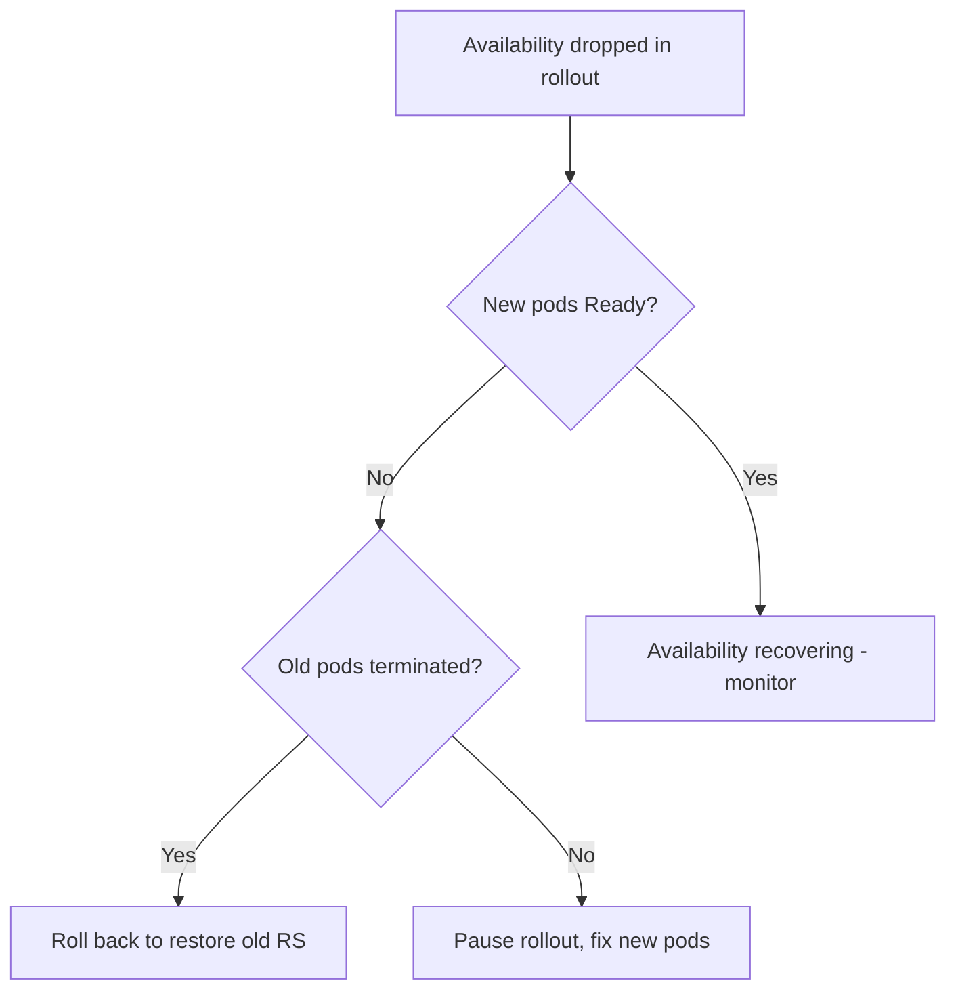

# maxUnavailable Outage

> **Severity:** Critical · **Typical recovery time:** 5–30 min · **Affected versions:** 1.20+

## Error Message

```text
deployment "web": too many replicas unavailable during rollout
NAME   READY   UP-TO-DATE   AVAILABLE
web    0/6     6            0
```

## Description

During a RollingUpdate, the Deployment controller may take down old pods up to
`maxUnavailable` before new pods are ready. If the new pods are slow to become
ready, or never do, available replicas can drop far enough to cause a partial or
total service outage even though the rollout is "progressing".

This is most damaging when `maxUnavailable` is set high (or as a large
percentage) and the new pods have a long readiness ramp or are failing. The
classic incident: a rollout starts, old healthy pods are terminated to honour
`maxUnavailable`, new pods aren't ready yet, and availability collapses while the
old, working version is being removed.

## Affected Kubernetes Versions

Applies to all supported releases (1.20+). RollingUpdate defaults are
`maxUnavailable: 25%` and `maxSurge: 25%`. The arithmetic and rounding rules
(maxUnavailable rounds down, maxSurge rounds up) are stable across versions.

## Likely Root Causes

- `maxUnavailable` too high relative to replica count
- New pods slow to pass readiness while old pods are already terminated
- `maxSurge: 0` combined with high `maxUnavailable`, leaving no buffer
- No PodDisruptionBudget to floor minimum availability

## Diagnostic Flow



## Verification Steps

Compare available replicas to desired during the rollout and confirm old pods
were terminated before new pods became ready.

## kubectl Commands

```bash
kubectl get deployment web -n prod -o wide
kubectl get deployment web -n prod -o jsonpath='{.spec.strategy.rollingUpdate}'
kubectl get rs -n prod -l app=web
kubectl get pods -n prod -l app=web -o wide
kubectl rollout status deployment/web -n prod --timeout=10s
kubectl get pdb -n prod
```

## Expected Output

```text
$ kubectl get deployment web -n prod -o wide
NAME   READY   UP-TO-DATE   AVAILABLE   AGE
web    0/6     6            0           9m

$ kubectl get deployment web -n prod -o jsonpath='{.spec.strategy.rollingUpdate}'
{"maxSurge":"25%","maxUnavailable":"50%"}
```

## Common Fixes

1. Lower `maxUnavailable` (e.g. `0` or `1`) and set `maxSurge >= 1`
2. Fix readiness probes so new pods are marked ready quickly and accurately
3. Add a PodDisruptionBudget to enforce a minimum available count

## Recovery Procedures

1. Assess current availability and whether new pods will recover (read-only).
2. If service is degraded and new pods are failing, roll back immediately:
   `kubectl rollout undo deployment/web -n prod`. **Blast radius:** restores the
   previous ReplicaSet to full size — fastest path back to availability.
3. If the rollout just needs to stop progressing while you fix it:
   `kubectl rollout pause deployment/web -n prod` to halt further pod
   termination, then correct the strategy and resume. **Blast radius:** freezes
   the rollout at its current mix of old/new pods.

## Validation

`kubectl get deployment web -n prod` shows `AVAILABLE` back to the desired
count, error rates return to baseline, and readiness probes pass.

## Prevention

- Set `maxUnavailable: 0` (or `1`) with `maxSurge >= 1` for critical services
- Define PodDisruptionBudgets with a sensible `minAvailable`
- Use accurate readiness probes so availability reflects real health
- Canary or progressive rollouts for high-impact services

## Related Errors

- [Deployment Rollout Stuck](deployment-rollout-stuck.md)
- [ProgressDeadlineExceeded](progressdeadlineexceeded.md)
- [New ReplicaSet ImagePullBackOff](deployment-new-replicaset-imagepull.md)

## References

- [Rolling update strategy](https://kubernetes.io/docs/concepts/workloads/controllers/deployment/#rolling-update-deployment)
- [Pod Disruption Budgets](https://kubernetes.io/docs/concepts/workloads/pods/disruptions/)

## Further Reading

- [Free Kubernetes config validators](https://devopsaitoolkit.com/validators/)
