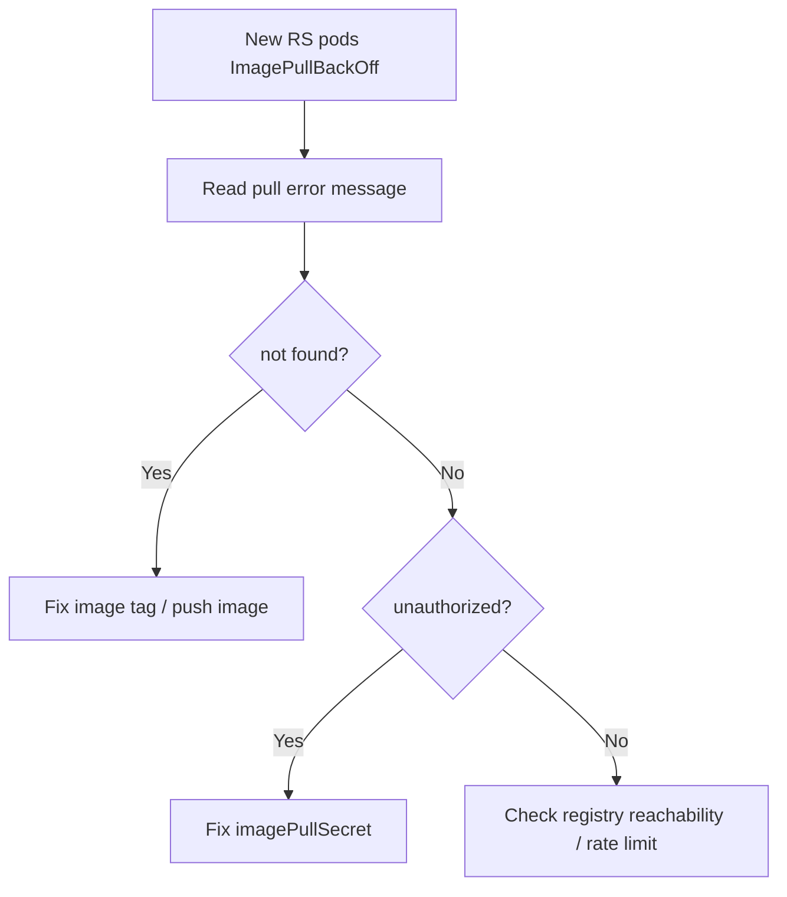

# New ReplicaSet ImagePullBackOff

> **Severity:** High · **Typical recovery time:** 5–30 min · **Affected versions:** 1.20+

## Error Message

```text
NAME                 READY   STATUS             RESTARTS   AGE
web-7d4f-aaaaa       0/1     ImagePullBackOff   0          6m
Events:
  Failed to pull image "registry.example.com/web:v2": rpc error:
  not found / unauthorized
```

## Description

A rollout created a new ReplicaSet, but its pods cannot pull the container
image, so they stay in `ImagePullBackOff`. The old ReplicaSet's pods keep
serving traffic, so the symptom is a stalled rollout rather than an immediate
outage — until `maxUnavailable` erodes the old pods or the progress deadline
trips.

The trigger is almost always the new image reference: a wrong or missing tag, a
private registry with no/expired pull secret, or a registry/network problem.
Because only the *new* ReplicaSet is affected, the fix is in the new pod
template, and rollback is a safe immediate mitigation. See the pod-level
[ImagePullBackOff](../pods/crashloopbackoff.md) patterns for image-specific
debugging.

## Affected Kubernetes Versions

Applies to all supported releases (1.20+). Image pull behaviour, backoff, and
`imagePullSecrets` are stable. Registry auth mechanics differ by runtime but the
Deployment-level symptom is identical.

## Likely Root Causes

- Wrong or nonexistent image tag/digest in the new template
- Missing or expired `imagePullSecret` for a private registry
- Registry unreachable, rate-limited, or down
- Image not pushed/promoted to the registry before deploy

## Diagnostic Flow



## Verification Steps

Confirm the failing pods belong to the newest ReplicaSet and read the exact
pull error (`not found` vs `unauthorized` vs network).

## kubectl Commands

```bash
kubectl get rs -n prod -l app=web --sort-by=.metadata.creationTimestamp
kubectl get pods -n prod -l app=web -o wide
kubectl describe pod <new-pod> -n prod
kubectl get deployment web -n prod -o jsonpath='{.spec.template.spec.containers[*].image}'
kubectl get events -n prod --field-selector reason=Failed --sort-by=.lastTimestamp
kubectl get serviceaccount default -n prod -o yaml
```

## Expected Output

```text
$ kubectl describe pod web-7d4f-aaaaa -n prod
  Warning  Failed  Failed to pull image "registry.example.com/web:v2":
  manifest unknown: manifest unknown
  Warning  Failed  Error: ImagePullBackOff
```

## Common Fixes

1. Correct the image tag/digest, or push the image to the registry
2. Add/refresh the `imagePullSecret` and reference it in the pod spec/SA
3. Resolve registry reachability or Docker Hub rate-limit issues

## Recovery Procedures

1. Identify the new ReplicaSet and read the pull error (read-only).
2. To stop bad pods churning while you investigate:
   `kubectl rollout pause deployment/web -n prod`. **Blast radius:** halts the
   rollout; old pods keep serving.
3. If the image is broken, roll back:
   `kubectl rollout undo deployment/web -n prod`. **Blast radius:** removes the
   failing new ReplicaSet and restores the previous version.
4. After fixing the image/secret, apply the corrected template (or resume) to
   re-roll. **Blast radius:** normal rolling update.

## Validation

New ReplicaSet pods reach `Running 1/1`, `kubectl rollout status` succeeds, and
no further `Failed`/`ImagePullBackOff` events appear.

## Prevention

- Pin images by immutable digest and verify they exist pre-deploy
- Manage pull secrets centrally; alert before credentials expire
- Mirror/cache critical images to avoid registry rate limits
- Validate image references in CI before merge

## Related Errors

- [Deployment Rollout Stuck](deployment-rollout-stuck.md)
- [ProgressDeadlineExceeded](progressdeadlineexceeded.md)
- [CrashLoopBackOff](../pods/crashloopbackoff.md)

## References

- [Images and pull secrets](https://kubernetes.io/docs/concepts/containers/images/)
- [Pull an image from a private registry](https://kubernetes.io/docs/tasks/configure-pod-container/pull-image-private-registry/)

## Further Reading

- [DevOps AI ToolKit — Kubernetes guides](https://devopsaitoolkit.com/blog/)
