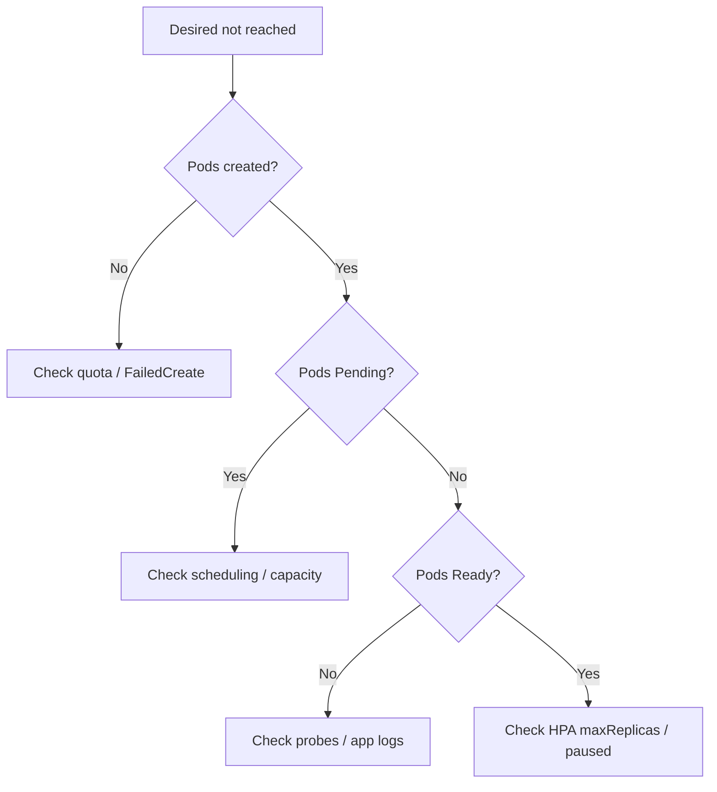

# Deployment Not Scaling Up

> **Severity:** High · **Typical recovery time:** 10–40 min · **Affected versions:** 1.20+

## Error Message

```text
deployment "web": desired replicas not reached
NAME   READY   UP-TO-DATE   AVAILABLE
web    2/5     5            2
```

## Description

You scaled a Deployment (or an HPA did) but the available replica count never
reaches the desired number. The Deployment shows `READY 2/5` and stays there.
This means the ReplicaSet created the pod objects but they cannot become ready,
or could not be created at all.

The root cause is almost always downstream of the Deployment: pods stuck
`Pending` for lack of capacity, blocked by quota, or failing to start. A
secondary cause is the desired count itself being wrong — an HPA capped at a low
`maxReplicas`, or a paused deployment ignoring the spec change. During an
incident this manifests as under-capacity and rising latency.

## Affected Kubernetes Versions

Applies to all supported releases (1.20+). Scaling semantics are stable. On
clusters with Cluster Autoscaler or Karpenter, node provisioning latency is the
common reason scale-up lags behind desired count.

## Likely Root Causes

- Insufficient cluster capacity — new pods stay `Pending` (no node fits)
- ResourceQuota blocking additional pods (`FailedCreate`)
- HPA `maxReplicas` lower than expected, capping the desired count
- Deployment paused, or pods failing readiness so they never count as available

## Diagnostic Flow



## Verification Steps

Compare desired vs. available, then check whether missing pods exist as
`Pending`, are missing entirely, or exist but are not ready.

## kubectl Commands

```bash
kubectl get deployment web -n prod -o wide
kubectl get rs -n prod -l app=web
kubectl get pods -n prod -l app=web -o wide
kubectl describe pod <pending-pod> -n prod
kubectl get hpa -n prod
kubectl describe resourcequota -n prod
kubectl get events -n prod --sort-by=.lastTimestamp
```

## Expected Output

```text
$ kubectl get pods -n prod -l app=web
NAME             READY   STATUS    RESTARTS   AGE
web-5c9d-aaaaa   1/1     Running   0          12m
web-5c9d-bbbbb   1/1     Running   0          12m
web-5c9d-ccccc   0/1     Pending   0          3m

$ kubectl describe pod web-5c9d-ccccc -n prod
Warning  FailedScheduling  0/6 nodes are available: 6 Insufficient cpu.
```

## Common Fixes

1. Add cluster capacity (scale node group / let autoscaler provision)
2. Raise ResourceQuota or reduce pod requests
3. Adjust HPA `maxReplicas`, or resume a paused deployment

## Recovery Procedures

1. Identify why missing pods are absent or `Pending` (read-only).
2. For capacity: scale the node group or wait for Cluster Autoscaler; new pods
   schedule automatically once nodes appear. **Blast radius:** none to existing
   pods.
3. For a paused deployment: `kubectl rollout resume deployment/web -n prod`.
   **Blast radius:** applies any pending spec changes as a rolling update.
4. For HPA caps, raise `maxReplicas` in the HPA spec and re-apply.

## Validation

`kubectl get deployment web -n prod` shows `READY 5/5` and `AVAILABLE 5`, with
no `Pending` pods remaining.

## Prevention

- Configure Cluster Autoscaler/Karpenter with headroom
- Set HPA `maxReplicas` to cover peak load
- Keep quotas aligned with expected peak replica counts
- Alert when available replicas trail desired for >N minutes

## Related Errors

- [Exceeded Quota](deployment-exceeded-quota.md)
- [ReplicaFailure / FailedCreate](replicafailure-failedcreate.md)
- [Deployment Paused](deployment-paused.md)

## References

- [Scaling a Deployment](https://kubernetes.io/docs/concepts/workloads/controllers/deployment/#scaling-a-deployment)
- [Horizontal Pod Autoscaler](https://kubernetes.io/docs/tasks/run-application/horizontal-pod-autoscale/)

## Further Reading

- [DevOps AI ToolKit — Kubernetes guides](https://devopsaitoolkit.com/blog/)
