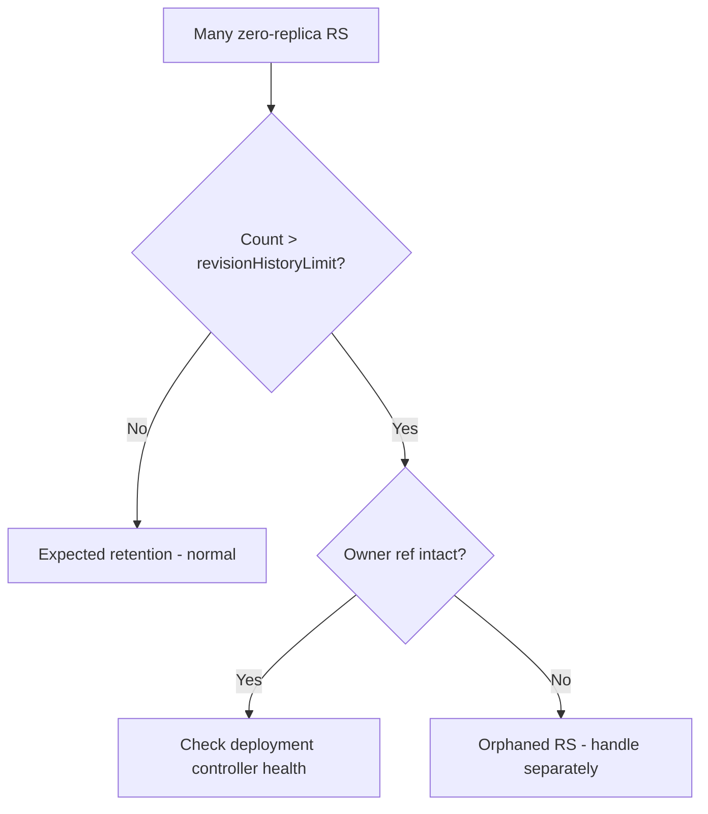

# Old ReplicaSets Not Cleaned

> **Severity:** Low · **Typical recovery time:** 5–15 min · **Affected versions:** 1.20+

## Error Message

```text
$ kubectl get rs -n prod -l app=web
NAME             DESIRED   CURRENT   READY   AGE
web-5c9d         3         3         3       2m
web-7f8a         0         0         0       3d
web-9a1b         0         0         0       8d
web-2c3d         0         0         0       20d   # old ReplicaSets retained
```

## Description

After many rollouts, a Deployment accumulates ReplicaSets — one per revision.
Kubernetes keeps up to `revisionHistoryLimit` (default 10) scaled-to-zero
ReplicaSets for rollback history and garbage-collects the rest. If the limit is
high or never set, you can end up with a long list of zero-replica ReplicaSets
cluttering the namespace.

This is rarely an incident on its own. The concern is etcd/object clutter, noisy
`kubectl get rs` output, and edge cases where stale ReplicaSets cause confusion
during rollback. If old ReplicaSets are *not* being cleaned even below the limit,
suspect a stuck Deployment controller or a ReplicaSet with stray ownership.

## Affected Kubernetes Versions

Applies to all supported releases (1.20+). Default `revisionHistoryLimit` is 10.
Cleanup is performed by the Deployment controller; semantics are stable.

## Likely Root Causes

- `revisionHistoryLimit` set high (or to a large number) so many are kept
- Frequent rollouts generating many revisions
- Deployment controller not reconciling (controller-manager issue)
- Old ReplicaSets with broken/removed owner references not GC'd

## Diagnostic Flow



## Verification Steps

Count the ReplicaSets and compare against `revisionHistoryLimit`. Confirm extras
are scaled to zero and owned by the Deployment.

## kubectl Commands

```bash
kubectl get rs -n prod -l app=web --sort-by=.metadata.creationTimestamp
kubectl get deployment web -n prod -o jsonpath='{.spec.revisionHistoryLimit}'
kubectl get rs -n prod -l app=web -o custom-columns=NAME:.metadata.name,OWNER:.metadata.ownerReferences[0].name,REPLICAS:.spec.replicas
kubectl rollout history deployment/web -n prod
kubectl describe rs <old-rs> -n prod
```

## Expected Output

```text
$ kubectl get deployment web -n prod -o jsonpath='{.spec.revisionHistoryLimit}'
10

$ kubectl get rs -n prod -l app=web
NAME       DESIRED   CURRENT   READY   AGE
web-5c9d   3         3         3       2m
web-7f8a   0         0         0       3d
web-9a1b   0         0         0       8d
```

## Common Fixes

1. Lower `revisionHistoryLimit` to keep fewer revisions automatically
2. Let normal garbage collection run once the limit is reduced
3. If controller isn't reconciling, restore controller-manager health

## Recovery Procedures

1. Confirm whether retention is expected (within limit) — if so, no action.
2. Reduce `revisionHistoryLimit` in the Deployment spec and apply; the
   controller GCs the excess scaled-to-zero ReplicaSets automatically.
   **Blast radius:** removes rollback history beyond the new limit — ensure Git
   holds the manifests you might need.
3. Only delete a specific stale ReplicaSet manually if it is confirmed
   zero-replica and outside the history you need:
   `kubectl delete rs <old-rs> -n prod`. **Blast radius:** deletes that revision
   permanently; never delete the current ReplicaSet.

## Validation

`kubectl get rs -n prod -l app=web` shows a count at or below
`revisionHistoryLimit`, with the current revision intact and serving.

## Prevention

- Set a sensible `revisionHistoryLimit` (e.g. 3–10) per workload
- Monitor controller-manager health so GC keeps running
- Use GitOps as the durable history rather than cluster retention
- Avoid manual ReplicaSet deletion in automation

## Related Errors

- [Rollback Revision Not Found](deployment-revision-not-found.md)
- [Orphaned ReplicaSet](deployment-orphaned-replicaset.md)
- [Deployment Rollout Stuck](deployment-rollout-stuck.md)

## References

- [Clean up policy](https://kubernetes.io/docs/concepts/workloads/controllers/deployment/#clean-up-policy)
- [Garbage collection](https://kubernetes.io/docs/concepts/architecture/garbage-collection/)

## Further Reading

- [DevOps AI ToolKit — Kubernetes guides](https://devopsaitoolkit.com/blog/)
