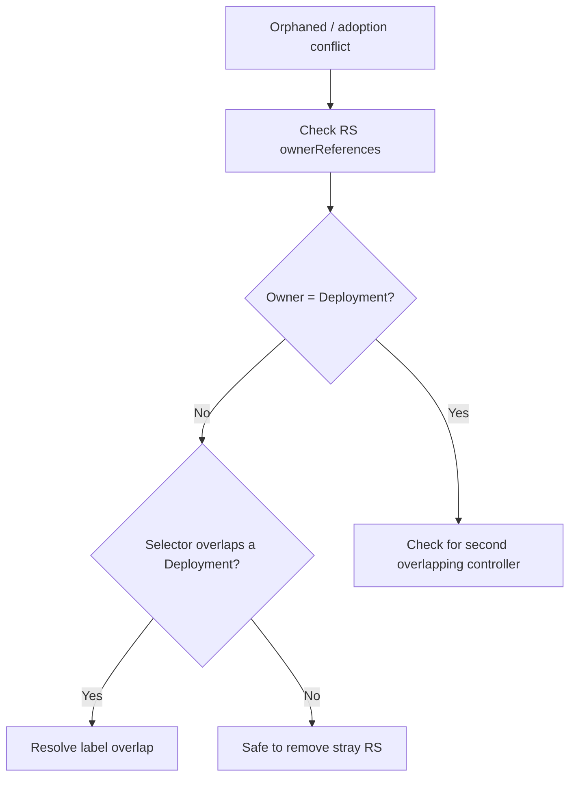

# Orphaned ReplicaSet

> **Severity:** Medium · **Typical recovery time:** 10–30 min · **Affected versions:** 1.20+

## Error Message

```text
Events:
  Warning  SelectorOverlap  replicaset-controller
  ReplicaSet "web-legacy" has overlapping selector and no controller owner reference;
  pods may be adopted/orphaned unexpectedly
```

## Description

A ReplicaSet is "orphaned" when it has no controlling `ownerReference` to a
Deployment, or when two controllers' selectors overlap so pod ownership is
ambiguous. Kubernetes' controllers adopt pods that match their selector and lack
an owner; if a stray ReplicaSet shares labels with your Deployment, pods can be
adopted by the wrong controller, double-counted, or fought over — leading to
unexpected scaling, surprise terminations, or a ReplicaSet that won't be cleaned
up.

This usually stems from manually created ReplicaSets, broken owner references
after a bad `kubectl replace`/restore, or two objects (e.g. a Deployment and a
bare ReplicaSet) with overlapping selectors. The Deployment may appear to have
"extra" pods or fail to reconcile counts correctly.

## Affected Kubernetes Versions

Applies to all supported releases (1.20+). Owner references, adoption, and
garbage-collection semantics are stable. The behaviour follows the controller
adoption rules common to ReplicaSet/Deployment controllers across versions.

## Likely Root Causes

- A bare ReplicaSet created manually with labels overlapping a Deployment
- Owner reference lost after `kubectl replace --force` or a partial restore
- Two Deployments with overlapping selectors competing for the same pods
- Backup/restore tooling that dropped `ownerReferences`

## Diagnostic Flow



## Verification Steps

Inspect each ReplicaSet's `ownerReferences` and compare selectors across
controllers to find overlap or a missing owner.

## kubectl Commands

```bash
kubectl get rs -n prod -o custom-columns=NAME:.metadata.name,OWNER:.metadata.ownerReferences[0].name,KIND:.metadata.ownerReferences[0].kind
kubectl get rs web-legacy -n prod -o yaml
kubectl get deployments -n prod -o custom-columns=NAME:.metadata.name,SELECTOR:.spec.selector.matchLabels
kubectl get pods -n prod --show-labels -l app=web
kubectl describe rs web-legacy -n prod
kubectl get events -n prod --sort-by=.lastTimestamp
```

## Expected Output

```text
$ kubectl get rs -n prod -o custom-columns=NAME:.metadata.name,OWNER:.metadata.ownerReferences[0].name,KIND:.metadata.ownerReferences[0].kind
NAME         OWNER   KIND
web-5c9d     web     Deployment
web-legacy   <none>  <none>
```

## Common Fixes

1. Delete the stray bare ReplicaSet if it is not owned and not needed
2. De-overlap selectors so each controller owns a distinct label set
3. Restore correct `ownerReferences` from the managing Deployment

## Recovery Procedures

1. Map owner references and selectors to identify the orphan and any overlap
   (read-only).
2. If a bare ReplicaSet overlaps your Deployment's selector, first make its
   labels distinct or scale it to zero, so its pods aren't tied to your app,
   then remove it: `kubectl delete rs web-legacy -n prod`. **Blast radius:**
   deletes that ReplicaSet and its pods — verify they are not serving production
   traffic first.
3. If selectors overlap between two Deployments, the safe fix is to recreate one
   under a unique selector (selectors are immutable). **Blast radius:** treat as
   a migration with traffic cutover, not an in-place edit.

## Validation

Every remaining ReplicaSet has a correct `ownerReference` to its Deployment, no
selector overlap remains, and pod counts reconcile to desired.

## Prevention

- Never create bare ReplicaSets; manage pods via Deployments
- Keep selectors unique and minimal per workload
- Avoid `kubectl replace --force`; prefer `apply`
- Ensure backup/restore tooling preserves owner references

## Related Errors

- [Selector Immutable](deployment-selector-immutable.md)
- [Old ReplicaSets Not Cleaned](deployment-old-replicasets-not-cleaned.md)
- [Deployment Not Scaling Up](deployment-not-scaling-up.md)

## References

- [Owners and dependents](https://kubernetes.io/docs/concepts/overview/working-with-objects/owners-dependents/)
- [ReplicaSet](https://kubernetes.io/docs/concepts/workloads/controllers/replicaset/)

## Further Reading

- [Free Kubernetes config validators](https://devopsaitoolkit.com/validators/)
