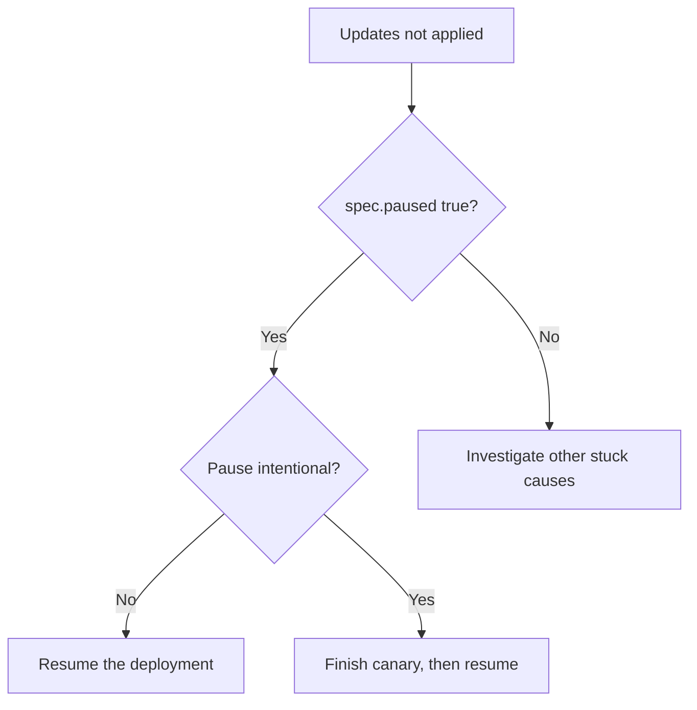

# Deployment Paused

> **Severity:** Medium · **Typical recovery time:** 2–10 min · **Affected versions:** 1.20+

## Error Message

```text
$ kubectl rollout status deployment/web -n prod
Waiting for deployment "web" rollout to finish: deployment is paused, will not be reconciled
```

## Description

A Deployment with `spec.paused: true` will not roll out spec changes. The
Deployment controller stops reconciling: you can edit the pod template, image,
or replica count, but no new ReplicaSet is created and no scaling occurs until
the Deployment is resumed. `kubectl rollout status` reports that it is paused.

Pausing is intentional — it is the mechanism behind manual canary workflows
(`kubectl rollout pause`, make several edits, then `resume` to apply them all at
once). The problem arises when a Deployment is left paused by mistake, making it
look "stuck" while it is simply ignoring updates. Existing pods keep running, so
there is no outage, but new releases silently never take effect.

## Affected Kubernetes Versions

Applies to all supported releases (1.20+). The `paused` field and
`pause`/`resume` subcommands are stable and unchanged across versions.

## Likely Root Causes

- A canary/manual rollout was paused and never resumed
- A CI/CD or progressive-delivery tool left the Deployment paused
- Someone ran `kubectl rollout pause` for debugging and forgot to resume
- The manifest itself sets `spec.paused: true` and was applied

## Diagnostic Flow



## Verification Steps

Confirm `spec.paused` is `true` and check whether any pending spec changes are
waiting to be applied once resumed.

## kubectl Commands

```bash
kubectl get deployment web -n prod -o jsonpath='{.spec.paused}'
kubectl get deployment web -n prod -o wide
kubectl rollout status deployment/web -n prod --timeout=5s
kubectl rollout history deployment/web -n prod
kubectl describe deployment web -n prod
```

## Expected Output

```text
$ kubectl get deployment web -n prod -o jsonpath='{.spec.paused}'
true

$ kubectl rollout status deployment/web -n prod
Waiting for deployment "web" rollout to finish: deployment is paused
```

## Common Fixes

1. Resume the Deployment so queued changes reconcile
2. Complete the canary workflow, then resume to roll out fully
3. Remove `spec.paused: true` from the manifest if it shouldn't be set

## Recovery Procedures

1. Confirm `spec.paused` is `true` and review pending edits (read-only).
2. Resume: `kubectl rollout resume deployment/web -n prod`. **Blast radius:** any
   accumulated spec changes (image, replicas, template) roll out at once per the
   update strategy — verify the desired spec before resuming so you don't ship
   an unintended template.
3. If the manifest sets `paused`, remove it and re-apply through normal CI/CD.

## Validation

`kubectl get deployment web -n prod -o jsonpath='{.spec.paused}'` is empty/false
and `kubectl rollout status` proceeds and reports success.

## Prevention

- Always pair `rollout pause` with a resume step in runbooks/automation
- Alert when a Deployment stays paused beyond an expected window
- Keep `spec.paused` out of committed manifests unless deliberate
- Let progressive-delivery controllers manage pause/resume, not humans

## Related Errors

- [Deployment Not Scaling Up](deployment-not-scaling-up.md)
- [Deployment Rollout Stuck](deployment-rollout-stuck.md)
- [Selector Immutable](deployment-selector-immutable.md)

## References

- [Pausing and resuming a rollout](https://kubernetes.io/docs/concepts/workloads/controllers/deployment/#pausing-and-resuming-a-deployment)
- [kubectl rollout](https://kubernetes.io/docs/reference/kubectl/generated/kubectl_rollout/)

## Further Reading

- [DevOps AI ToolKit — Kubernetes guides](https://devopsaitoolkit.com/blog/)
