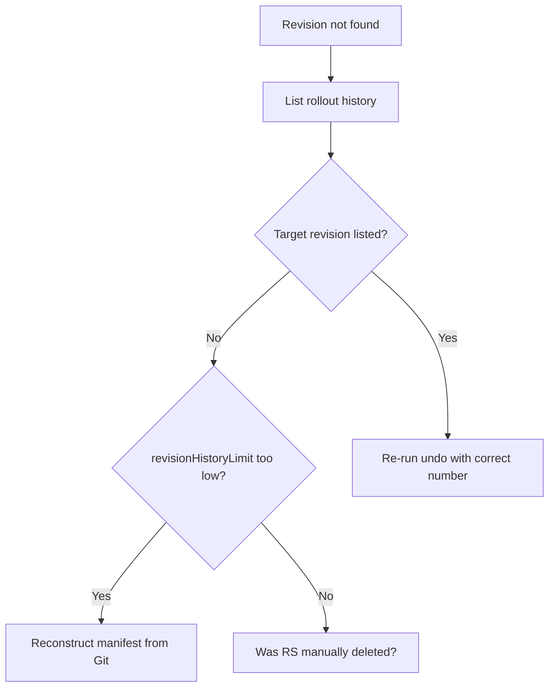

# Rollback Revision Not Found

> **Severity:** Medium · **Typical recovery time:** 5–20 min · **Affected versions:** 1.20+

## Error Message

```text
error: unable to find specified revision 5 in history
```

## Description

`kubectl rollout undo --to-revision=N` failed because revision N no longer
exists in the Deployment's history. Each revision corresponds to a ReplicaSet
that the Deployment retains; rollback works by scaling an old ReplicaSet back
up. If that ReplicaSet was deleted — usually because it fell outside
`revisionHistoryLimit` — the revision is gone and cannot be restored.

This typically bites during an incident: you try to roll back to a known-good
release and discover the cluster only kept the most recent few. The Deployment
spec is intact, but the historical pod templates needed for an automatic
rollback have been garbage-collected.

## Affected Kubernetes Versions

Applies to all supported releases (1.20+). The default `revisionHistoryLimit` is
10. Behaviour is stable; the only variable is how aggressively history was
trimmed in your manifests.

## Likely Root Causes

- `revisionHistoryLimit` set low, so the target ReplicaSet was deleted
- The old ReplicaSet was manually deleted with `kubectl delete rs`
- Requesting a revision number that never existed (typo)
- Many rapid rollouts pushed the wanted revision out of history

## Diagnostic Flow



## Verification Steps

List the available revisions and confirm the target number is genuinely absent
versus mistyped. Check `revisionHistoryLimit` to understand how many are kept.

## kubectl Commands

```bash
kubectl rollout history deployment/web -n prod
kubectl rollout history deployment/web -n prod --revision=4
kubectl get deployment web -n prod -o jsonpath='{.spec.revisionHistoryLimit}'
kubectl get rs -n prod -l app=web --sort-by=.metadata.annotations.deployment\.kubernetes\.io/revision
kubectl get deployment web -n prod -o yaml
```

## Expected Output

```text
$ kubectl rollout history deployment/web -n prod
deployment.apps/web
REVISION  CHANGE-CAUSE
8         kubectl apply --filename=web.yaml
9         kubectl apply --filename=web.yaml
10        kubectl apply --filename=web.yaml

$ kubectl rollout undo deployment/web -n prod --to-revision=5
error: unable to find specified revision 5 in history
```

## Common Fixes

1. Roll back to the oldest revision still present instead of the missing one
2. Re-apply the desired version from source control (Git is the real history)
3. Raise `revisionHistoryLimit` going forward to keep more revisions

## Recovery Procedures

1. Run `kubectl rollout history` to see which revisions remain (read-only).
2. If a good revision still exists, roll back to it:
   `kubectl rollout undo deployment/web -n prod --to-revision=<n>`.
   **Blast radius:** rolling replacement of all pods with the chosen template.
3. If the target is gone, recover the manifest from Git and
   `kubectl apply -f web.yaml`. **Blast radius:** triggers a fresh rollout; treat
   like any production deploy.

## Validation

`kubectl rollout status deployment/web -n prod` reports success and the running
pod template matches the intended version (image tag, env).

## Prevention

- Treat Git, not cluster history, as the source of truth for rollbacks
- Set `revisionHistoryLimit` high enough to cover realistic rollback needs
- Use GitOps so any past state can be re-applied deterministically
- Record `CHANGE-CAUSE` annotations for readable history

## Related Errors

- [Old ReplicaSets Not Cleaned](deployment-old-replicasets-not-cleaned.md)
- [Deployment Rollout Stuck](deployment-rollout-stuck.md)
- [ProgressDeadlineExceeded](progressdeadlineexceeded.md)

## References

- [Rolling back a Deployment](https://kubernetes.io/docs/concepts/workloads/controllers/deployment/#rolling-back-a-deployment)
- [Revision history limit](https://kubernetes.io/docs/concepts/workloads/controllers/deployment/#clean-up-policy)

## Further Reading

- [DevOps AI ToolKit — Kubernetes guides](https://devopsaitoolkit.com/blog/)
