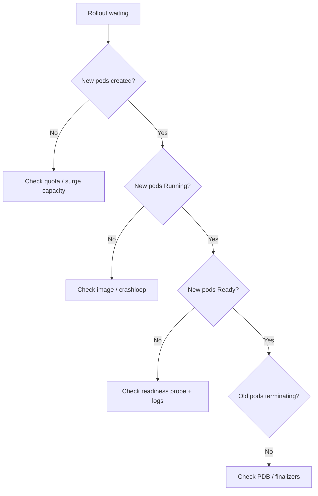

# Deployment Rollout Stuck

> **Severity:** High · **Typical recovery time:** 10–45 min · **Affected versions:** 1.20+

## Error Message

```text
Waiting for deployment "web" rollout to finish: 1 out of 3 new replicas have been updated...
Waiting for deployment "web" rollout to finish: 2 old replicas are pending termination...
```

## Description

`kubectl rollout status` blocks and repeats a "Waiting for..." message because
the Deployment controller cannot complete the transition from the old
ReplicaSet to the new one. The new pods are not becoming `Ready`, or the update
strategy will not let old pods terminate, so updated and available replica
counts never reach the desired total.

Unlike `ProgressDeadlineExceeded`, this is the live, in-progress view. The
deployment is partially rolled out: some traffic hits new pods, some hits old.
Left long enough, it will trip the progress deadline. The job during an incident
is to find which replicas are stuck and why.

## Affected Kubernetes Versions

Applies to all supported versions (1.20+). The rollout state machine and
`kubectl rollout status` output are stable across releases.

## Likely Root Causes

- New pods never pass readiness probes (app slow to start, wrong probe path)
- New pods fail to start (ImagePullBackOff, CrashLoopBackOff)
- `maxUnavailable: 0` plus no schedulable capacity for surge pods
- PodDisruptionBudget or anti-affinity preventing old pod termination

## Diagnostic Flow



## Verification Steps

Confirm both ReplicaSets exist and compare desired vs. ready/available counts.
Identify whether new pods are missing, not running, or not ready.

## kubectl Commands

```bash
kubectl rollout status deployment/web -n prod --timeout=10s
kubectl get deployment web -n prod -o wide
kubectl get rs -n prod -l app=web
kubectl get pods -n prod -l app=web -o wide
kubectl describe pod <new-pod> -n prod
kubectl get pdb -n prod
kubectl get events -n prod --sort-by=.lastTimestamp
```

## Expected Output

```text
$ kubectl get deployment web -n prod
NAME   READY   UP-TO-DATE   AVAILABLE   AGE
web    2/3     1            2           40m

$ kubectl rollout status deployment/web -n prod
Waiting for deployment "web" rollout to finish: 1 out of 3 new replicas have been updated...
```

## Common Fixes

1. Fix the new pods so they pass readiness (image, config, probe path/timeout)
2. Allow surge capacity (`maxSurge`) or add nodes when `maxUnavailable: 0`
3. Relax or temporarily widen a blocking PodDisruptionBudget

## Recovery Procedures

1. Inspect the new ReplicaSet pods read-only and resolve the start/readiness
   failure in the manifest.
2. If the new revision is bad, roll back:
   `kubectl rollout undo deployment/web -n prod`. **Blast radius:** scales the
   previous ReplicaSet back to full and removes the new pods; short churn.
3. To re-attempt after a fix, `kubectl rollout restart deployment/web -n prod`.
   **Blast radius:** recreates all pods per the rolling strategy.

## Validation

`kubectl rollout status` prints `successfully rolled out` and the deployment
shows `READY 3/3` with `UP-TO-DATE` equal to the replica count.

## Prevention

- Test rollouts in staging with the same probes and resources
- Set `maxSurge`/`maxUnavailable` so at least one pod can always be replaced
- Keep PDB `minAvailable` consistent with replica count and surge
- Add CI image/manifest validation

## Related Errors

- [ProgressDeadlineExceeded](progressdeadlineexceeded.md)
- [maxUnavailable Outage](deployment-maxunavailable-outage.md)
- [New ReplicaSet ImagePullBackOff](deployment-new-replicaset-imagepull.md)

## References

- [Managing rollouts](https://kubernetes.io/docs/concepts/workloads/controllers/deployment/#updating-a-deployment)
- [kubectl rollout](https://kubernetes.io/docs/reference/kubectl/generated/kubectl_rollout/)

## Further Reading

- [Free Kubernetes config validators](https://devopsaitoolkit.com/validators/)
