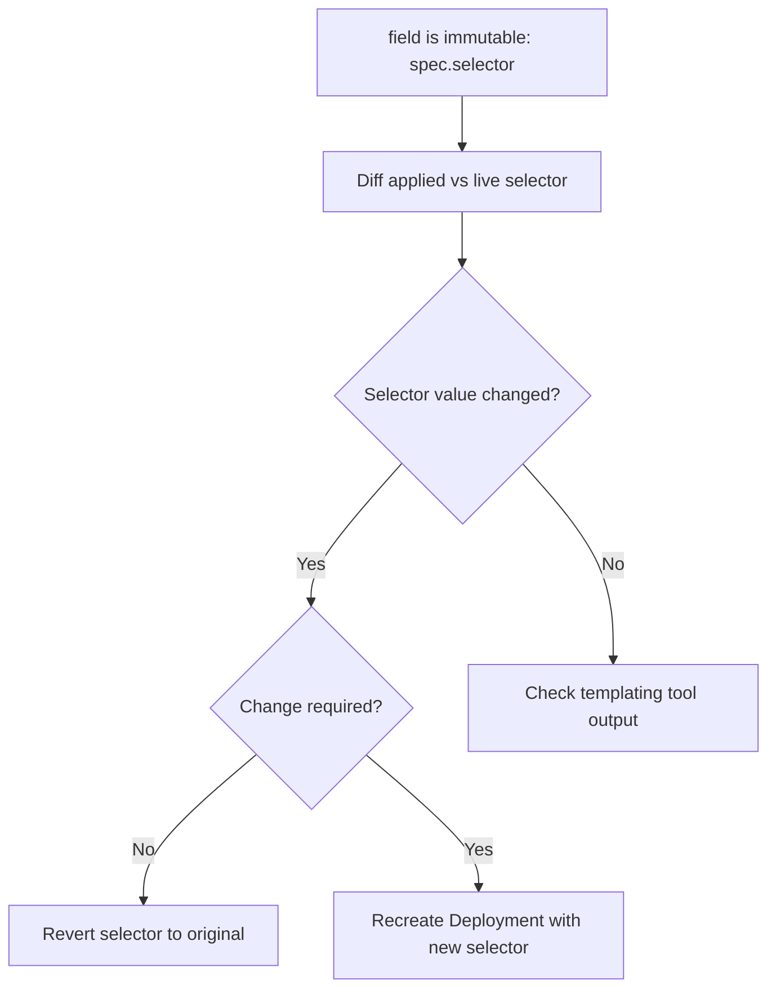

# Selector Immutable

> **Severity:** Medium · **Typical recovery time:** 5–20 min · **Affected versions:** 1.20+

## Error Message

```text
The Deployment "web" is invalid: spec.selector: Invalid value:
v1.LabelSelector{...}: field is immutable
```

## Description

`spec.selector` on a Deployment is immutable after creation. Any `kubectl apply`
or edit that changes the selector's `matchLabels`/`matchExpressions` is rejected
by the API server. The selector is what binds a Deployment to its ReplicaSets
and pods; changing it would orphan the existing ReplicaSets, so Kubernetes
forbids it outright rather than allowing a dangerous mutation.

This commonly surfaces when someone renames an app label, refactors common
labels across manifests, or a templating tool (Helm/Kustomize) changes a
selector value. The apply fails cleanly and the running Deployment is unchanged,
so it is a deploy-time blocker rather than a runtime outage.

## Affected Kubernetes Versions

Applies to all supported releases. The selector has been immutable for
`apps/v1` Deployments since that API version became the default (1.16). All
1.20+ clusters enforce this.

## Likely Root Causes

- Renaming or restructuring `matchLabels` keys/values in the manifest
- A shared/common label refactor changing the selector indirectly
- Helm chart upgrade that altered selector templating
- Copy-paste of a manifest with a mismatched selector

## Diagnostic Flow



## Verification Steps

Compare the live Deployment's selector with the manifest you are applying to
confirm the selector — not just pod labels — actually changed.

## kubectl Commands

```bash
kubectl get deployment web -n prod -o jsonpath='{.spec.selector}'
kubectl get deployment web -n prod -o yaml
kubectl diff -f web.yaml -n prod
kubectl get rs -n prod -l app=web
kubectl get pods -n prod --show-labels -l app=web
```

## Expected Output

```text
$ kubectl get deployment web -n prod -o jsonpath='{.spec.selector}'
{"matchLabels":{"app":"web"}}

$ kubectl apply -f web.yaml -n prod
The Deployment "web" is invalid: spec.selector: Invalid value:
field is immutable
```

## Common Fixes

1. Revert the selector to its original value (keep pod label changes separate)
2. If the selector must change, recreate the Deployment under the new selector
3. Pin the selector in templates so refactors don't touch it

## Recovery Procedures

1. Diff the manifest against the live object to confirm the selector change
   (read-only).
2. If the change was unintentional, restore the original selector and re-apply.
   **Blast radius:** none; the live Deployment was never modified.
3. If the new selector is genuinely required, perform a controlled replacement:
   create a new Deployment with the new selector, shift traffic, then delete the
   old one. **Blast radius:** running two ReplicaSets during cutover; plan it
   like a migration, not an in-place edit. Avoid
   `kubectl replace --force`, which deletes and recreates pods causing downtime.

## Validation

`kubectl apply -f web.yaml -n prod` succeeds, and the Deployment's selector
matches intent with all pods adopted (no orphaned ReplicaSets).

## Prevention

- Treat selectors as immutable identifiers; never refactor them casually
- Keep selector labels minimal and stable, separate from descriptive labels
- Review `kubectl diff` before apply in CI/CD
- Lock selector values in Helm/Kustomize so upgrades can't change them

## Related Errors

- [Orphaned ReplicaSet](deployment-orphaned-replicaset.md)
- [Deployment Rollout Stuck](deployment-rollout-stuck.md)
- [Deployment Paused](deployment-paused.md)

## References

- [Deployment selector](https://kubernetes.io/docs/concepts/workloads/controllers/deployment/#selector)
- [Labels and selectors](https://kubernetes.io/docs/concepts/overview/working-with-objects/labels/)

## Further Reading

- [Free Kubernetes config validators](https://devopsaitoolkit.com/validators/)
