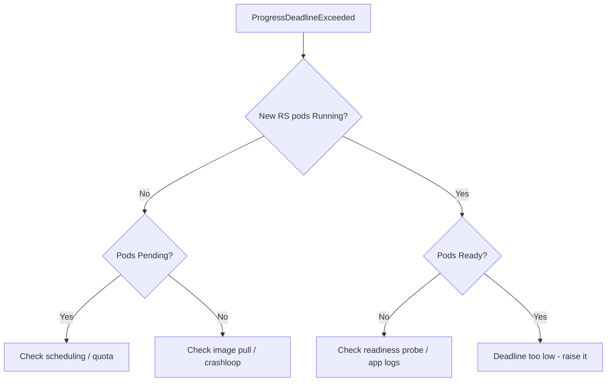

# ProgressDeadlineExceeded

> **Severity:** High · **Typical recovery time:** 5–30 min · **Affected versions:** 1.20+

## Error Message

```text
Conditions:
  Type           Status  Reason
  Progressing    False   ProgressDeadlineExceeded
Message: Deployment "web" exceeded its progress deadline
```

## Description

The Deployment controller tracks how long a rollout takes to make progress.
If the new ReplicaSet does not become fully available within
`spec.progressDeadlineSeconds` (default 600s), the controller sets the
`Progressing` condition to `False` with reason `ProgressDeadlineExceeded`.

This is a *status signal*, not an automatic rollback. The rollout does not stop
or revert; Kubernetes simply reports that it stopped making forward progress in
time. New pods that cannot start (bad image, failing probes, insufficient
resources) are the usual trigger. During an incident this condition tells you
the rollout is wedged and traffic may still be served by the old ReplicaSet.

## Affected Kubernetes Versions

Applies to all supported releases (1.20+). The `progressDeadlineSeconds` field
and `ProgressDeadlineExceeded` reason are stable. Behaviour is unchanged across
recent versions; only the default of 600 seconds matters when tuning.

## Likely Root Causes

- New pods crash or never pass readiness probes (image, config, dependencies)
- Insufficient cluster capacity, so new pods stay `Pending`
- ResourceQuota or LimitRange rejecting the new ReplicaSet's pods
- `progressDeadlineSeconds` set too low for a slow-starting application

## Diagnostic Flow



## Verification Steps

Confirm the `Progressing` condition reason is `ProgressDeadlineExceeded` and
identify the newest ReplicaSet and its pod states before acting.

## kubectl Commands

```bash
kubectl rollout status deployment/web -n prod --timeout=10s
kubectl describe deployment web -n prod
kubectl get rs -n prod -l app=web --sort-by=.metadata.creationTimestamp
kubectl get pods -n prod -l app=web -o wide
kubectl describe pod <new-pod> -n prod
kubectl get events -n prod --sort-by=.lastTimestamp
```

## Expected Output

```text
$ kubectl rollout status deployment/web -n prod
error: deployment "web" exceeded its progress deadline

$ kubectl get pods -n prod -l app=web
NAME                   READY   STATUS             RESTARTS   AGE
web-5c9d-abcde         0/1     ImagePullBackOff   0          11m
web-7f8a-fghij         1/1     Running            0          2d
```

## Common Fixes

1. Fix the underlying pod failure (correct the image tag, config, or probe)
2. Add cluster capacity or relax quota so new pods can schedule
3. Raise `spec.progressDeadlineSeconds` if the app legitimately starts slowly

## Recovery Procedures

1. Diagnose the new ReplicaSet's pods (read-only) before changing anything.
2. If the new spec is broken, roll back to the last good revision:
   `kubectl rollout undo deployment/web -n prod`. **Blast radius:** terminates
   the new (failing) pods and scales the previous ReplicaSet back up; brief
   churn but restores the known-good version.
3. If capacity is the issue, scale nodes/quota, then re-trigger with
   `kubectl rollout restart deployment/web -n prod`. **Blast radius:** rolls all
   pods per the update strategy.

## Validation

`kubectl rollout status deployment/web -n prod` returns
`successfully rolled out`, and the `Progressing` condition shows
`NewReplicaSetAvailable`.

## Prevention

- Validate images and manifests in CI before deploy
- Set realistic readiness probes (initialDelaySeconds, failureThreshold)
- Right-size `progressDeadlineSeconds` per workload startup time
- Use canary/staging to catch broken rollouts early

## Related Errors

- [Deployment Rollout Stuck](deployment-rollout-stuck.md)
- [New ReplicaSet ImagePullBackOff](deployment-new-replicaset-imagepull.md)
- [maxUnavailable Outage](deployment-maxunavailable-outage.md)

## References

- [Deployment progress deadline](https://kubernetes.io/docs/concepts/workloads/controllers/deployment/#progress-deadline-seconds)
- [Deployment status](https://kubernetes.io/docs/concepts/workloads/controllers/deployment/#deployment-status)

## Further Reading

- [DevOps AI ToolKit — Kubernetes guides](https://devopsaitoolkit.com/blog/)
