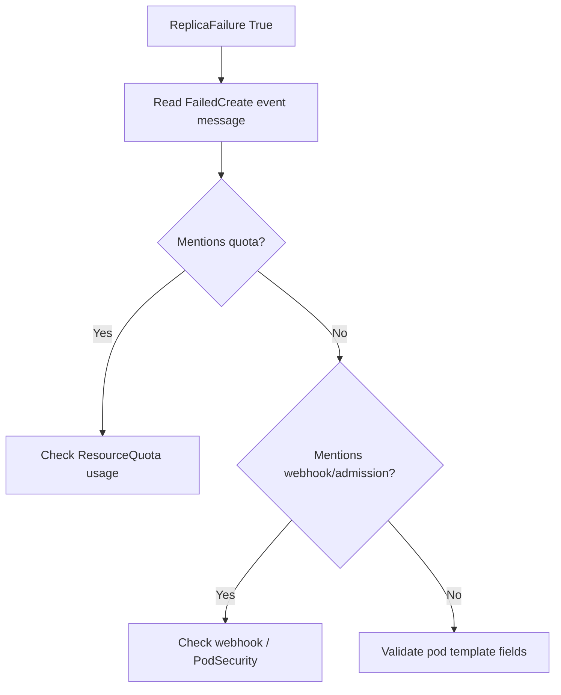

# ReplicaFailure / FailedCreate

> **Severity:** High · **Typical recovery time:** 5–30 min · **Affected versions:** 1.20+

## Error Message

```text
Conditions:
  Type             Status  Reason
  ReplicaFailure   True    FailedCreate
Events:
  Warning  FailedCreate  replicaset-controller
  Error creating: pods "web-5c9d-" is forbidden: exceeded quota: compute-quota,
  requested: requests.cpu=500m, used: requests.cpu=4, limited: requests.cpu=4
```

## Description

When the ReplicaSet controller tries to create pods but the API server rejects
them, the controller records a `FailedCreate` event and the Deployment surfaces
a `ReplicaFailure` condition with `Status: True`. The deployment then reports
fewer ready replicas than desired because the pods were never admitted.

The most common rejection is a ResourceQuota limit, but admission webhooks,
PodSecurity, or invalid pod templates produce the same `FailedCreate` shape. The
key signal is that no pod object is created at all — the failure happens at
admission, before scheduling. This makes it distinct from `Pending` pods that
exist but cannot be placed.

## Affected Kubernetes Versions

Applies to all supported releases (1.20+). The `ReplicaFailure` condition and
`FailedCreate` event reason are stable. With the built-in PodSecurity admission
(GA in 1.25), namespace-level enforcement is a more frequent cause of
`FailedCreate` on newer clusters.

## Likely Root Causes

- ResourceQuota exceeded for cpu/memory/pods/object counts
- Validating/mutating admission webhook rejecting the pod template
- PodSecurity admission denying the pod's securityContext
- Invalid pod template (bad field, missing required value)

## Diagnostic Flow



## Verification Steps

Read the exact `FailedCreate` message — it names the reason (quota, webhook,
forbidden field). Confirm the ReplicaSet's desired count exceeds its current.

## kubectl Commands

```bash
kubectl describe deployment web -n prod
kubectl get rs -n prod -l app=web
kubectl describe rs <new-rs> -n prod
kubectl get events -n prod --field-selector reason=FailedCreate --sort-by=.lastTimestamp
kubectl get resourcequota -n prod
kubectl describe resourcequota -n prod
```

## Expected Output

```text
$ kubectl describe rs web-5c9d -n prod
Replicas: 0 current / 3 desired
Conditions:
  Type             Status  Reason
  ReplicaFailure   True    FailedCreate
Events:
  Warning  FailedCreate  Error creating: pods "web-5c9d-" is forbidden:
  exceeded quota: compute-quota, requested: requests.cpu=500m
```

## Common Fixes

1. Increase the ResourceQuota or lower pod requests to fit
2. Correct the pod template to satisfy the admission webhook / PodSecurity
3. Free quota by removing unused workloads in the namespace

## Recovery Procedures

1. Read the `FailedCreate` message and identify the rejecting policy
   (read-only).
2. For quota, raise the `ResourceQuota` (cluster-admin) or reduce
   `resources.requests` in the deployment, then let the controller retry.
3. For admission failures, fix the template (securityContext, labels) and
   re-apply. The controller retries automatically; no restart needed.
   **Blast radius:** none for read-only edits; applying a new template triggers
   a normal rolling update of affected pods.

## Validation

`kubectl describe deployment web -n prod` no longer shows `ReplicaFailure`, and
`kubectl get deployment web -n prod` reports `READY` matching desired replicas.

## Prevention

- Set pod requests/limits that fit namespace quotas
- Alert on `ResourceQuota` usage approaching limits
- Validate manifests against admission policies in CI
- Document namespace quota budgets for teams

## Related Errors

- [Exceeded Quota](deployment-exceeded-quota.md)
- [Deployment Not Scaling Up](deployment-not-scaling-up.md)
- [ProgressDeadlineExceeded](progressdeadlineexceeded.md)

## References

- [Resource Quotas](https://kubernetes.io/docs/concepts/policy/resource-quotas/)
- [Deployment status conditions](https://kubernetes.io/docs/concepts/workloads/controllers/deployment/#deployment-status)

## Further Reading

- [Free Kubernetes config validators](https://devopsaitoolkit.com/validators/)
