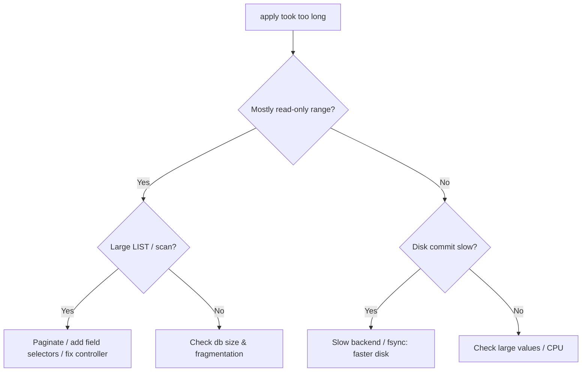

# etcd Apply Took Too Long

> **Severity:** High · **Typical recovery time:** 10–45 min · **Affected versions:** 1.19+

## Error Message

```text
{"level":"warn","msg":"apply request took too long","took":"842ms","expected-duration":"100ms","prefix":"read-only range ","request":"key:\"/registry/pods/...\" "}
```

## Description

After a Raft entry is committed, etcd "applies" it to the backend (bbolt)
store. The `apply request took too long` warning fires when applying a single
request exceeds the expected duration (100 ms by default). It is logged with the
offending request, so it doubles as a slow-query log: expensive range reads,
large writes, or a slow backend all show up here.

Occasional warnings are normal under load. Sustained or frequent warnings mean
the backend is struggling — usually slow disk commit, an oversized/fragmented
database, or expensive list operations (e.g. `kubectl get pods -A` across huge
namespaces, or a controller doing unbounded LISTs). Left unaddressed it leads to
request timeouts and apiserver latency.

## Affected Kubernetes Versions

All etcd v3 clusters (Kubernetes 1.19+). The warning and its 100 ms threshold
are present in etcd 3.4/3.5. The structured `request`/`prefix` fields (3.5)
make it easy to attribute slow applies to specific key prefixes.

## Likely Root Causes

- Slow backend commit / disk fsync (often paired with slow fdatasync)
- Large, fragmented database increasing bbolt page access cost
- Expensive range reads (large unpaginated LISTs, full keyspace scans)
- Large individual values (big ConfigMaps/Secrets, CRDs with huge status)
- Leader CPU saturation during apply

## Diagnostic Flow



## Verification Steps

Read the `prefix`/`request` fields to see whether slow applies are reads or
writes and which keyspace they hit. Correlate with disk commit latency and db
size to separate a disk problem from an expensive-query problem.

## kubectl Commands

```bash
kubectl logs -n kube-system -l component=etcd --tail=400 | grep -i "apply request took too long"
kubectl get --raw='/metrics' | grep etcd_disk_backend_commit_duration_seconds | head
kubectl get pods -A | wc -l   # gauge object volume

# Read-only etcd inspection
ETCDCTL_API=3 etcdctl --endpoints=https://127.0.0.1:2379 \
  --cacert=/etc/kubernetes/pki/etcd/ca.crt \
  --cert=/etc/kubernetes/pki/etcd/server.crt \
  --key=/etc/kubernetes/pki/etcd/server.key \
  endpoint status --cluster -w table
ETCDCTL_API=3 etcdctl ... endpoint health --cluster
journalctl -u kubelet -n 200 | grep -i etcd
```

## Expected Output

```text
{"level":"warn","msg":"apply request took too long","took":"842ms","expected-duration":"100ms","prefix":"read-only range ","request":"key:\"/registry/pods/\" range_end:\"/registry/pods0\" "}
# endpoint status: DB SIZE 3.4 GB while logical keys small -> fragmentation
# etcd_disk_backend_commit_duration_seconds p99 = 0.12 (high)
```

## Common Fixes

1. Move etcd to faster storage so backend commit/fsync drops below target
2. Compact + defrag to shrink a bloated, fragmented database
3. Fix expensive clients: paginate LISTs, use field/label selectors, add resourceVersion=0 caching
4. Reduce large values (split big ConfigMaps/Secrets; trim CRD status)

## Recovery Procedures

**etcd is the source of truth — snapshot before compaction/defrag.**

1. **Snapshot save** first (non-disruptive).
2. **Compact** old revisions to the current revision (blast radius: discards
   historical revisions; breaks watches bound to old revisions).
3. **Defragment one member at a time** to reclaim pages and speed up apply
   (blast radius: each member briefly blocked; never defrag all at once or risk
   quorum loss).
4. Throttle or fix the offending controller/client causing heavy LISTs — a
   configuration change with no etcd blast radius but it stops recurrence.

## Validation

Warnings drop to occasional/none, `etcd_disk_backend_commit_duration_seconds`
p99 is within target, db size shrinks after defrag, and apiserver latency
recovers.

## Prevention

- Auto-compaction + scheduled defrag to keep db small
- Dedicated low-latency disks with commit/fsync alerting
- Review controllers/operators for unbounded LISTs and watch misuse
- Keep object sizes modest; alert on `etcd_mvcc_db_total_size_in_bytes`

## Related Errors

- [etcd Slow fdatasync](./etcd-slow-fdatasync.md)
- [etcd Request Timed Out](./etcd-request-timed-out.md)
- [etcd Needs Defragmentation](./etcd-needs-defragmentation.md)
- [etcd Database Space Exceeded](./etcd-mvcc-database-space-exceeded.md)

## References

- [etcd — Maintenance](https://etcd.io/docs/latest/op-guide/maintenance/)
- [etcd tuning guide](https://etcd.io/docs/latest/tuning/)
- [Kubernetes — Operating etcd clusters](https://kubernetes.io/docs/tasks/administer-cluster/configure-upgrade-etcd/)

## Further Reading

- [DevOps AI ToolKit — Kubernetes guides](https://devopsaitoolkit.com/blog/)
