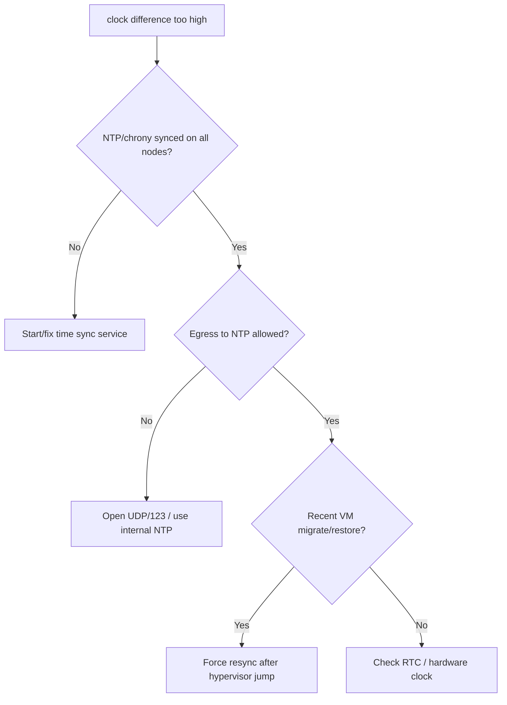

# etcd Clock Difference Too High

> **Severity:** Medium · **Typical recovery time:** 10–30 min · **Affected versions:** 1.19+

## Error Message

```text
{"level":"warn","msg":"the clock difference against peer is too high","peer-id":"9a1b...","clock-drift":"1.7s","max-tolerated":"1s"}
the clock difference against peer 9a1b2c3d is too high [1.7s > 1s]
```

## Description

etcd periodically compares its system clock against each peer. If the measured
drift exceeds the tolerated maximum (1 s by default), it logs a warning. etcd
itself uses Raft logical clocks for consensus, so moderate drift does not break
correctness — but large clock skew is a strong signal of an unhealthy node and
causes real downstream problems: confusing lease/TTL behaviour, misleading log
timestamps during incident correlation, and — most importantly — TLS handshake
failures when certificate `notBefore`/`notAfter` windows are evaluated against a
badly wrong clock.

In practice this warning is your cue that NTP/chrony is broken or absent on a
control-plane node. It frequently precedes TLS/auth errors and makes
troubleshooting harder because timestamps across members no longer line up.

## Affected Kubernetes Versions

All etcd v3 clusters (Kubernetes 1.19+). The clock-difference check and 1 s
default tolerance are present in etcd 3.4/3.5. The structured `clock-drift`
field is emitted by etcd 3.5.

## Likely Root Causes

- NTP/chrony not running or not synchronised on one or more nodes
- VM clock drift after pause/migration/snapshot restore (hypervisor time jumps)
- Blocked egress to NTP servers (UDP/123) by firewall
- Wrong timezone vs. UTC confusion (usually a red herring; etcd compares UTC)
- Hardware/RTC issues on bare metal

## Diagnostic Flow



## Verification Steps

Check time-sync status on every control-plane/etcd node and measure actual skew
between them. Confirm whether the drift is also causing TLS handshake or auth
failures, which would raise urgency.

## kubectl Commands

```bash
kubectl logs -n kube-system -l component=etcd --tail=200 | grep -i "clock difference\|clock-drift"
kubectl get pods -n kube-system -l component=etcd -o wide

# Read-only time + etcd checks on each node
timedatectl status
chronyc tracking 2>/dev/null || ntpq -p 2>/dev/null
ETCDCTL_API=3 etcdctl --endpoints=https://127.0.0.1:2379 \
  --cacert=/etc/kubernetes/pki/etcd/ca.crt \
  --cert=/etc/kubernetes/pki/etcd/server.crt \
  --key=/etc/kubernetes/pki/etcd/server.key \
  endpoint health --cluster
journalctl -u chronyd -n 100 2>/dev/null; journalctl -u systemd-timesyncd -n 100 2>/dev/null
journalctl -u kubelet -n 100 | grep -i etcd
```

## Expected Output

```text
{"level":"warn","msg":"the clock difference against peer is too high","peer-id":"9a1b2c3d","clock-drift":"1.7s","max-tolerated":"1s"}
# timedatectl on the bad node:
System clock synchronized: no
NTP service: inactive
# chronyc tracking: "Leap status : Not synchronised"
```

## Common Fixes

1. Enable and start chrony/systemd-timesyncd on every node, then force a sync
2. Allow egress to NTP (UDP/123) or point nodes at an internal NTP source
3. After a VM migration/restore, force an immediate resync (`chronyc makestep`)
4. Standardise all nodes to UTC and the same NTP servers

## Recovery Procedures

This is a node-level fix; it does not require disruptive etcd operations.

1. On the drifting node, restore time sync (start chrony, `chronyc makestep` to
   step the clock immediately). Blast radius: the local node only — no etcd data
   impact.
2. If a large backward step causes a brief TLS/handshake hiccup, etcd peers
   reconnect automatically once clocks agree; no member rebuild is needed.
3. Only if the bad clock had already triggered cert-validity TLS failures, see
   [etcd TLS / Auth Failure](./etcd-tls-auth-failure.md) for the follow-up.
4. **Always keep current snapshots** as standard practice before touching any
   control-plane node, even for low-risk fixes.

## Validation

`timedatectl` shows the system clock synchronised on all nodes, the warning
stops in etcd logs, and timestamps across member logs line up. No TLS errors
attributable to clock skew.

## Prevention

- Enforce NTP/chrony via configuration management on every node
- Alert on `node_timex_offset_seconds` / time-sync status
- Use a reliable internal NTP source for air-gapped/restricted networks
- Resync clocks automatically after VM pause/migrate/restore events

## Related Errors

- [etcd Leader Changed](./etcd-leader-changed.md)
- [etcd Member Unhealthy](./etcd-member-unhealthy.md)
- [etcd TLS / Auth Failure](./etcd-tls-auth-failure.md)
- [etcd Request Timed Out](./etcd-request-timed-out.md)

## References

- [etcd FAQ — time synchronization](https://etcd.io/docs/latest/faq/)
- [etcd tuning guide](https://etcd.io/docs/latest/tuning/)
- [Kubernetes — Operating etcd clusters](https://kubernetes.io/docs/tasks/administer-cluster/configure-upgrade-etcd/)

## Further Reading

- [DevOps AI ToolKit — Kubernetes guides](https://devopsaitoolkit.com/blog/)
