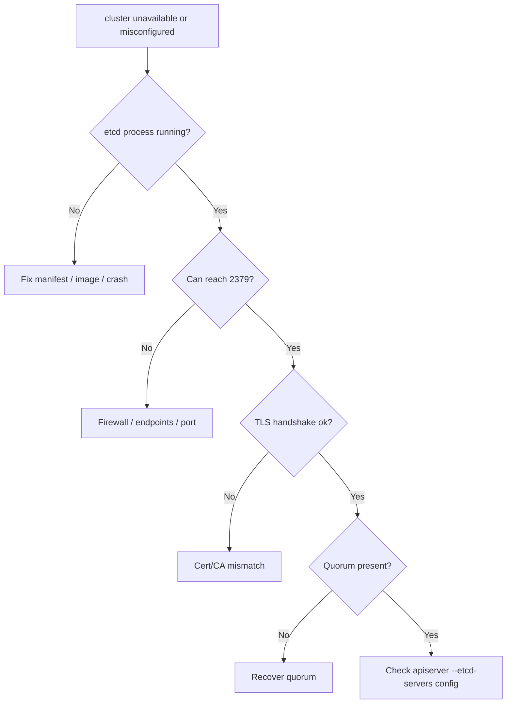

# etcd Cluster Unavailable

> **Severity:** Critical · **Typical recovery time:** 15–60 min · **Affected versions:** 1.19+

## Error Message

```text
etcdserver: cluster is unavailable or misconfigured
dial tcp 127.0.0.1:2379: connect: connection refused
context deadline exceeded (etcd health check)
```

## Description

This message means a client — almost always the kube-apiserver — cannot reach
a working etcd endpoint at all. Either no etcd process is listening, the
endpoints/certificates are wrong, or the cluster has no quorum to answer. Unlike
a slow cluster (timeouts), "unavailable or misconfigured" usually points to a
connectivity or configuration break: the apiserver's `--etcd-servers`, the TLS
material, or the etcd process itself.

When this occurs the kube-apiserver fails its etcd health check and stops
serving the API correctly. Existing pods keep running, but no cluster state can
be read or written until etcd connectivity is restored. It is one of the most
common symptoms after a control-plane node rebuild, cert rotation, or a bad
manifest edit.

## Affected Kubernetes Versions

All etcd v3 / Kubernetes 1.19+ clusters. Kubeadm stacks the apiserver and etcd
on each control-plane node and wires endpoints/certs via static pod manifests,
so manifest or PKI mistakes there directly trigger this error.

## Likely Root Causes

- etcd static pod / process not running (crash, bad manifest, image pull failure)
- Wrong `--etcd-servers` endpoints or ports in the apiserver manifest
- Mismatched / expired client certificates or CA after rotation
- Quorum lost so no member can respond (overlaps with "no leader")
- Firewall / network policy blocking 2379 (client) between apiserver and etcd

## Diagnostic Flow



## Verification Steps

Establish whether etcd is even running and listening, then whether the apiserver
is pointed at the right endpoints with valid certs. Rule out a quorum outage
(see etcd No Leader) versus pure misconfiguration.

## kubectl Commands

```bash
kubectl get pods -n kube-system -l component=etcd -o wide
kubectl get pods -n kube-system -l component=kube-apiserver -o wide
kubectl describe pod -n kube-system -l component=kube-apiserver | grep -i etcd
kubectl logs -n kube-system -l component=kube-apiserver --tail=200 | grep -i etcd

# Read-only checks on the control-plane node
crictl ps -a | grep etcd
journalctl -u kubelet -n 300 | grep -i etcd
ETCDCTL_API=3 etcdctl --endpoints=https://127.0.0.1:2379 \
  --cacert=/etc/kubernetes/pki/etcd/ca.crt \
  --cert=/etc/kubernetes/pki/etcd/server.crt \
  --key=/etc/kubernetes/pki/etcd/server.key \
  endpoint health --cluster
ETCDCTL_API=3 etcdctl ... member list -w table
```

## Expected Output

```text
W ... clientv3/retry_interceptor: retrying ... "transport: Error while dialing dial tcp 127.0.0.1:2379: connect: connection refused"
{"level":"warn","msg":"etcd health check failed","error":"context deadline exceeded"}
Error: context deadline exceeded
# crictl shows etcd container in Exited state or absent
```

## Common Fixes

1. Restore the etcd static pod manifest / fix the failing container, restart kubelet
2. Correct `--etcd-servers`, ports, and cert paths in the apiserver manifest
3. Reissue/align client certs and CA after a rotation
4. Open firewall for port 2379 between apiserver and etcd members

## Recovery Procedures

**etcd is the source of truth — snapshot any surviving member before changes.**

1. If etcd merely crashed, fix the manifest/image and let kubelet restart it
   (blast radius: that member; quorum preserved if a majority remains).
2. For cert/endpoint misconfig, correct the apiserver static pod manifest
   (blast radius: brief apiserver restart on that node only).
3. If the cluster has **lost quorum**, follow the [etcd No Leader](./etcd-no-leader.md)
   recovery path — restart recoverable members, or **restore from snapshot**
   (blast radius: full control-plane rebuild, loses writes since the snapshot).
4. Replace a permanently dead member one at a time via member remove/add to
   avoid dropping below majority.

## Validation

`endpoint health --cluster` is healthy, the apiserver etcd health check passes
(`kubectl get --raw=/healthz/etcd`), and `kubectl` read/write operations work.

## Prevention

- Monitor etcd container restarts and apiserver `/healthz/etcd`
- Automate cert rotation with validity alerting before expiry
- Version-control and review static pod manifests; back them up before edits
- Odd member count across failure domains; regular snapshot backups

## Related Errors

- [etcd No Leader](./etcd-no-leader.md)
- [etcd Member Unhealthy](./etcd-member-unhealthy.md)
- [etcd TLS / Auth Failure](./etcd-tls-auth-failure.md)
- [etcd Request Timed Out](./etcd-request-timed-out.md)

## References

- [etcd — Disaster recovery](https://etcd.io/docs/latest/op-guide/recovery/)
- [etcd FAQ](https://etcd.io/docs/latest/faq/)
- [Kubernetes — Operating etcd clusters](https://kubernetes.io/docs/tasks/administer-cluster/configure-upgrade-etcd/)

## Further Reading

- [DevOps AI ToolKit — Kubernetes guides](https://devopsaitoolkit.com/blog/)
