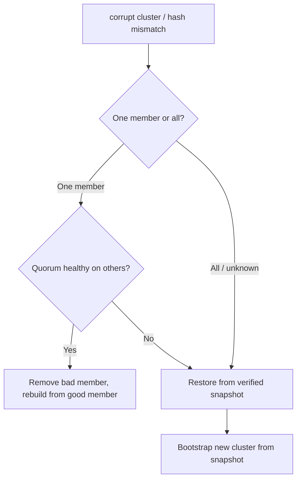

# etcd Data Corruption

> **Severity:** Critical · **Typical recovery time:** 30–120 min · **Affected versions:** 1.19+

## Error Message

```text
etcdserver: corrupt cluster
{"level":"warn","msg":"found data inconsistency with peer","local-hash":...,"peer-hash":...}
alarm:CORRUPT
mvcc: failed to find revision / database file corrupt
```

## Description

etcd can detect data corruption two ways: at startup it validates its bbolt file
and WAL, and (when corruption checking is enabled) it periodically compares a
hash of the keyspace across members. A mismatched hash or an unreadable backend
triggers a `CORRUPT` alarm, and etcd refuses to serve to protect cluster
integrity. Corruption is one of the most dangerous etcd states because the
"source of truth" for the whole cluster is no longer trustworthy.

Causes are typically physical: a disk that lied about fsync (power loss with
volatile write cache), a bad block, a filesystem bug, or an unclean kill mid-
write. Because corruption can silently differ between members, the only safe
resolution is usually to discard the bad member and rebuild it from a known-good
member, or restore the whole cluster from a verified snapshot.

## Affected Kubernetes Versions

All etcd v3 clusters (Kubernetes 1.19+). Corruption detection (`--experimental-
initial-corrupt-check` / `--experimental-corrupt-check-time`, later promoted to
stable flags in 3.5) and the `CORRUPT` alarm are available in etcd 3.4/3.5.
Enabling the initial corrupt check on startup is strongly recommended.

## Likely Root Causes

- Disk that ignored/cached fsync during a power loss (volatile write cache)
- Bad disk sectors / failing storage hardware
- Filesystem or volume-snapshot inconsistency (copying a live data dir)
- Unclean process kill (SIGKILL/OOM) during a write on flaky storage
- An etcd bug in a specific patch version (rare; check release notes)

## Diagnostic Flow



## Verification Steps

Determine whether corruption is isolated to one member (others agree on the
hash) or cluster-wide. Identify the underlying storage fault so the rebuild
doesn't land on the same bad disk. Locate your most recent verified snapshot.

## kubectl Commands

```bash
kubectl logs -n kube-system -l component=etcd --tail=300 | grep -i "corrupt\|inconsistency\|mismatch\|hash"
kubectl get events -A --sort-by=.lastTimestamp | grep -i etcd

# Read-only integrity inspection
ETCDCTL_API=3 etcdctl --endpoints=https://127.0.0.1:2379 \
  --cacert=/etc/kubernetes/pki/etcd/ca.crt \
  --cert=/etc/kubernetes/pki/etcd/server.crt \
  --key=/etc/kubernetes/pki/etcd/server.key \
  alarm list
ETCDCTL_API=3 etcdctl ... endpoint status --cluster -w table   # compare hashes/revisions
ETCDCTL_API=3 etcdctl ... endpoint health --cluster
journalctl -u kubelet -n 300 | grep -i etcd
dmesg | grep -i "I/O error\|bad sector\|ext4\|xfs"
```

## Expected Output

```text
memberID:9a1b2c3d4e5f alarm:CORRUPT
{"level":"warn","msg":"found data inconsistency with peer","local-hash":1234567,"peer-hash":7654321}
# endpoint status shows differing HASH/REVISION across members
panic: freepages: failed to get all reachable pages (db corrupt)
```

## Common Fixes

There is no in-place "repair" for genuine corruption. The fixes are rebuild or
restore:

1. Rebuild the single corrupt member from healthy peers (if quorum is intact)
2. Restore the whole cluster from a verified snapshot (if corruption is widespread)
3. Replace the faulty disk/hardware before rebuilding on it
4. Enable startup corrupt-check so future corruption fails fast, not silently

## Recovery Procedures

**etcd is the source of truth and it is now untrustworthy — proceed carefully.
Always snapshot any member you believe is good before destructive steps, and
prefer your most recent verified backup snapshot.**

1. **Single corrupt member, quorum healthy:** `member remove <id>`, wipe its
   data dir (move it aside for forensics), then `member add` and start it so it
   re-replicates from the healthy majority (blast radius: reduced fault
   tolerance during rebuild; do one member at a time).
2. **Widespread corruption / no trustworthy quorum:** stop all members and
   **restore from your latest verified snapshot** onto fresh data dirs, bringing
   up a new cluster (blast radius: FULL control-plane rebuild; loses all writes
   since the snapshot — every cluster object reverts to snapshot state).
3. Replace failing hardware first; never rebuild onto the disk that corrupted.

## Validation

`alarm list` is empty, `endpoint status` shows matching hashes/revisions across
members, the startup corrupt-check passes, and the apiserver serves normally.
Spot-check critical resources exist and are correct after a restore.

## Prevention

- Enable `--experimental-initial-corrupt-check=true` (and periodic corrupt check)
- Use disks that honour fsync; ensure write caches are battery-backed or disabled
- Take frequent snapshots, store them off-cluster, and TEST restores regularly
- Never copy a live data dir as a "backup" — always use `snapshot save`

## Related Errors

- [etcd Member Unhealthy](./etcd-member-unhealthy.md)
- [etcd No Leader](./etcd-no-leader.md)
- [etcd Slow fdatasync](./etcd-slow-fdatasync.md)
- [etcd Cluster Unavailable](./etcd-cluster-unavailable.md)

## References

- [etcd — Disaster recovery](https://etcd.io/docs/latest/op-guide/recovery/)
- [etcd FAQ — data corruption](https://etcd.io/docs/latest/faq/)
- [Kubernetes — Backing up an etcd cluster](https://kubernetes.io/docs/tasks/administer-cluster/configure-upgrade-etcd/#backing-up-an-etcd-cluster)

## Further Reading

- [DevOps AI ToolKit — Kubernetes guides](https://devopsaitoolkit.com/blog/)
