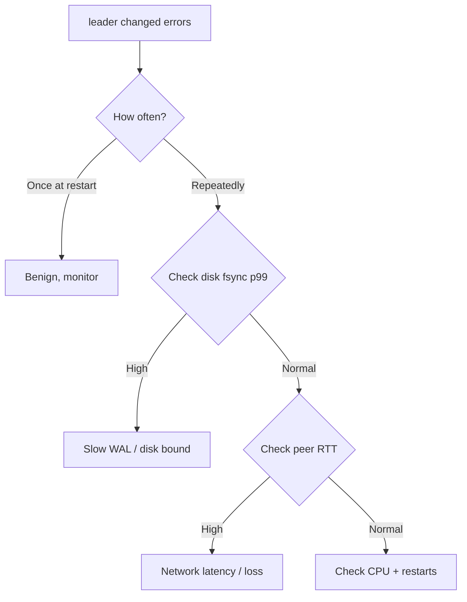

# etcd Leader Changed

> **Severity:** High · **Typical recovery time:** 5–30 min · **Affected versions:** 1.19+

## Error Message

```text
etcdserver: leader changed
rpc error: code = Unavailable desc = etcdserver: leader changed
```

## Description

etcd uses the Raft consensus protocol, in which exactly one member is the
leader and serves all writes. When the leader steps down (lost election,
restarted, or partitioned), in-flight proposals are rejected with
`etcdserver: leader changed`. The kube-apiserver surfaces this as transient
write failures, watch resets, and 500s on `create`/`update`/`delete`.

A single leader change is normal during rolling restarts. Repeated, frequent
leader elections ("leader flapping") are an incident: they indicate the
cluster cannot keep a stable quorum, almost always due to slow disk fsync,
network latency between peers, or an overloaded leader. While flapping, the
control plane intermittently rejects writes and controllers fall behind.

## Affected Kubernetes Versions

Applies to all clusters using etcd v3 (Kubernetes 1.19+ through current). The
gRPC error wording is identical across etcd 3.3, 3.4, and 3.5. etcd 3.5.x
improved election stability under load, so older 3.4.x clusters flap more
readily on marginal disks.

## Likely Root Causes

- Slow disk WAL fsync on the leader (most common) causing heartbeat timeouts
- High network latency or packet loss between peers exceeding the heartbeat interval
- CPU starvation / noisy neighbour on a control-plane node
- Aggressive `--heartbeat-interval` / `--election-timeout` relative to real latency
- A member repeatedly restarting (OOM, crashloop) and re-triggering elections

## Diagnostic Flow



## Verification Steps

Confirm the error is recurring rather than a one-off, and identify whether disk
or network is the limiting resource before changing any tuning flags.

## kubectl Commands

```bash
kubectl get pods -n kube-system -l component=etcd -o wide
kubectl describe pod -n kube-system -l component=etcd
kubectl logs -n kube-system -l component=etcd --tail=200 | grep -i "elected\|leader\|election"

# Read-only etcd health (run on a control-plane node)
ETCDCTL_API=3 etcdctl --endpoints=https://127.0.0.1:2379 \
  --cacert=/etc/kubernetes/pki/etcd/ca.crt \
  --cert=/etc/kubernetes/pki/etcd/server.crt \
  --key=/etc/kubernetes/pki/etcd/server.key \
  endpoint status --write-out=table
ETCDCTL_API=3 etcdctl ... member list -w table
journalctl -u kubelet -n 200 | grep -i etcd
crictl ps -a | grep etcd
```

## Expected Output

```text
+------------------------+------------------+---------+---------+-----------+------------+
|        ENDPOINT        |        ID        | VERSION | DB SIZE | IS LEADER | RAFT TERM  |
+------------------------+------------------+---------+---------+-----------+------------+
| https://127.0.0.1:2379 | 8e9e05c52164694d |   3.5.9 |   210 MB |     false |        148 |
+------------------------+------------------+---------+---------+-----------+------------+
# RAFT TERM climbing every few minutes == leader flapping
etcd log: "lost leader ... elected leader ..." repeating
```

## Common Fixes

1. Move etcd to dedicated, low-latency SSD/NVMe storage (fsync p99 < 10 ms)
2. Reduce control-plane CPU contention; give etcd guaranteed resources
3. Fix peer network: separate etcd peer traffic, reduce RTT/packet loss
4. Only if latency is genuinely high, raise `--heartbeat-interval` (e.g. 250 ms) and `--election-timeout` (5× heartbeat)

## Recovery Procedures

Ordered, production-safe steps. **etcd is the source of truth for the entire
cluster — take a snapshot before any disruptive action.**

1. Snapshot first (non-disruptive): `etcdctl snapshot save backup.db`.
2. Identify the flapping member from `member list` / logs.
3. **Restart a single unhealthy member** (blast radius: that member only;
   quorum preserved if remaining members ≥ majority). Do NOT restart multiple
   members at once — losing quorum makes the cluster read-only/unavailable.
4. **Member replace** (blast radius: temporary reduced fault tolerance):
   `member remove` then `member add` only if a node is permanently bad and
   quorum is healthy. Adds risk of quorum loss — perform one member at a time.

## Validation

Confirm `RAFT TERM` stabilises, `endpoint status` shows one steady leader, and
apiserver write latency returns to baseline. No new `leader changed` entries in
etcd logs over 15+ minutes.

## Prevention

- Dedicated disks with fsync SLO alerting (`etcd_disk_wal_fsync_duration_seconds`)
- Resource isolation for control-plane nodes
- Regular `snapshot save` backups and tested restore runbooks
- Alert on `etcd_server_leader_changes_seen_total` rate

## Related Errors

- [etcd No Leader](./etcd-no-leader.md)
- [etcd Request Timed Out](./etcd-request-timed-out.md)
- [etcd Slow fdatasync](./etcd-slow-fdatasync.md)
- [etcd Apply Took Too Long](./etcd-apply-took-too-long.md)

## References

- [etcd FAQ — leader election and tuning](https://etcd.io/docs/latest/faq/)
- [etcd tuning guide](https://etcd.io/docs/latest/tuning/)
- [Kubernetes — Operating etcd clusters](https://kubernetes.io/docs/tasks/administer-cluster/configure-upgrade-etcd/)

## Further Reading

- [DevOps AI ToolKit — Kubernetes guides](https://devopsaitoolkit.com/blog/)
